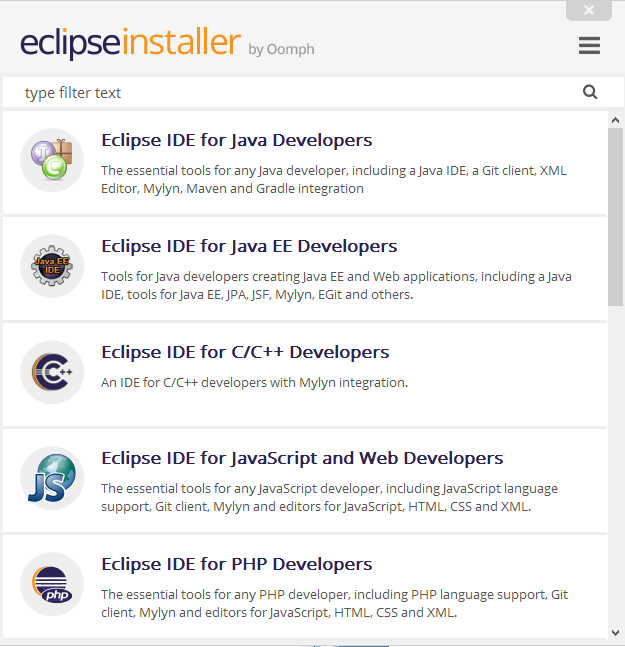
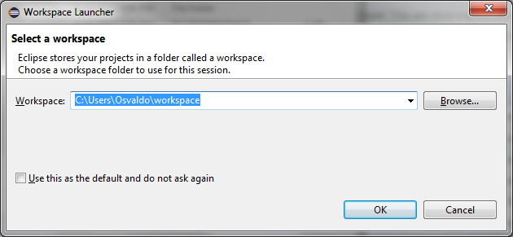
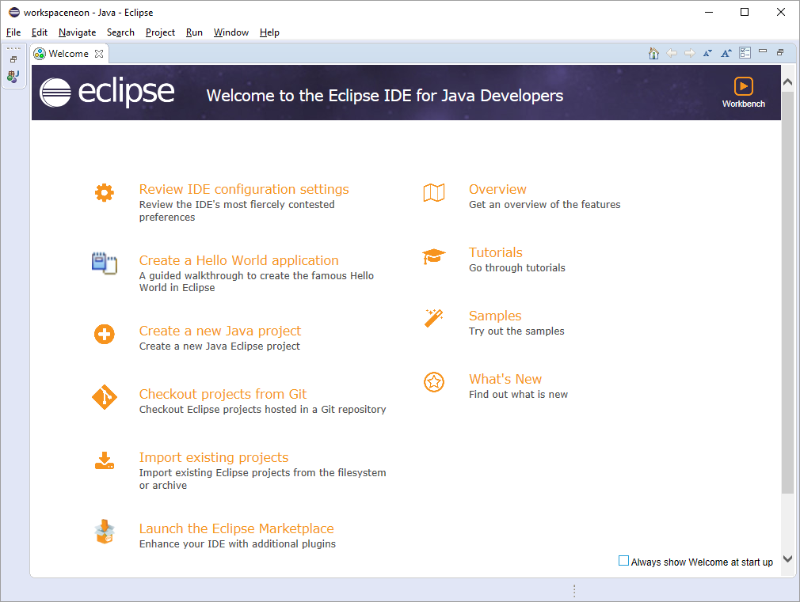
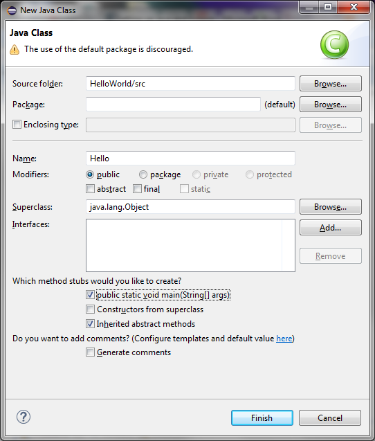
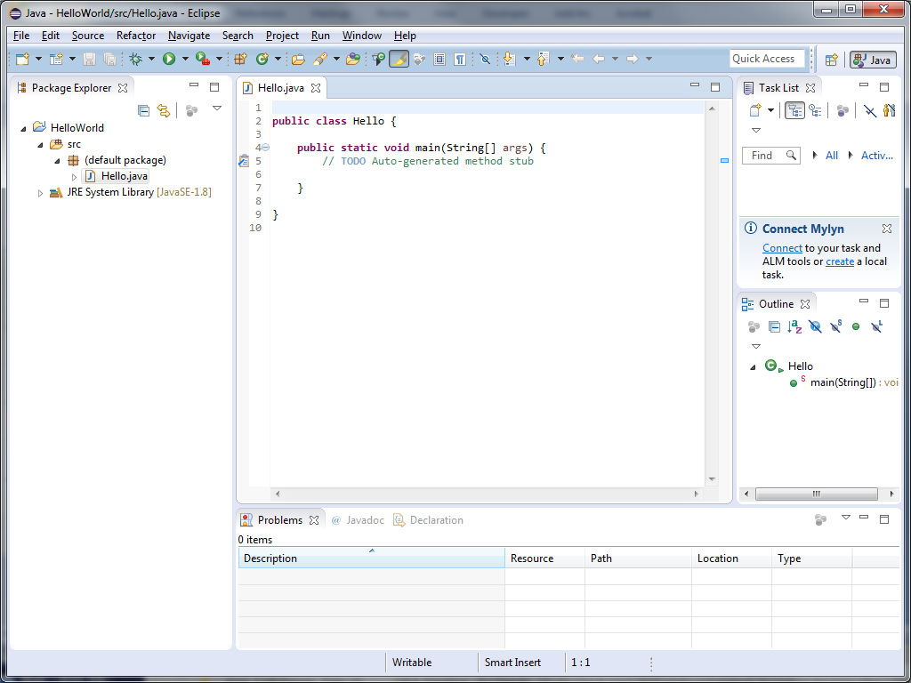
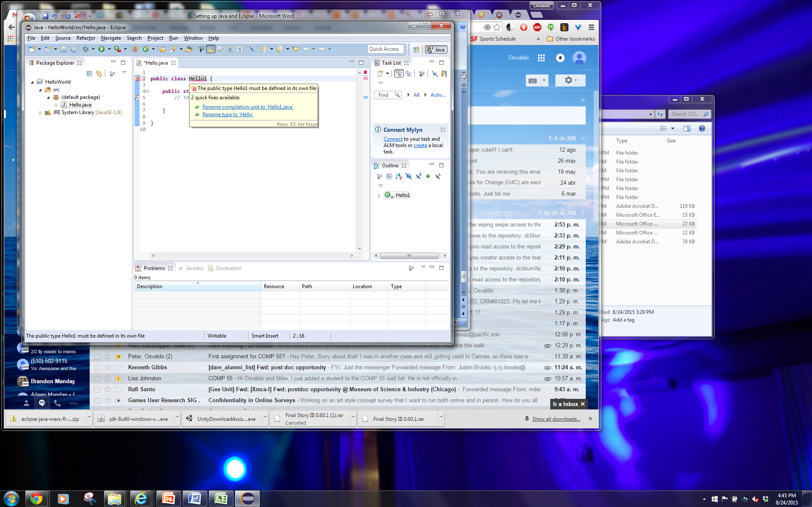
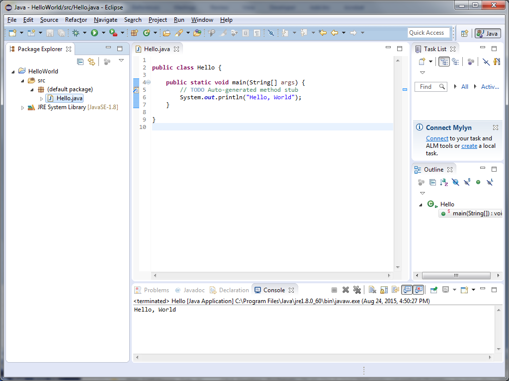
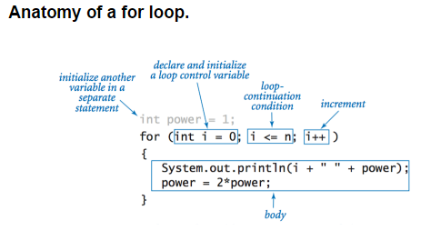

# Java and Eclipse Lab (Credit given if done by next class)

If you are using a school computer skip down to Step 5.

## STEP 0: Remove any previous installations of Java that you have

This class uses a very specific version of java, specifically Java 8 to
help us in getting certain elements done quickly and efficiently. In
order to remove any confusion, we're going to have you remove any
previous versions of java that you may have, so that they don't get used
when installing eclipse. You can do this by going to your add and remove
programs setting in windows, or applications on a mac.

## STEP 1: First thing you'll need is a Java 8 JDK (Java Development Kit)

To get a Java 8 JDK, go to:

<http://www.oracle.com/technetwork/java/javase/downloads/index.html>

Your page may be updated - click on the JDK link on that page that will
lead you to **Java 8** which is typically in the middle of the page
somewhere


That will take you to an awesome page with lots of options for which JDK
you want to download, try to pick the version that corresponds to your
operating system (Windows for the most of you) and accept the license
agreement. The latest version is the one on the website and not the one
posted here.


You'll download a largish file.

## STEP 2: Install the JDK

Go ahead and install and accept for the most part EXCEPT if they ask you
if you want some extra software or add-on. That's your call. Pick where
you want it located and continue to get it to installed.

## STEP 3: Download Eclipse

Go to the eclipse site: <http://www.eclipse.org/downloads>


Click the orange download 64 bit button. It will take you to another
page where you need to click the big download button again.

Wait for that file to download.

## STEP 4: Run the Eclipse Installer

Once you double click the installer, you'll eventually be taken to a
screen that looks like this.



Click on *Eclipse for Java Developers*. It will then ask you to specify
where you would like eclipse to be installed and live. You can also
choose whether you want a start menu entry or desktop icon. After
clicking *Install* you can read the User Agreement or just click Accept
Now. If you click Decide Later it will just pop up later in the process.

Once it's finished installing, you'll then get a green *Launch* button
which you can click to start Eclipse.

## STEP 5: Get Familiar with and start Eclipse

Since this is your first time running eclipse here are a couple of
things you want to know.



*If you are using a school computer, make sure that you change the
workspace to a **Comp 55** folder inside of your **Documents** folder.*

When you double click eclipse, after seeing the splash screen you will
be greeted with this.

Eclipse likes to use the word **workspace** to mean the location where
you store all of your code. Think of it as the parent or base directory.
It breaks that directory or workspace down into **projects**, which is
the code you'd write for different assignments or different projects.
Each project gets its own directory, you can think of the project as the
solution from C++ or Visual Studio. Eclipse does allow for you having
different workspaces and allows you to switch between them, which is why
it asks this question. Go ahead and pick the directory where you want
your projects to live on your hard drive. **I would recommend clicking
the checkbox to use as a default, and then click OK.**

That after loading the application, Eclipse will then jump you to a
screen that looks something like this…



**Uncheck the box at the bottom** and then click on the workbench button
up near the top. You can go to the tutorials or look at the overview if
you have the time, or you can just click on Workbench, which brings you
the basic layout and looks like this.


I typically close the task list tab on the right. On the left is package
explorer, where you will have all of your projects listed, and the
middle window will bring up your code. Eclipse is different than Visual
Studio in that when you start Eclipse, all of your projects will be
listed, which I think makes it easier for you to look at past projects
and explore other files you have written, in case you need to look back
at anything. I would encourage you to not think o

## STEP 6: Let's get a Hello World going.

To start programming in any language, it's best to start with a simple
thing like "Hello, world", so let's do that. Go ahead and right click on
*File-\>New-\>Java Project*. Java Projects are very similar to the
Solutions you had in Visual Studio. After clicking, you'll see a window
that looks like this…


Give your project a name *HelloWorld*, and then click **Finish**. You'll
see a project on the left.

Now, Right-click on the project name (HelloWorld) and then go to
*New-\>Class*, (this can also be accessed from the file menu
*File-\>New-\>Class*)

This takes you to a window with a lot of options that looks like this,
though this version has it populated with the options you want,
highlighted.



In Java, class files are where you will write your code. Rather than
having separate .h and .cpp files like in C++, Java just has one file,
the .java file, which are also referred to as **class** files.

Make sure that you select the options I highlight in the image, which
have eclipse write a little bit of code for you so that you don't waste
your brainpower on tangential tasks. Eclipse will make a main method for
you. We may go over other parts of this, but for right now, writing in
the name for the class and selecting the *public static void main*
option are the only two things you need to do before you click
**Finish**.

Once you do, you'll get a window that looks something like this.



## STEP 7: Write and Run

Notice that the file Hello.java is now your HelloWorld Project. That
file has also been opened in the editor, where it has a few words. Any
text in blue you can ignore for now. ```public class Hello``` just lets
the computer know that you are creating a class. All java files are
class files; the name after ```public class``` must match the .java
filename. If you change it, (like we did below to say *Hello1*) you will
be greeted by a nice red squiggly. Hover over the squiggly to get the
quick fix popup shown below.



Notice the quick fixes…These are options you can click on to have
eclipse do little tasks for you, like change Hello1 back to Hello, or to
rename the java file as Hello1.java. Click on whichever you see fit.

Once you're done, inside your main, I want you to type.

```java
System.out.println("Hello, World!")
```

That is like the standard C++ ```cout``` statement, except you provide
```println``` a string. Eclipse may start giving you suggestions right away
and tell you that code recommenders is enabled, which is a nifty little
feature for later.

After typing the line, go ahead and right-click on your java file, and
head to *Run-as-\>Java application*, or you can just click on *Run* in
the menu up top. The super handy keyboard shortcut here is
***Ctrl-F11.*** If you haven't saved, you'll get a popup asking if you
want to save like this.


Again, here I would check the box at the bottom to always save resources
before launching, and click that you want it to save before running. If
you didn't get the popup, add an exclamation point to *Hello, World\!*
and then run it again without saving.

Once you click OK you'll get the console up and running, which will show
on the bottom of the screen.



Congrats you've written and run your first Java application\! Java
doesn't have a separate compile and run step like you did in C++, it's
all combined into one step.

# STEP 8 – Submit confirmation by uploading a picture to Canvas

To get credit for this lab, what you'll do is submit an image of you
running this hello world program to canvas, but using your own name
instead. The image should be of the program, similar to the one on the
previous page. To get full credit however, use a for loop, make sure the
java file is showing and have the for loop repeat the salutation three
times. In my case it would be something like

```

Hello, PutYourName Here!

Hello, PutYourName Here!

Hello, PutYourName Here!

```

If you don't remember how to do a ```for``` loop, here's a snippet from
Princeton's java cheatsheet.

(<http://introcs.cs.princeton.edu/java/11cheatsheet/>)



Also, if you're not sure how to get an image, use the **Snipping tool**
for windows (Search for it in your windows menu). If you're on a mac,
key in: *⌘ + Shift + 4*. Or just google "take screenshot window mac" and
the instructions will come up.

I encourage you at this point to try to work on some of the coding bat
problems or other work that you've done before to get them to work in
java. Try to make some functions, declare an array, etc. You'll notice
all of those things are very similar to what you've done before.
Unfortunately there is no equivalent to ```cin``` in Java that is as simple
and easy to use, but we'll talk about how to get some additional
interactivity in the future.
