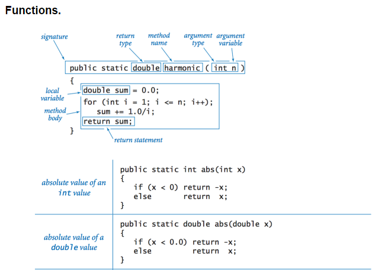
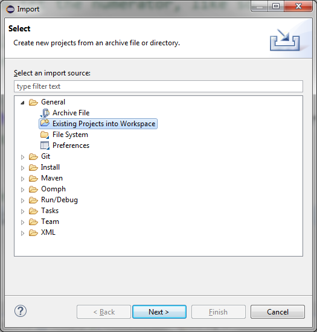

# Intro to Java Lab

Step 0: Generate a function/method.

We'll be using the word function & method interchangeably. Before you go
onto the java lab for today, go into your hello world project in eclipse
and make sure you feel comfortable writing at least one function/method.
You can check this by making the hello world into a function that gets
run instead and then run the program.



We'll talk more about the use of the static variable later, but you will
not be using it most of the time.

## STEP 0: Download the zip file from Canvas

Make sure that you downloaded the zip file from the Lab Assignment Page.
No need to unzip it, just have it in a temporary location.

## STEP 1: Import the project into eclipse

The best way to do this is by using the zip file directly, no need to
unzip. Once eclipse is open, go to *File-\>Import* and click on
*General-\>Existing projects into workspace*, and then click *Next*.



On this screen, click the *Select archive file* option, then click
*Browse*, locate the zip file, and then hit *OK*. If you don't have the
zip but have an actual folder, use the *Select root directory* option on
top instead. 

Once you've located the zip file or directory, you'll be able to hit
*Finish*. Once you do that, the project will be shown on the left hand
side, but it will have several red X's, that means that Java has found
some issues for you.

Eclipse is organized into lots of small
areas, including a window that will show you both errors and warnings,
so you could examine them if you wanted to. Go ahead and look at the
problems in the window, or simply open up the file and double click on
it and then hover over the red squiggly mark, and you'll see that it
says something like *Fraction cannot be resolved to a type* which means
"I have no clue what Fraction is". This is because we have yet to
create a class to represent a Fraction. We'll go ahead and do that now.

# STEP 2: Create a Fractions class

Go ahead and create a **Fraction** class file. While you can do this as
a *quick fix*. Let's do it the regular way. Right-click on the project
label itself in the Project Explorer, and then go *New-\>Class*. Once
you do that, Eclipse will bring up another form to fill out (shown
below). Put *Fraction* as the name of the class and then click *Finish*,
which will bring you back to the main window.


A couple of the options that would be relevant are including the main
method stub (1<sup>st</sup> checkbox). Unlike in C++, where you can have
just one main class, Java allows each class to have its own main method.
Then rather than just saying that you want to run the project, you can
run any class that has a main method. This is useful for when you want
to test a particular class. In fact in our scenario, the entire main
method *could* be copied into the **Fraction** class and then we would
eliminate the need for **TestFraction** altogether (but we won't copy it
over there for this lab). When you do have more than one main method in
a project, to run a particular main you can just right click on the java
file whose main method you want to run and then go to *Run As -\> Java
application.*

# STEP 3: Fill out the Fractions class

Once you click Finish, the Fraction class will be added to your project
and you will notice it has very few lines in it, just the Fraction and
the curly braces. The curly braces tell the computer that everything
inside of those two outer curly braces is part of the Fraction class.
While normally I would have you write out the code. In this situation,
I'm going to provide you with a little bit of help initially so that
you feel more comfortable getting started with Java. Eclipse is
extremely powerful in helping you generate Java code so you don't have
to worry about the syntax as much. As long as you understand the
concepts, you will be able to go to any problem in the problems window,
right click on it, and then hit the quick fix to see if any of the fixes
make sense. For example, let's look at our initial error. The
*constructor Fraction(int, int) is undefined*. Remember that
constructors are a special set of instructions (like a method) that one
could use to help setup a fraction. In this case, when we would like to
say something like ```new Fraction(3, 4)```, it should use the 3 and the 4
passed in and set the numerator and denominator to those values. To help
use write this class, without knowing much java, we are going to rely on
Eclipse.

Now *right-click* on the error "*The constructor Fraction(int, int) is
undefined*" and select *Quick Fix* (or press **Ctrl+1**). You should see
a window pop up that gives you a couple of options


Make sure the option to create the constructor is selected and click
*Finish*. You'll now see code that looks like this.

```java
public class Fraction {

    public Fraction(int i, int j) {
        // **TODO** Auto-generated constructor stub
    }
}
```

Unlike C++, because we are working in the same file, we just add the
word public, as well as the name of the file and the arguments we want
to create the constructor. If you want to see the error disappear, just
*Save* (**Ctrl+S**) the file. Notice the comments look the same, but
there is a comment followed by the TODO, which is a nice way of
remembering that you have to go back and actually write the code in
there. Also, notice that any comments with TODO will have a blue box on
the right side of the file, so you can quickly scan a file and see
what's left for you to complete. We know that as a constructor, we
want to store the parameters into instance variables (AKA member
variables). It makes sense to change the parameters **i** and **j** to
**num** and **den**, and then to store the contents of each variable
into variables **numerator** and **denominator**. We want the
**numerator** and **denominator** to be instance variables, so let's
have eclipse help us out. Rewrite your code so that it is now:

```java
public class Fraction {

    public Fraction(int num, int den) {
        numerator = num;
        denominator = den;
    }
}
```

Once you save, you'll notice that errors pop up in the problems pane
again, as well as the red squigglies. Hover over the errors to read the
quick fixes here, which would be that we would want to declare each
variable as an instance variable (Eclipse may call instance variable
"field"). Doing that will insert the following two lines above the
constructor.

```java
private int numerator;
private int denominator;
```

Notice that they have changed color to be blue, which is an indication
that they are instance variables instead of local variables. This is how
you declare member variables, just with the word ```private``` before each
variable declaration and outside of any method. ```private``` and ```public```
work just like they did in C++.

To help us write the getters and setters, we'll also use Eclipse. Move
your mouse over to the package explorer window and locate the
Fraction.java file. *Right click* on **Fraction.java** and then go to:
*source-\>generate getters and setters.* Once you do that…you'll get the
following window:


Select the options like I did to have eclipse write the
accessor/mutators (known in java as getters and setters) for you. There
are some additional options you can play with (like the insertion point
option) that will allow you to place where you want the code generated
to be inserted. Once you click **OK** and finish, you should be able to
run your result that you have so far. You'll notice there is still a
**todo** and you can certainly write more code to flesh out the class
which involves the next step. While it's nice that Eclipse does some
basics for you, it should help you think about how to make a class more
robust. For example, should ```setNumerator``` and ```setDenominator``` accept
all numbers? Should the class do anything else? You should modify your
code so that if someone asks to set the fraction's denominator to zero,
it will just ignore the request. With all classes, you want to
concentrate on adding in logic that makes sense for that particular
class to have.

## STEP 4: Override the toString() method

Since you aren't working on the assignment just yet, I would just
encourage you to explore and ask questions and use the people around you
as a resource. I'll be putting up additional guides and resources of
information for you in the future on Canvas, so that you can make more
sense of all the neat things eclipse and Java can do for you. For this
lab though, I want you to explore making a really cool Fractions class.
The first step in that is to override the ```toString()``` method as well as
creating multiple constructors to make the fractions class more
flexible, as well as test code that can help you make sure that your
Fractions class is working.

When you look at the output when you ran the program, the second line in
the output is printing out something like ***Fraction@2a139a55***.
However, the numbers after the ```@``` symbol will be completely different.
Those numbers stand for the actual location in memory where that
Fraction object currently resides on your own computer. To have the
```Fraction``` class print something more useful, we have to override
```toString()```. ```toString()``` is a method that returns a ```String``` and takes
nothing as the arguments. You can generate the body of ```toString``` by
right-clicking on the file and going to *source-\>generatetoString()*,
but the important thing is to think about what string you want to form
or have the class print when ```println``` is called, which in our case will
be something like ***1/3***. To combine variables with actual text and
concatenate them, you can use the **+** operator to join two or more
pieces together.

## STEP 5: Submit a picture of your program finishing

To get credit for this lab, submit a picture after just having run your
project, **making sure the code from Fraction** **and console windows
are viewable**. You will need to add a ```println``` to your
FractionsTest.java file that shows your own name. In your picture, **you
should have the code for Fraction.java present**, while the console
window should have the printout of the test code given. To get full
credit, the ```toString``` method must be overwritten. Upload the picture by
the assignment due date to get full credit, your picture should look
exactly like this, just with your name instead, **make sure you show
this console tab in your picture**, you can also provide an entire
screen shot of the application or window instead, as long as all the
text of your program is visible.


