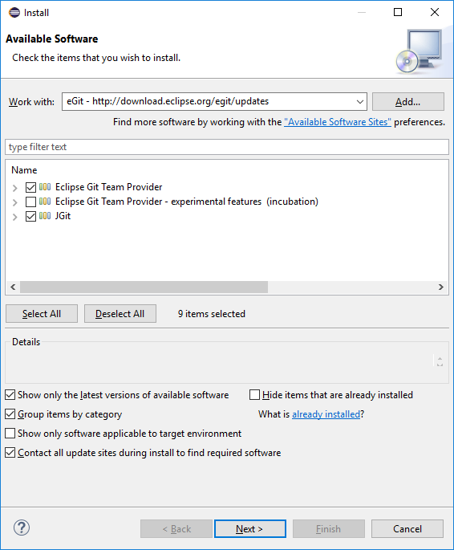
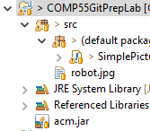
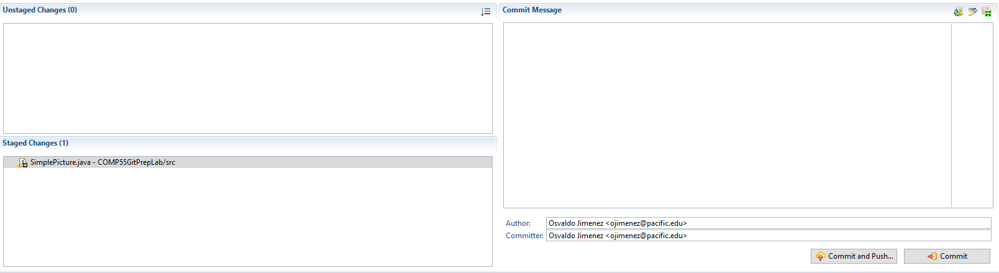
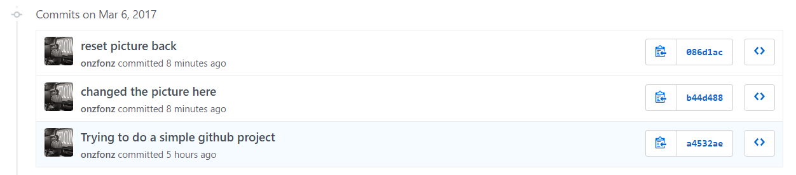

# Preparation for Git Team Lab (Take out egit stuff, just explain, but add direct hash for git credentials)

This lab are a mishmash of steps that need to be completed individually
before we meet again in class.

## Step-1

Signup for a github account.

Easiest way to do this is by going here:

**<http://education.github.com/pack>**

If you already have a github account, you can still get the pack (and
you should\!), but you can also just go to the next step. Some of these
are just awesome technologies that might be of use later when you are
writing programs to take over the world. One thing you'll need to do for
certain is to verify your email address. You can check to see if your
email is verified by going to the github settings clicking on the icon
on the upper right, going to *Settings*, and then clicking on *Emails*
in the Personal Settings list on the left. The other thing you should do
is give youself an icon, it can be the same one as from basecamp if
you'd like. You can also change this in settings.

## Step-2

Visit this URL:

**<http://go.djosv.com/prelab>**

Make sure to accept any of the authorizations that are present and to
Accept the assignment. This is going to have you enter the comp55
organization. If you have already signed up for an account it may ask
you to re-enter your credentials. Once you have clicked on all the admin
processes and you've reached the place where you get the message below
(with your github username down below), you can move on to the next
step. Leave this window open as we'll need to access it later.


Make sure to save this URL that was just created specifically for you.
You will need it for Step 8.

## Step-3

Now we are going to follow the rules that I adapted from this crunchify
site
(http://crunchify.com/how-to-configure-bitbucket-git-repository-in-you-eclipse/),
however, I had to modify their directions so that they would work for
GitHub instead of the site they used (bitbucket).

Now let's make Eclipse ready for Git.

  - > Open Eclipse

  - > Click on **Help** menu

  - > Click **Install New Software**


## Step-4

Let's Install eGit
into [Eclipse](http://crunchify.com/step-by-step-guide-to-setup-and-install-apache-tomcat-server-in-eclipse-development-environment-ide/). 

Click the Add Button in the upper right of the Install Window to add a
repository

URL: **http://download.eclipse.org/egit/updates**


## Step-5

Select **Eclipse Git** (1<sup>st</sup> option) and **Java Implementation
of Git** (3<sup>rd</sup> option) form option and click **Next** a few
times accept the agreement and **Finish** the install.



## Step-6

After it finishes, restart eclipse. Once eclipse restarts, Click
**Window -\> Perspective -\> Open Perspective -\> Other** and then
choose **Git** from list and click **OK**. The other option is to click
the highlighted button below which is in the toolbar in the upper right.


## Step-7

Click Clone
Repository [Button](http://crunchify.com/simple-scroll-to-top-button-in-wordpress-footer-without-any-javascript-loading-genesis-framework-tips/).


## Step-8

Enter your GitHub URL that you were given for this prelab assignment
from Step 2. Not sure what this is? You can go back to the page I asked
you to leave open on Step 2 and click on the link that discusses your
assignment (*KEEP SCROLLING to see the picture*). When you get there, or
if you log back in you just need to access your repositories, which will
be listed on the right once you login to github. Once you click on that
repository, you'll eventually see a page like this:


Click the Green button that says *"Clone or Download"* and then click
this button (the clipboard icon to the
right of the URL) to get automatically copy that URL to your clipboard.
Once you do this it may actually automatically paste the URL into
eclipse for you. Also check the option **Store in Secure Store** so that
way your password is saved. As part of this, it might ask you for some
recovery questions, which you can provide if you want.


Click **Next**, which will bring you to a branch selection window, which
you can just click **Next** again. This will lead you to this Local
Destination Window, which looks like this:


Make the option **Import all existing Eclipse projects after the clones
finishes** is selected and then click **Finish**

## Step-9

You should see your GitHub repository now in eclipse's Git Repositories
window. This is part of the Git View.


## Step-10 – Running the downloaded project

Now you can switch back to the Java Perspective which is the little
toolbar button with the ***J*** that is in the upper right

> 

You should now see your java project, but it will look slightly
differently. Because the project is connected to the repository now
you're going to see the project name followed by some brackets and the
repository name.

Go ahead and open up the project *COMP55GitPrepLab* and double click on
*SimplePicture.java* . You'll see that it will behave like if you
imported the project. You can also run it if you like by running simple
picture. At this point the project should work and run. If it doesn't,
you may have to change some preferences on your eclipse, but this is
very rare.

# Step-11 Editing your Git Preferences

So that we can make sure that you get credit for committing and working
on the project, we're going to have you make one additional change to
your Eclipse settings, which you should also do if you work on any other
computers so that you get credit for all the work that you do. In order
to do this, we'll go into eclipse and click on *Window-\>Preferences*
(If you are on a mac, this would be in *Eclipse-\>Preferences*.

Once there, you'll see a window like this.


In the left hand menu, you can click the down arrow for *Team* and then
click *Git*, alternatively, you can just search for **Git** in the
filter text box in the upper left, and then click on the *Git* label.
Once you click on the Git label's down arrow, you should click on
*Configuration*, which would get you to this window.


While you won't have those sections highlighted in red, you'll add these
in this step. You'll be adding your email (the one you used in github)
and name to your settings for all computers. In the User Settings tab,
click on user (if it's present) and then click the *Add Entry* button on
the upper right. For the *key* type **user.email** and for *value*, you
want to put the email that you registered with or used to signup for a
github account. The user.name can just be your first name if you want.
You need to do this with every computer that you have so that you can
get credit for your submissions. Make sure to use the same name and
email for all your computers\!

## Step-12 Making changes and sending them upwards

For this mini-lab, we're only interested in getting you used to the
mechanics of making a simple change and uploading that change to github.
So here's what I'm going to ask you to do.

Change line 16 in *SimplePicture.java* so that the text says ```"How I
felt before knowing about github"```, and change the ```y``` position for the
Glabel to be ```300```.

Once you do this, you'll notice that your project will now have a
greater than sign (```>```) in the package explorer, which will look
something like this:

Those signs that you see to the left of
the project are letting you know that git believes that these files have
changed. When files have changed, git wants to give them a new version
number. To give or to save these files so that git can reference them in
the future, you'll want to do what's called **commit**. To commit the
files, simply right click on the project and select *Team-\>Commit*.
That may open up a **Git Staging View**, which will look something like
this



If you look, **staged** changes are files that git has identified as
needing to be updated once you click the commit button, while
**unstaged** changes are files that git has identified as being
different than what's on the server, but will not be updated after
clicking commit. *You need to be careful of what you decide to put in
staged changes versus unstaged changes.* When you try to commit, git
looks at all files in your current directory to see what is new or what
has changed. Anything it doesn't know what to do will be put in the
unstaged changes area.

In the picture above, the right area is the commit message, where you'll
want to write a short message that outlines what changes you made, in
this case you can simply put something like, ```Changed the text to
reflect final assignment```. *Make sure the author/committer has the name
and email that you stored in your preferences settings*. Finally near
the bottom right of the image you'll find two buttons: ***Commit and
Push*** and ***Commit***. In this situation, I'm going to ask you to
simply click **Commit and Push**, which not only saves a new version of
your project (**commit**), but also sends your changes over to
github.com (**push**). Sometimes you may just want to commit without
sending all the changes to the server yet. We'll talk about that in the
git lab in the future. For now just click ***Commit and Push***. After
clicking, you'll get a dialog box where you can click OK.

## Step-13

Once you completed the steps and push, then I will know that you have
completed the tutorial. To check yourself go to **github.com** and click
on the repository file to see the changes that were made. If github.com
has the change you pushed that's part of the credit. The other part of
the credit will come from the settings. In github.com you can go to your
repository and click on the **commits** label in the upper left.


When you do that, you'll see a list of the changes that you've made to
the project. You should see a commit that has your picture and name on
it at the top.



Click on the text that you made for your particular one to see the
changes that you committed and how your commit changed the file, which
you can immediately identify. If you see your custom picture and your
name or id, then you'll get the rest of the credit. If you don't, then
simply make an additional change to one of the files (adding a line or a
space) while editing the user preferences outlined earlier in this lab.
There's no need to upload anything to canvas as all your changes will be
stored on github. Hooray\!


That's it for now\! We'll do more with git in the future, but this is
just meant to get you ready for when we start coding, which you should
not do yet, since I have more code to give you to help you move along in
the project, work on designing and coming up with classes and methods
and the rest of your system design project instead\!
