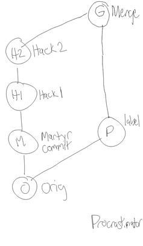
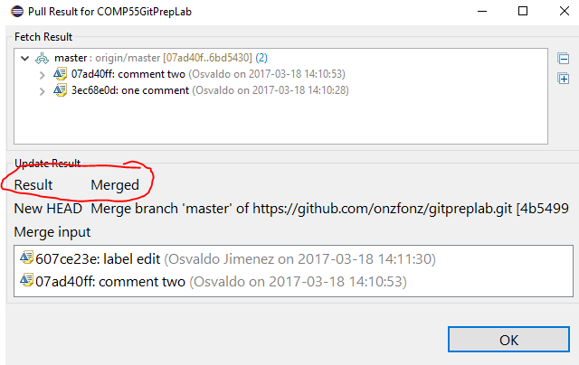
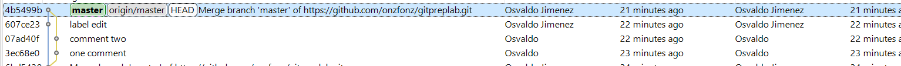

# Git Team Lab (Points given based on completing all steps with team)

While this is a team lab, each of you will need to do this on your own
computer. Your points for this lab will be based off of both your own
and your team's ability to finish this lab, so it's important to work
together. **Make sure that you sit in a way where you can see what
everyone else is doing, so that you can provide each other help.** It's
also important that all of you finished the Git Prep Mini-Lab, which was
necessary to finish before starting here. You should also be part of
this class's github organization, if you didn't accept the invite, let
me know and I can send you another one.

## Step-0 

*Setup your computers so you can all see each other's screens, and
decide on labelling the people on your team: 1) git team admin 2)
hackslash 3) procrastinator 4) martyr*

Choose one git team admin – this person should feel comfortable with
git, or have a fully working laptop that hasn't had any issues in the
past couple of weeks, the git team admin should also feel comfortable
searching for things in google. Once you decide on an admin notify me.
The others don't matter, if you only have 3 people on your team, have
the git team admin also server the martyr role.

## Step-1 (For team admins only – others review the mini-lab)

Team Admins, go to this site: http://go.djosv.com/teamlab. There you'll
accept the assignment, and it will ask you to create a team. Make the
team with your original name. Once you click to finish and a repository
is created, you'll get the default files that I have provided for all of
you for this lab. The next thing will be to let everyone know that they
can now signup.

## Step-2 (for everyone)

Checking out the new project

Once your team admin has notified you that the team has been created,
visit **go.djosv.com/teamlab**. There make sure **that you choose your
correct group**. Once you've chosen the group and accepted the group
assignment, you'll then be led to your new repository. At this point
you'll want to **checkout** your team's new project.

To checkout the project, you'll need the URL from github, so once you
are on the project page via github's site, you should arrive to a page
that looks something like this: Once
there, you'll see a green button called clone or download, click it and
you'll see a URL and what looks like a clipboard button, use that or
select the URL to copy the entire URL.


With that URL in your clipboard, you should use the same guidelines that
we posted previously about cloning a git repository via eclipse, so go
into eclipse, open up the git perspective and clone a repository.

If the URL was copied correctly, it should autofill when cloning the new
repository. Make sure that as you check out the repository you place a
checkmark on **import the project**. If you've forgotten the steps here,
it's best if you go back and look at the mini lab. *Before moving to
step 3 make sure everyone on your team has the group project and that it
looks the same on everyone's computers when you expand and see the
source files*.

## Step-3 (for everyone)

Let's all make a change and reset

This may seem silly, but part of this will be just to make sure that all
of you are used to making small changes and that all of you get practice
pulling and making changes to the project. For many of you, this will be
the first time where you will be working with other people to write
functional code. Mistakes can happen.

What I'd like you to do is simply add one line to the graphics program
java file. It can be changing a color adding a comment or doing
anything. Make sure you don't spend too much time coming up with the
change. The change is not important, what's important is getting used to
using git with a team before you start working on a much more
complicated project.

Once that person has made the changes and saved, you'll notice that
their project, along with the file that they modified, now have a
greater than sign (```>```) next to all projects and directories that have
contain changes that are different than the latest commit.


If you ever want to see what's different you can right click on the file
and select *compare to-\>HEAD revision*. Anytime you see a greater than
sign, it means that if you have something that is different than the
latest version, and you have two choices to make: commit or **reset a
directory**, which would revert your changes back to what the latest
version is, thereby losing the changes you've made. Let's all do this
right now. To do this, right click on the project, and say
*Team-\>Reset*. Once you are in the reset menu, you'll see a menu like
this.


Make sure that as part of that, you select the **Hard option** at the
bottom to do a *Hard reset*, which will replace your current files with
the previous files that were committed. Click the **Reset** Button, and
you'll see that the changes you just made will go away and the **\>**
symbol will be gone from the project, which lets you know that you are
back to how the project was initially. Doing a reset is useful in
situations where you don't remember what changes you made and you are
getting into situations where you are getting errors and don't feel like
you've done much with the code. Once all your team members make a change
and reset so that they *no longer have a \> sign on their project*, you
can move on to step 4.

## Step 4 (Martyr to commit, Hackslash to pull afterwards)

Let's have the Martyr make a commit

Remember how in grade school you sometimes had a talking stick where the
person holding the stick was able to talk? For this lab we're going to
start by doing something similar, where I want your team to take turns
making a change, committing the change and pushing it to the repository,
to help with this. **make sure everyone remembers who they are according
to the labels up top.** While one person is holding the talking stick
they will be the only ones making changes to code, everyone else should
just watch them. Now this isn't realistic, but this is just meant to
again get us used to the workflow of how to use leverage this software
while working on a group project. Let's have the martyr make a change to
the code and then **commit and push** the change. One note on
committing. When committing in the git staging view you end up seeing
two areas, Staged Changes and Unstaged Changes. Files that have been
saved after being modified will show up in one of these two areas.


**Staged Changes** means that these are changes that are going to be
submitted as part of that commit, while **Unstaged Changes** are changes
that may have been made but that you don't want the repository to
record. Any files that you could potentially add to the directory will
show up as unstaged changes. A commit needs at least one staged change,
but you do not always want to move everything from unstaged to staged.
For example, let's say you were testing out some code and added a
picture of yourself to the project so that you could use it. You may not
necessarily want that picture to be added into git and stored on github
as once you add it to the repository, it's a bit more difficult to get
it out. Another thing could be certain development preferences that you
have like having a dark color theme. Git is agnostic about tracking
changes it does not know much about your project, all it does is checks
all the directories in your git repository for new files or files that
are different than what's on the server and asks if you want to commit
them. If you don't want git to track certain files, you can ask git to
**ignore** those files. On the other hand, your java files should
typically be in staged changes everytime you commit though, as you want
to git to keep track of those changes in each commit. Remember that when
you commit, you will have to enter a commit message which is just a
simple message that describes what the change they made was. Once the
martyr commits and pushes, if it was successful they'll get a message
like this.


It's important to look at the upper window, since if it fails it's going
to give you a message that just says something like *rejected, non
fast-forward* in the area highlighted. We'll get into this more in a
later step. Everything else will just have information on the date of
the commit, when it was, and what repository it was for. Once you're
finished clicking the message, you can click OK.

Once the martyr pushes, the hackslash person, who does not have the \>
signs on their project, should pull the project from eclipse (which they
can do by right-clicking on the project and saying *Team-\>Pull*,
selecting the Pull option that does not have the three dots next to it).
If hackslash does have the \> sign on their project, have them do a hard
reset like we did in step 2 before pulling.

## Step 5: Looking at the results (Everyone)

Open up the history view to view the changes

Everyone can open up the **History view** which can be done by right
clicking on the project and selecting *Team-\>Show In History*. This
will bring up the history of commits, along with the authors and the
little messages detailing what happened.


The history will show you the list of all the changes that were made for
a particular project and when they were committed, along with an ID that
you can just think of as being a version number. In the lower right
panel of the history view you'll see the files that were changed as part
of that commit, In this commit, only one file was changed, but when you
click on one of the files down there, you'll see that file with more
details in the opposite panel. That panel will highlight the additions
and deletions that were made to that file as part of that commit. Git
will keep track for you line by line of each change on each file that
was made as part of that commit.

When you do a history view, also notice that the martyr has different
commits than everyone else. You can verify with your team members that
their history might have a different commit at the top, depending on
whether they pulled or committed or did nothing. That is because git
uses your local copy of the repository to bring up the history. It does
not give you the latest version unless you ask it to fetch the latest
version or pull.

## Step 6:

Hackslash commits multiple times and then pushes

Let's have the hackslash, who just pulled in the previous step, now add
a comment at the top of the java file, **but not push.** After
committing, let's have the hackslash add an additional comment to the
beginning of java file and commit again without pushing. If the
hackslash did push that's ok, just start the process over. What the
hackslash should have is a series of two commits that have not been
pushed onto the server, where the changes are only in the comments at
the top. Hackslash should also not edit any other lines\! Once the
hackslash has this, they should open up their history view to verify
that they have two commits that their teammates don't have. The other
option would be to have the hackslash just check in the package explorer
where their project is for up arrow with a number next to it, which
shows how many commits have yet to be pushed to the server (in this
case, 2 commits).


Once the hackslash has the two commits, they can then right click on
their project and say *Team-\>Push to upstream*. Pushing to upstream
takes those local commits that they have on their computer and sends
them over to the github server, making them visible to everyone.
Hackslash, make sure you get a message that does not say it was
rejected, but rather, something that has this in the top window, which
represents the two different commits:


About committing…You should think of committing as being like a
meta-save. Generally you want to commit every time you add some new
feature into your code that works. If you get something to work or there
is new functionality then you should commit to describe what it is that
you added. **For the purposes of this class I'm going to ask you to
commit very often.** Committing code is going to be an important factor
in your grade. While you shouldn't commit after doing every line like
I'm going to ask you to do here, I would say once you've added
something that makes the program different than what you had before (say
a difference or change of 20 or 30 lines of code just to give a rough
estimate) it would make sense to commit. It makes sense that when you
have something that can be described in a short message as being
different than what you had before, you should commit it. Then after
having several commits, once you have something that you feel is working
well enough that it won't break other people's code and is bug free and
that they should now have, that is when you should push the code to
github.

Once hacklash has pushed, have the martyr pull the latest results, and
verify that they have the same history. Notice that when the martyr
pulled, their version of the code was replaced with the newest version.
This is what generally happens when you pull, it will not only fetch the
information from the server, but also change your code so that you have
the latest changes in your project's files. So far the hackslash and
martyr should have the latest changes, and the others should not. This
is important before moving on, if not you can just repeat this step to
make additional changes to the code. No need to revert back.

## Step 7

Let's have the procrastinator push changes

Now it's the procastinator's turn. Let's have them make a change to the
file in run. For our purposes, let's have them change the text of the
GLabel to whatever they want. Then save the file, commit
(*Team-\>Commit*) and try to push the changes they just made to that
file. While the commit will have been successful, the push would not,
eclipse will very subtly tell you the push was unsuccessful, by showing
you this:


Why was it rejected? Let's have a quick drawing to see what's going on
here.

Think of the two sides here as being a
simplified view of the two competing histories. On the one hand the left
side represents the history of commits that the server has, as well as
martyr & hackslash. For example, first everyone was on the original
version. Then martyr ended up making a commit based off of that version
which would be the little M and it's based off of that original commit.
Then the hackslash, who pulled, received the latest commit, so then they
made 2 commits that were based off of martyr's changes (which we are
calling H1 and H2). Meanwhile, the procrastinator, who never pulled,
ended up committing a change that was based on the original. When they
tried to push their changes. The server noticed that their newest change
was based on the original, but that they did not have the latest
changes, and therefore rejected the change, saying it couldn't update
the server since they don't have the latest information. A more accurate
representation of this graph, which we'll get to is this:

Notice that here we are more accurately
reflecting that the procrastinator and the martyr commits are both based
off of the original commit. Because the procrastinator's build is not
based off of the latest version, it won't allow it to say that it is in
fact the latest version. This is completely reasonable behavior, and so
you should not worry as much about getting into this situation but
rather just know how to get out. The most important thing to not do is
to save the project and have a greater than symbol and then try to pull
in the latest code. To resolve this, what the procrastinator is going to
have to do is to pull the code (*Right click-\>Team-\>Pull)*. Because
they have already committed, git will do its darndest to do the right
thing and merge the procrastinator's changes with the hack's changes and
create a new version based on the changes. That new change or the merge
would theoretically look like the following graph below.

As you can see what git is doing is
basing the new commit off of the two changes, what was on the server and
the changes that the procrastinator did. As mentioned previously when
you pull, git will automatically try to create a merged version. Based
off of the merge it might be able to merge the two commits completely by
itself, or it may need your help. When the changes are done on
completely different files, git does not have much trouble merging,
since it will just use the latest version of the file from each commit.
If the changes are on the same file, if git has an idea of where those
lines are git will also do its best to keep the changes from each
version, as you can see from this pull. However, if it needs more
information from you to make the decision, you will enter into what's
considered a merge mode since it needs to know what version is the
latest based on your decisions. In this case, since the procrastinator
pulled if they were to get conflicts then they would be the ones making
the decision as to which lines of the file are the most current. We will
get ourselves into that mess in the next step, as it's important for all
of you to be aware of and to at least try it. If you did you yourself
into that mess already, congratulations\! You can move on to the next
step, just read this part here until you get the picture that has the
**Conflicting** result. If git knew how to merge the two files, then
you'll get a success message to pop up, where the result will say
**Merged**, like this:



In this case, the Procrastinator, after clicking OK, will now have the
representation on their own machine like the graph that I placed up at
the top, they can confirm this by showing the history of the git commits
in their history, (they can get here by right clicking on the project,
and then going to *Team-\>Show Repository in History View*.)

Before moving on to the next step if the Procrastinator did get the
Merged result, before all of you move on, *the procrastinator will want
to push that merged branch back to the server*, to let folks know that
the procrastinator has the right updated version. To do this, the
procrastinator won't commit at all, since git already committed the
merged branch for them as soon as they pulled. The procrastinator will
now have on their screen two commits with the arrow to upwards saying
those commits need to be pushed to the server. To do this, one simply
right clicks on the project and says *Team-\>Push To Upstream*. Once
they do that they should verify it was a success by looking at the
results.


Now the rest of the team can pull the latest changes, making sure they
don't have any greater than signs on their projects. Once they pull they
should also look at the history view to notice how there was the
branching figure that I just showed on the previous page.



If you notice the left, it shows a similar diverging graph that comes
back together with the merge at the end.

## Step 8

Let's cause some havoc

So at this point you either had success getting git to merge something
for you or git failed at being able to merge things for you. If git was
successful in merging, let's have you get into a situation where git
can't figure out what the latest version or the best lines to have in
the file are. To do this we're going to set it up so that the martyr and
the hackslash try to modify the same line in the same file. Ensuring
both of them have pulled the latest changes from the server, have both
hackslash and the martyr change the GLabel's text. The easiest thing to
do in this case is to change the text by adding in your name as part of
the label. You can use your own real name or you can use the name I've
assigned you. Then go ahead and commit. Let's have hackslash push their
commit to the server and then try to have the martyr push theirs. The
martyr will notice that they will be rejected from pushing their
changes. When they pull to get the latest changes from the server,
they'll notice that the result will be slightly different, where
they'll get a conflicting results instead of merging.


Now, this is going to look a little bit scarier as well, since your
project explorer will have some red icons that are next to it.

This is eclipse letting you know that
you have conflicts or changes that it doesn't know how to resolve.
Because it doesn't know how to resolve the changes, you will be tasked
with solving them and updating the server. If SimplePicture.java is not
open already go ahead and open it up. When you open it, you'll notice a
lot of scary red, but don't worry about it\! Git has replaced your java
file with a text version of the one it needs help resolving, the java
file when opened up will look something like this:


The important parts to look at are lines 18 and 20. Line 18 shows the
version that you made, while line 20 shows the version that was on the
server. When it doesn't know which change is right, git will use this
notation of having the ```<<<<<<< HEAD``` in there to let you know
you need to make a decision. Everything above the line of equals signs
on line 18 is the changes you made, and everything below the line of
equals and up to the ```>>>>>``` branch label are the changes that the
server has. If you are the one in the conflicting state, it's your job
to decide whether to keep the code above the equals sign, below the
equals sign or some mix of the two. Once you decide what lines are the
right ones, you will go ahead and delete the rest of the markings so
that the errors go away and it looks like a java file. In this case,
let's have the martyr use hackslash's line 20 instead. This means that
after editing and saving the file, it should look something like this.


(The white x's to the left of the line
numbers are only there if you haven't saved the file yet) While the
syntax errors went away, you'll notice that the red icons in the project
explorer for martyr have not. To get rid of the red marks, the martyr
will need to right click, then go to *Team-\>Add to Index*. The icons
will update to looking something like this: Once they have turned to
brown, they'll then want to commit and push the changes to update the
server. If this all sounds scary to you, then you should certainly have
your team members with you to decide what is the best version when you
have conflicts, though if they committed changes and they disappear,
those changes will always be tracked and they are viewable so that you
can get them and change your code back if needed.

## Step 9

Wreak More Havoc

This part about resolving conflicts is so integral that I now want you
to as a team to all try to make a change on the same line and go through
the process of each of you resolving the changes being in that conflict
mode and having to re-add the file and commit and push. Part of your
credit from this lab will be me looking at your git history and seeing
that all of you have tried this, so make sure to help each other along
the way. Since the martyr tried making the change the last time, have
them push first so that they don't have to do the process again. Also
make sure that no one tries to pull after each push, assume they don't
know the changes have been pushed. So that the last person will be
possibly many commits behind everyone else.

## Step 10

Checkout conflict exceptions

While this is the end of the official lab, I want you to be aware of one
more issue that seems to pop up a lot when folks are using git, which is
a git conflict exception. This tends to happen when you have uncommitted
changes, and then you decide to try to pull in the latest changes. Git
has issues with this because pulling replaces your code and files with
the latest versions. However, if you have work that you saved, but did
not commit, it would be throwing this code potentially away. This is not
the case when you commit, since those changes are stored on the database
if you ever need to go back to them, which you can view in the history.
If you do have **\>** signs on the project explorer and decide to pull
in changes from the server (and the server has changes to give you)
you'll raise this scary looking error.


If you do get that error, you have two options, you can either commit
your latest changes, or if you feel like you didn't really make any
changes and they must be by accident or say you were just playing around
with the code, then it would be best for you to do a hard reset like we
did in Step 2. Once you either commit or reset the code, you can then
try to pull the code again. Remember that if you did commit after
pulling and merging it's best for you to push the code back on the
server so that you let the server know that you have the latest changes.

## Step 11

Practice the workflow\!

Based on the lab, I think it's important to remember how to work on the
project. Before you start working on the project, make sure to pull to
get the latest changes. The easiest way to know you are up to date is by
making sure you have no arrows in the project explorer and that when you
pull it tells you everything is up to date. Then you go ahead and
commit, commit, and commit again. Once you are finally ready then push
your changes. If that push fails, you'll need to do a pull to merge with
your team members changes. Once you merge and commit, you should then
push your changes. There are more advanced ways of using git, but this
is the way that I'm going to be looking for you to use git in this
class, as simply getting used to source control when working on projects
is a big undertaking. For the rest of this lab you guys should just get
into the habit of trying to quickly modify the file that you have and
making changes to it together. Each of you should try to have as many
changes made to this lab project as possible and points will be given
based on the smallest number of commits and merges done by the team
member with the smallest amount of activity before the due date. Also
for this class I want all of you to only use the single master branch.

Also if any of this confuses you, you may start searching google for
more resources to learn git. There is some good stuff out there (and
also lots of bad stuff), however, most of it revolves around using the
command line, so it's probably better to ask me or your TA if you need
help or have any questions.

Let me know what still confuses you so I can make this lab better in the
future\!
