# Java and Eclipse Lab (Credit given if done by next class)

If you are using a school computer skip down to Step 5.

## STEP 1: Remove any previous installations of Java that you have

This class uses a very specific version of java,
to help us in getting certain elements done quickly and efficiently.
To avoid confusion,
please ***remove previous versions of java that you may have***
so that they don't get used when installing eclipse.

You can do this by:

1. Visiting your add and remove programs setting in windows (or applications on a mac)
2. Searching for any java programs
3. **Removing** any existing java installations.


## STEP 2: Download Eclipse

Go to the eclipse site: <http://www.eclipse.org/downloads>


Click the orange download 64-bit button (your version will provide the latest year).
It will take you to another page
where you need to click the big orange download button again at the top.

Wait for that file to download.

## STEP 3: Run the Eclipse Installer

Once you double-click the installer,
you'll eventually be taken to a screen that looks like this.


Click the top option on *Eclipse for Java Developers*.
It will then ask you to specify where you would like eclipse to be installed and live,
as well as what JRE you'd like.
Stick to the JRE specified in the list,
and pick an appropriate place.
You can also choose whether you want a start menu entry or a desktop icon.
After clicking *Install* you can read the User Agreement or just click Accept Now.
If you click Decide Later it will just pop up later in the process.

Also,
you may receive a warning about the process taking longer than usual,
have no fear,
just let it keep working.

Once it's finished installing,
you'll then get a green *Launch* button.
Click it to start Eclipse.

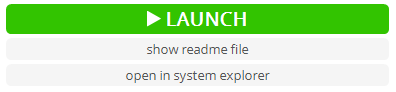

## STEP 4: Get Familiar with and start Eclipse

Since this is your first time running Eclipse here are a couple of things you want to know.

*If you are using a school computer,
make sure that you change the workspace
to a **Comp 55** folder inside of your **Documents** folder.*

When you double click eclipse,
after seeing the splash screen you will be greeted with the image below.

Eclipse likes to use the word ***workspace*** to mean the location where you store all of your code.
Think of it as the parent or base directory.
It breaks that directory or workspace down into ***projects***,
which is the code you'd write for different assignments or different projects.
Each project gets a directory,
you can think of the project as the solution from C++ or Visual Studio.
Eclipse allows you to have different workspaces and switch between them,
which is why it asks this question.
Go ahead and pick the directory where you want your projects to live on your hard drive.
**Click the checkbox to use as a default, and then click Launch.**

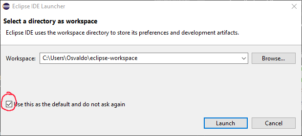

Once clicked and Eclipse takes a bit to start up,
Eclipse will then jump you to a screen that looks something like this:

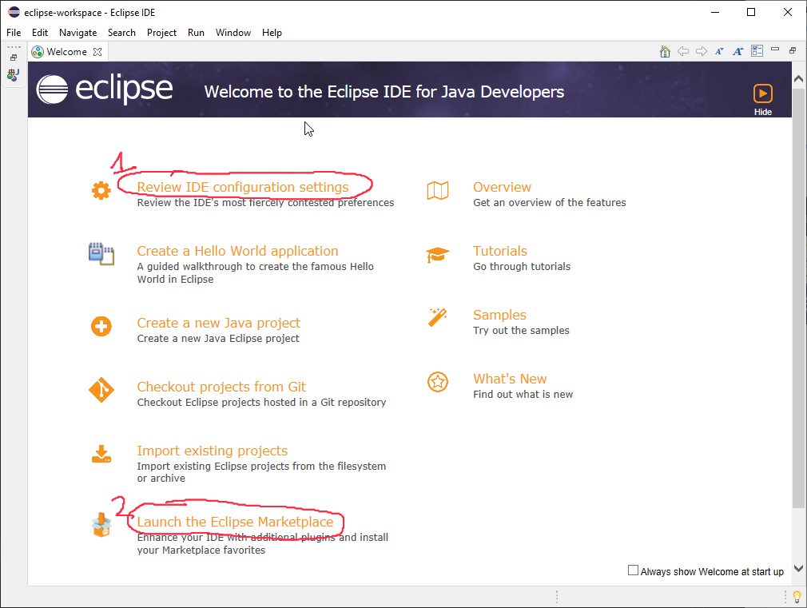

### Reviewing IDE configuration settings

Since all of you have had some previous experiences with other IDEs,
Eclipse allows you to review some settings that depending on how you work you may want to change.
In case you are curious,
these are the options that I ended up with in the end.

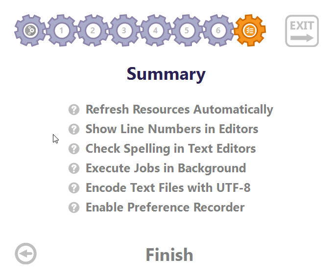

The next thing we are going to do is change Eclipse's appearance.
I have been using eclipse for a long time now and did not change this until this year.
Eclipse is written in Java and so it does not have as clean of an interface
as some of the other programs that you have grown to love by now.
Nonetheless,
remember, this is open source,
eclipse has been used heavily in the industry
(and I'm sure you've probably come across at least a few open-source projects
that just don't look as pretty but get the job done).
I would not play around too much with the colors,
but I will walk you through this one option because it will make it easier to follow along with these labs
if you change the appearance to match mine.
**Please follow the options here to get full credit
for the image you upload for credit at the end of this lab**

<!-- ### OPTIONAL: If you prefer the standard theme, skip to
[Step 6](##step-6:-let's-get-a-hello-world-going.).

You don't need to download this from the Eclipse Marketplace if you prefer the default theme,
but understand that most of the pictures
that we have in the tutorials will use the theme we're asking you to download here.
-->

## STEP 5: Installing Darkest Dark Theme

Once you are back you should be at the main page where we clicked to review the IDE preferences.
Go ahead and [click here](https://marketplace.eclipse.org/content/darkest-dark-theme-devstyle)
to open a webpage on the eclipse marketplace for the darkest dark theme.
The eclipse marketplace is a variety of third-party add-ons for Eclipse.
Here what you are going to do is to drag the install button into your open version of eclipse,
as the image below shows.


Once it finishes loading, follow the next set of images to *uncheck the CodeTogether bundle*.
You'll have to accept another license agreement by picking the option before being able to finish.
**Be sure to uncheck the *Devstyle with CodeTogether* bundle option,
and watch the gif a few times.**


Once it finishes installing,
Eclipse will ask you to restart eclipse to apply the software update,
click **Restart Now**

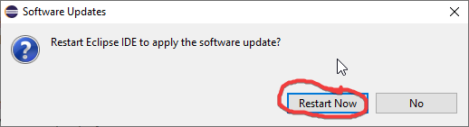

Eclipse will close and start itself up again.
Once it finishes you'll be greeted with this screen.

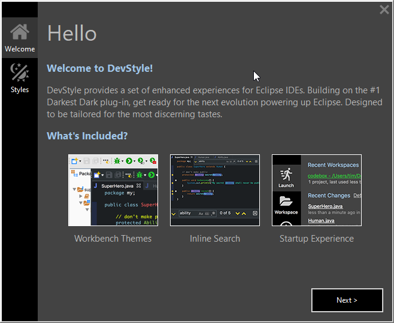

Go ahead and click next.
You'll then be presented with some options.
While your preferences are up to you,
to match this website's color scheme and the labs,
you will start this lab by following the directions here.
After you submit your picture,
then you can change the color scheme to your heart's content
(That is a rabbit hole though, so you can see how to do this later).
While you can change the color scheme to whatever you want,
just know the icons and any future screens you see may differ a little bit from what I have.
**Please do not spend more than 10 minutes looking at all the color combinations
after finishing the lab**

Once you click next,
you may get a scary-looking screen about windows defender possibly getting angry with you
about directories that Darkest dark will change and offers a fix.
I did just say *Fix Automatically*.
(I'm not sure what happens if you click skip)

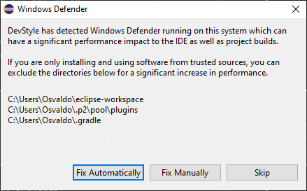

If you do allow it to fix automatically,
you'll have to allow for elevated privileges from Genuitec LLC,
which is the maker of Darkest Dark.  

Then eclipse will fire up with Darkest Dark one last time to ask you about your options.
I left all of this the same,
except for checking the box "Show breadcrumbs",
which just helps with navigation,
then finish.
Once you do,
you'll see the same launch screen as before,
but if you picked the theme,
you'll see some of the windows in a different color.

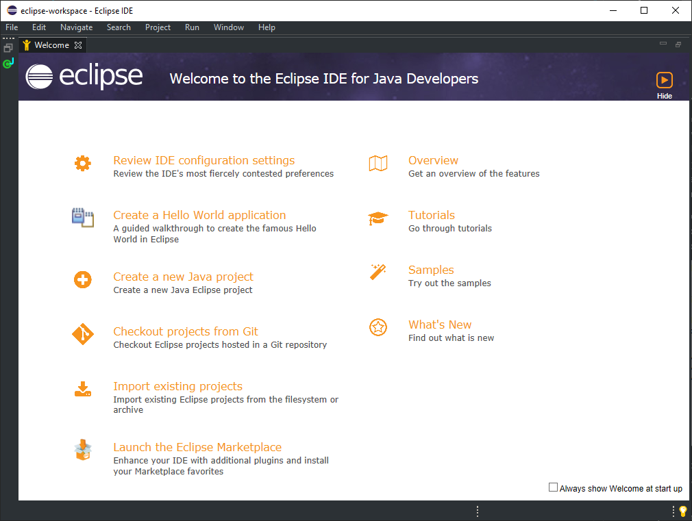

If you didn't already,
go ahead and click hide,
and you'll now be shown your new workspace.

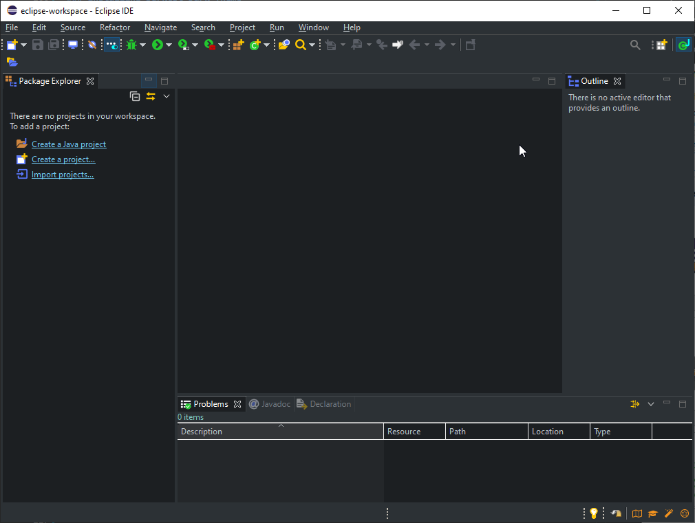.

If you didn't end up switching to this darkest dark theme,
then your eclipse would look more like the image below.
This is from a previous version,
so the windows open may be slightly different.


Eclipse describes the different panels that you have as **windows**.
The left window is called the package explorer,
where you will have all of your projects listed,
and the middle window will bring up your code.
Eclipse is different than Visual Studio in that when you start Eclipse,
all of your projects will be listed,
which I think makes it easier for you to look at past projects and explore other files you have written,
in case you need to look back
at anything.

## STEP 6: Let's get a Hello World going

To start programming in any language,
it's best to start with a simple thing like "Hello, world",
so let's do that.
Go ahead and right-click on *File->New Java Project*.
Java Projects are very similar to the Solutions you had in Visual Studio.
Watch the video a few times and then follow along with all of the steps.


Give your project the name *Hello World*,
make sure that you uncheck the module-info portion, and then click **Finish**.
You'll then see a project named Hello World on the left in your package explorer.

Now,
Right-click on the project name (HelloWorld) and then go to *New->Class*,
(this can also be accessed from the file menu *File->New->Class*)

This takes you to a window with a lot of options.
Look at the small animation below to check the correct options.


In Java, class files are where you will write your code.
Rather than having separate .h and .cpp files like in C++,
Java just has one file,
the .java file, which is also referred to as a **class** file.

Make sure that you follow the options in the animation,
which have eclipse write a little bit of code for you
so that you don't waste your brainpower on tangential tasks.
Eclipse will make a main method for you.
We may go over other parts of this,
but for right now,
writing in the name for the class and selecting the *`public static void main`*
option are the only two things you need to do before you click **Finish**.

Once you do, you'll get the code at the end that you see in the image above.

## STEP 7: Write and Run

Notice that the file Hello.java is now your HelloWorld Project.
That file has also been opened in the editor,
where it has a few words.
```public class Hello``` just lets the computer know that you are creating a class.
All java files are class files;
the name after ```public class``` must match the .java filename.
If you change it,
(like we did below to say *Hello1*)
you will be greeted by a nice red squiggly.
Hover over the squiggly to get the quick fix popup shown below.


Notice the quick fixes.
These are options you can click on to have eclipse do little tasks for you,
like changing Hello1 back to Hello,
or renaming the java file as Hello1.java.
Click on whichever you see fit.

Once you're done,
inside your main,
I want you to type:

```java
System.out.println("Hello, World!")
```

That is like the standard C++ ```cout``` statement,
except you provide ```println``` a string.
Eclipse may start giving you suggestions right away and tell you that code recommenders are enabled,
which is a nifty little feature for later.

After typing the line,
go ahead and right-click on your java file, and head to *Run-as->Java application*,
or you can just click the *Run* 
in the menu up top.
The super handy keyboard shortcut here is
***Ctrl-F11.***
If you haven't saved,
you'll get a popup asking if you want to save like this,
without the arrows but **make sure it is checked**

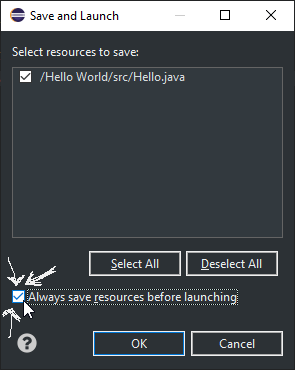

Again, here I would check the box at the bottom to always save resources before launching,
and click that you want it to save before running.
If you didn't get the popup,
add an exclamation point to *Hello, World!* and then run it again without saving.
***Please make sure that you are reading and following these steps.***
If I see that you haven't completed this step in the future,
expect some scorn from me.

Once you click OK you'll get the console up and running,
which will show on the bottom of the screen.

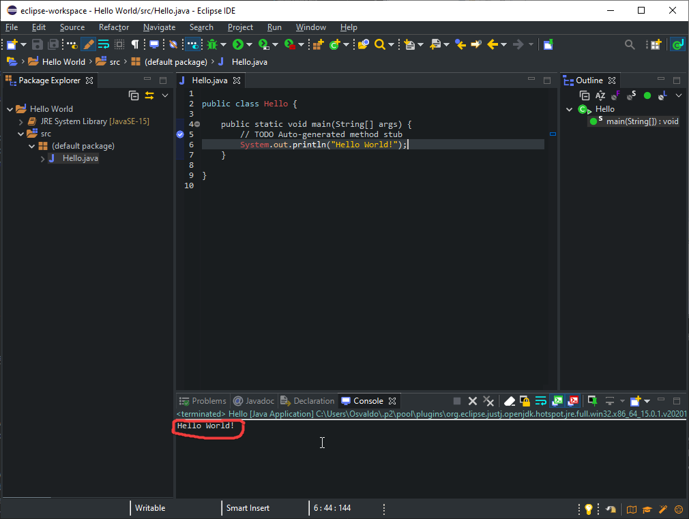

Congrats you've written and run your first Java application!
Java doesn't have a separate compile and run step as you had in C++,
it's all combined into one step.
Like I mentioned to you before,
the whole colors thing is a big rabbit hole.
If you notice in the picture that I ran,
the text that should be colored is not,
which may happen.
That is ok.
Once you start editing it again it will re-apply the color scheme.
But to be completely in line with this class and the color theme,
we are going to do one last set of steps.

## STEP 8 - One Last Customization of the Color Theme

I will try to make this last color theme
match as much as possible the site on which these labs are hosted,
with a couple of added preferences 
to keep it in line with some of the things that I've seen with Eclipse.
So to that end,
I'd like you to **[download this file](lab1media/media/COMP55LabColorScheme.xml)**
which you'll have to do by right-clicking and saying *Save link as...*.
Make sure you have the XML extension when you save the file.  

Then once you have that,
you're going to go to *Window->preferences->DevStyle->Color Themes* for PC
or *Eclipse->preferences->DevStyle->Color Themes* for Mac.
Once there I made two changes.
I decided I wanted my icons to be a little bit more subdued,
so I went with the pastels option.
More importantly,
let's get the color scheme to be closer to the theme here on this website.
**Import the XML file you downloaded and then click *Apply***.
Eclipse will ask to restart and once you do,
you'll notice that the colors changed
and have the same style as the final ones in the static image below.


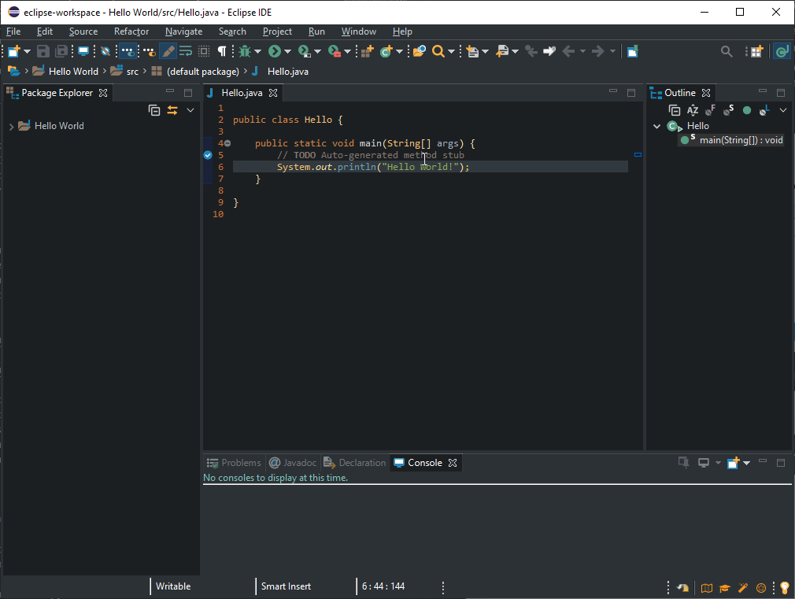

While you are in those preferences,
there is also a DevStyle privacy option that should you wish, you can opt out of.
I will only be supporting these colors, so in the future,
all guides will be using the DarkStyle with this XML layout and the pastel icons.
If you wish to go with another scheme,
I will not answer any questions about where those icons are.
Please again,
I can't stress this enough,
do not spend more time trying to pick colors now.
You can do that at the end once you are finished with your solo assignments.

## STEP 9 – Submit confirmation by uploading a picture to Canvas

To get credit for this lab,
submit an image of your entire eclipse running this hello world program to canvas,
but using your name instead.
The image should be of the program,
similar to the one in the image above,
and the source code should be shown with the step 8 color scheme.
However, to get full credit:

1. **use** a for loop
2. Make sure the java file is showing
3. Ensure your program's for loop repeats the salutation three times.

So it would be something like:

```text

Hello, PutYourName Here!

Hello, PutYourName Here!

Hello, PutYourName Here!

```

But with your name there instead.

If you don't remember how to do a ```for``` loop,
here's a snippet from [Princeton's java cheat sheet](http://introcs.cs.princeton.edu/java/11cheatsheet).


Also,
if you're not sure how to get an image,
use the **Snipping tool** or **Snip & Sketch** for windows
(Search for it in your windows menu).
If you're on a mac,
type: *⌘ + Shift + 4*.
Or just google *take screenshot window mac* and the instructions will come up.

I encourage you at this point to try to work on some of the coding bat problems
or other work that you've done before to get them to work in java.
Try to make some functions, declare an array, etc.
You'll notice all of those things are very similar to what you've done before.
Unfortunately,
there is no equivalent to ```cin``` in Java that is as simple and easy to use,
but we'll talk about how to get some additional interactivity in the future.
