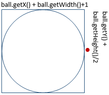
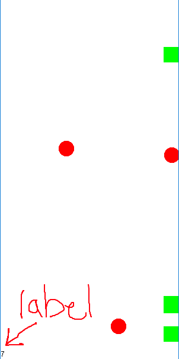

# Timers Lab

In this lab you'll start to get an appreciation of what a timer is, how
it works, and how we can make something that is pretty cool using it.

For this demo we're going to start with a very basic timer. You'll be
able to get timers lab by checking out the repository from github here:
<http://go.djosv.com/timer> . Once you accept the assignment, make sure
to from eclipse use the [***File-\>Import-\>Git-\>Projects from Git*** process](lab8media/media/importrepo.gif) that we outlined previously, [making sure to select the appropriate actions as you move through](lab8media/media/importfromgit.gif). Be sure to read the entire
document, as I'll be asking you to commit and push at various parts
while you're working on the project.

## What is a timer?

A **```Timer```** is a Java class whose sole responsibility is to wake up
every X milliseconds. You end up specifying how often you want a timer
to wake up. From an analogy standpoint, it's very much like a repeating
alarm. Since a ```Timer``` is a class, to create one of these alarms, we
have to follow three steps.  

## The Three Step Checklist Reference

Anytime you create a timer, you'll need to do these three steps.  **Please read these steps and use this as a reference, we'll go through the actual steps later in the lab.**

### 1. Create a timer object

We create timers using similar syntax that we've used previously to create other Java objects:

```java
import javax.swing.*;
Timer someTimerVar = new Timer(1000, objectToBeWokenUp);
```

* Make sure that you're importing the ```javax.swing.Timer``` class. There are multiple classes that are named ```Timer```.
* Instead of writing ```import javax.swing.*;```, remember that you can use ***Ctrl-Shift-O*** to have eclipse add the necessary imports for you.  You may need it below for the class, ```ActionEvent```.

There are two arguments for a ```Timer```:


1. The number of milliseconds that should pass before it wakes up

  * ```Timer someTimerVar = new Timer(1000, objectToBeWokenUp);```
  * Number of milliseconds = **1000 milliseconds**
2. Which class should be woken up
  * ```Timer someTimerVar = new Timer(1000, objectToBeWokenUp);```
  * Class to be woken up = **objectToBeWokenUp**
  * ```Timer someTimerVar = new Timer(1000, this);```
  * Class to be woken up = **this** (The class that you're currently in)

### 2. Setup event handlers - ```ActionListener``` and ```actionPerformed``` - in the appropriate class

Any class that would like to be responsible party for
handling the alarm must implement the ```ActionListener``` interface.
The ```ActionListener``` interface has just one method:

```public void actionPerformed(ActionEvent e)```

So every time the timer wakes up, it calls the ```objectToBeWokenUp```'s ```actionPerformed``` method. The structure that you follow is very similar to implementing ```mouseDragged```, except that rather than you responding to mouse events, you are responding to events that the ```Timer``` is initiating.

*We don't want to spend too much time doing anything complicated in mouse events or in handlers like ```actionPerformed```.*

If you are curious, put a really large `for` loop that counts from 0 to a billion in ```mousePressed```, and
watch the program grind to its knees. It does this because java treats timers and mouse events as being very important, so important that it stops doing other things (like listening to other events) until those
handlers are finished. So what you do in each should be small, and not have too many nested for loops or very long loops, so that your program doesn't hang.

### 3. Call the timer's ```start``` method

```Timer someTimerVar = new Timer(1000, objectToBeWokenUp);```

While the new ```Timer``` line shown above sets up the
```Timer```, it does not actually turn the timer on.

To start the timer so that it repeatedly calls ```actionPerformed```, you must tell that
particular timer to start, by calling its ```start``` method. So to start the Timer, you'll see a line like this shortly after creating a ```Timer``` object.

```java
someTimerVar.start();
```

## MyFirstTimer.java

Let's go ahead and open up **MyFirstTimer.java** to start writing in the
code. Notice that here we have a simple ```GraphicsProgram``` with a
```GLabel``` added to the screen. If you run the program, you'll get a
simple window with a label that does nothing.

### Let's first start by creating a Timer in the ```**run**``` method

1. Name the timer anything you want

2. Have the 1<sup>st</sup> argument be ```1000```

3. Have the 2<sup>nd</sup> argument be **```this```**

    Having these two arguments means ```MyFirstTimer``` (```this```) will be
    notified every second (```1000```ms).

4. Implement the ```ActionListener``` interface.

   * Let's add ```implements ActionListener``` to line 8, as well as an ```actionPerformed```
    method.

    ```java
    public void actionPerformed(ActionEvent e) {
        //TODO add what we want to do every two seconds
    }
    ```

5. Move the label horizontally every 1000ms.

   * Go ahead and have ```myLabel``` move 5 pixels to the right, while moving it zero
  pixels in the y direction.

6. Make sure that you call ```start()``` on the timer you created in ```run()```.  

*If you added in all of these steps, you should see this when you run the program.*


If you don't see it move, make sure that you have done the steps we outlined above.  

### Let's create a private variable ```numTimes``` that keeps track of how many times ```actionPerformed``` has been called

It's important have a variable that keeps track of how many times ```actionPerformed``` has been called.

To do this in ```run()```, make sure to initialize that number to 0, and
increment ```numTimes``` at the start of ```actionPerformed```. Now just for fun, let's
change the text of the label so that it updates the label with the
```numTimes```, we can do this by calling ```setLabel``` like
this:

```java
myLabel.setLabel("times called? " + numTimes);
```

When you run the program again, you'll notice the text will slowly move and
will also update every second or so with the number of times that it has
been called.


The **Timer** objects in java have a lot of flexibility, and so I
encourage you to later look at all the ways you can use and leverage a
timer. But for now I want to direct you to two methods:

* **```stop```** (Stops the timer)

  * Stops the timer

* **```setInitialDelay```**

  * Takes an integer for how many milliseconds you want to delay before
    constantly running the timer.

It's best to add the delay before you call ```start```.

### Add a three second delay before the timer starts

While the concept of **stop** seems simple enough, it may not always make sense as
to when or who should be able to make the timer stop.

1. Add a call to stop the timer in ```actionPerformed```.

2. We declared our Timer as a local variable, switch the timer to be an instance
variable instead.

3. Use an ```if``` statement to say that we want to stop the timer
when ```numTimes``` has reached 10.

* ```actionPerformed``` is called many times, to we want a special time when we would want to stop the timer.

In this situation,  When you run your program, you should get to a screenshot that looks like this (if you add a return statement, then you may end without it moving one final time)


Once you have that, **commit and push your work**, make sure to **put a
brief message in the commit that explains the three things a timer needs** and then move
on to the next task.

## BallLauncher.java

So far, we've mostly been showing the basics of Timers, however, Timers
end up being extremely useful in many situations, since what they allow
you to run **threads**.

* Threads are separate processes that run independently from the program's main loop.
* If you want to learn more about threads, follow this [link](https://www.iitk.ac.in/esc101/05Aug/tutorial/essential/threads/definition.html#:~:text=Definition%3A%20A%20thread%20is%20a,tasks%20in%20a%20single%20program.)

This is going to be
useful for creating animations or having any movement so that the
movement and animations can be made independently of what the user
clicks on or interacts with.

Similar to mouse events, the timer events happen independently of what
is going on in other parts of the game, this allows us to create some
very flexible & awesome programs.

*While it may be tempting to have many different timers, I suggest for now that you have a single timer and call it more often.*

For example:

If you only need something to happen every second (1000ms) and your timer is happening every 500 ms, just have a ```numTimes``` variable and check to see if ```numTimes``` is even.

Let's go through a slightly more complicated example by opening up
**BallLauncher.java**:

If you run at this point, what you'll notice is something similar to our
earlier interactivity lab. When we are clicking the mouse button, it is
making a ball at the same height as our mouse cursor but on the left
hand of the screen.

For example, if you click in different areas of the screen, you'll notice red circles on the left hand side based on where your cursor is when you click,
like so:


The code that is in the file is the following:

```java
public class BallLauncher extends GraphicsProgram {
    public static final int SIZE = 25;
    
    public void run() {
        addMouseListeners();
    }

    public void mousePressed(MouseEvent e) {
        GOval ball = makeBall(SIZE/2, e.getY());
        add(ball);
    }

    public GOval makeBall(double x, double y) {
        GOval temp = new GOval(x-SIZE/2, y-SIZE/2, SIZE, SIZE);
        temp.setColor(Color.RED);
        temp.setFilled(true);
        return temp;
    }
}
```

### Review of the Code

Most of this should be a refresher, the one thing to notice is how we
are using a constant ```SIZE``` to create a circle. Remember that since we want the circle to appear at the center of where we click, we are subtracting ```SIZE/2```, from where we click, which will cause where we click to be the center of the circle instead of the top left. ```makeBall``` is just a convenience
method to help make a red filled ball. What we are going to do is to
move all of the balls that are created to the right. To start this, we
want to make an ```ArrayList``` of ```GOval```s, which we can call ```balls```. Go
ahead and declare a new ```ArrayList``` as a private instance variable at
the top, initializing it in ```run```. The other thing we want to do is
after ```makeBall``` is called, we want to add that ball to our list of
balls by calling the ```add``` method that pertains to the ```ArrayList```. Visually at this point, nothing would have changed if you run the program.

Let's add something visual to our program.

### Setup a timer that moves all of the balls in our ```ArrayList```

1. Make two more constants

   * ```public static final int MS```

   * Just like the ```SIZE``` constant

   * Stores how often we want the timer to be woken up (set it to 50)

   * I called it ```SPEED```
     * Tells us how much to move each ball by each time (set this to 2).

2. Make a **Timer** object and start it.

   * (Can't remember how to do this?  [Go back and review.](##myfirsttimer.java))

3. Just like in the first file, you will make BallLauncher the one to respond to the timer.

   * Our ```actionPerformed``` method will be fairly simple. We will have it iterate through the balls ```ArrayList``` and move each one by SPEED in the X direction and 0 in the y.

  * If you haven't tried doing a for loop using the **:** operator to iterate through a list, now would be a good time to try.*

  Once you handled the ```actionPerformed``` event by moving all the balls in
  the list, created and started the timer, you should run your program
  again, and click around and notice how you have something that feels
  much more dynamic and expressive\!

  If you are still curious how my version behaves (or you just want to observe your professor's antiquated clicking habits for 15 seconds), you can [click here](lab10media/media/ballnextdemo.gif).

4. Once this is working, you should **commit and push your code** again

   * Use the message **"all balls move across the screen"**.

If it's not behaving how you would expect, review the [three step checklist above](##what-is-a-timer).

### The last thing we are going to add is a limit to the number of balls that someone can launch at any given time

While there are many ways to do this, what we are going to do is simply:

* Cycle through the list of balls

* Look to see if any have an x coordinate that is less than 100
  * By calling ```getX()``` on a single ball
  * If there is a ball that has an x coordinate that is less than 100, then we know ```mousePressed``` was just recently launched, so we can just return from ```mousePressed```, and ignore the user's press of the mouse button.  

Doing this will cause your program [to behave as if it has a cooldown, like this gif shows](lab10media/media/ballcooldown.gif).

Once you fix that and **read the note below**, **commit and push** this next change.

* As part of your commit, *in your own words*, ***write a sentence or two in the
commit message text that would describe what would happen if you were to
use ```pause``` in an ```actionPerformed``` method.***

***"OK, Bye ```pause```!"***

### Note

One thing some of you might have
remembered is that ```GraphicsProgram``` has a ```pause()``` method that would
simply pause the program for a certain amount of time.

**Why do we have to go through all this trouble of doing timers if we can simply call ```pause()```?**

The reason is because of how mouse events work together with
animations. To make things animate and still respond to mouse events,
all of those events need to be done in a way where the computer can
respond to both and not get confused.

If you think about our discussion,
what would happen when you click the mouse while the program is going
through the list and moving all of the balls? In the case of having the
timer, the program will actually wait until it is done with the
```actionPerformed``` before it calls ```mousePressed```, so that it feels like
both work at the same time (aka concurrently). Because mouse events and
our timers both involve the user interface, java will know enough that
it can coordinate between the two. However, if you decide to use
```pause```, java does not realize that you are just pausing to add some
pizzazz to your movement. **So if the mouse is pressed, it will interrupt
whatever loop it is in at the moment.** If you try to replace your timer
with a pause and a while loop, you'll notice that once you run the
program and click a couple of times, you'll get a ```ConcurrentModificationException```.

This exception means that you are
trying to modify the list of balls, while the program is currently
cycling through and moving them, something that you cannot do when you
use the for loop with the ```:``` operator. I've given the bad example below
of what your run shouldn't do (unless you want to get the ```ConcurrentModificationException```).

```java
// This is buggy code
public void run() {
    balls = new ArrayList<GOval>();
    // movement = new Timer(MS, this);
    // movement.start();
    addMouseListeners();

    // Having this while loop and for loop is no bueno! 
    while(true) {
        for(GOval ball:balls) {
            ball.move(SPEED, 0);
            pause(MS);
        }
    }
}
```

## DodgeBall.java

Alright, so now that you have some experience let's try to make a very
simple game by using timers and some randomness.

We're going to add a
little bit to our ball launcher game but rather than just add on top of
that one, we're going to work with a copy of it.

1. Open **DodgeBall.java and run it**.

  Notice that it works the same as BallLauncher at the
  moment. What I've done is added a couple of additional convenience
  methods. With our newfound ability to launch balls, let's try to have
  our users aim those balls at others.

  To help us with this, I ended up
  adding an ```ArrayList``` of ```GRects``` called ```enemies```, which are just going
  to be green rectangles. I have already added the code to create the
  empty list of enemies in ```run```.

  There is also an analogous ```makeEnemy```
  function which will create a green square to represent our enemies. To
  make it easier to use, I only have it provide a **y** coordinate, and
  the method automatically places the enemy on the right hand side of the
  screen.

  You'll also notice that we have a ```RandomGenerator rgen``` that we
  have created. One last refactoring that you'll see is that I created
  both ```addABall``` and ```addAnEnemy``` functions, each of which will call
  their respective ```make____``` functions, and then add them to the
  screen and their respective lists.

  Lastly, I moved the ball movement for
  loop into its own method, ```moveAllBallsOnce()```. The last thing is that you'll see that I
  have an ```if``` statement that acts like the cooldown you wrote earlier.

2. Call ```addAnEnemy``` in our timer.

   * However, we don't want to call ```addAnEnemy```, everytime ```actionPerformed``` is called, but rather every once in a while.
   * This is where something like that ```%``` operator works great if we add a ```numTimes``` instance variable that works similar to what we implemented in the [first timer example](##myfirsttimer.java), (feel free to initialize ```numTimes``` to ```-1``` if you want the enemy to appear faster, or to decrease it from 40 to say 5, [like I did here](lab10media/media/greenpopulate.gif)).
   * Because we are keeping track of the number of times
  ```actionPerformed``` is called, we can simply say every 40<sup>th</sup>
  time, go ahead and make a new enemy,

  ```java
  if(numTimes % 40 == 0) {
      addAnEnemy();
  }
  ```

   * Normally I would want you to make 40 a constant, but you can leave it
  like this for today (or you can just click on 40 and then click
  *Refactor-\>Constant* in the menu).

   1. Once you add these lines of code in
  ```actionPerformed```, run the code again and watch the green squares slowly
  take over\!

4. When the squares appear **commit and push your code again**
with the message **"enemies populate screen regularly"**.

  You can still have circles appear but right now they will just run over
  the squares. We'll get to that in a bit.

### The next thing we want to do is to make the enemies have some type of movement

1. Have each enemy randomly move between say a -2 and +2

* Use ```rgen.nextInt``` to give us a random number between these and then have it move this much.

2. Leveraging the code we have for
```moveAllBallsOnce```, create a method calls ```moveAllEnemiesOnce``` that will
cycle through the list of enemies and call move on each one, moving it 0
pixels in the ```x``` direction and a random integer (```SPEED```) in the ```y```
direction.

3. Call ```moveAllEnemiesOnce``` in
```actionPerformed```.

Once you run the program now, the enemies will come
to life\! [Here's a version where the enemies are being generated more quickly, but the movement is correct](lab10media/media/wigglymoves.gif).  

They will be very wiggly.

4. At this point you should **commit and push again,** with the message **"added wiggly enemy movement"**.

## Final required addition

At this point I'm guessing that you probably want some way to get rid of
these green squares using the ball. While there are many ways for
checking to see if a ball and rectangle overlap, that's not really part
of this course, so I'm going to explain a very simple way of checking to
see if the ball may have hit a square.

One thing you can do is that for
every red ball, when it's their time to move, check a point just outside
of the ball and call ```getElementAt```. If the object that is given back is
an ```instanceof``` a ```GRect```, we could say it's an enemy and then make that
enemy disappear. In this, case we'll want to check the red point in the picture below:



If it turns out that we do have potential enemy in front of us (by
calling ```getElementAt``` using the measurements shown above), then we want
to remove it not only from the screen (by calling **remove**) but also
from the ```enemies```. Once you run this you should be able to make the
green squares disappear by having the balls hit them\! [You may also notice that some balls will not completely disappear unless the ball collides with that midpoint](lab10media/media/greenfinal.gif), but that is sufficient for this lab.  Once again,
**commit and push** since you've added something cool, in the commit
message detail what it is you added.

To get full credit for this lab, you should have your program make the
squares disappear **and follow all the directions on when to push your
code**. Make sure to push your final changes to your repository by the
deadline.

## Advanced reading on multiple timers

If you're curious, [here's an explanation on how to implement multiple timers in your program](10-A-Mult-Timers.html)

## Bonus

### *"Hey! This is almost a game!"*

While this does not yet have the polish of some of the games you may
tend to play, there are many things you can do to make it more polished.
For example, you could add a label that is continually updated or set in
```actionPerformed``` that would update the number of green squares that you have removed from the
screen (see version on the left). Or you could instead (or in addition) add in checks to say if there
are more than ```MAX\_ENEMIES``` on the screen, then stop the timer, remove
everything an add a message telling them they lost. Lastly, it's fairly
simple to give them some indicator of progress or score by simply on the
lose screen presenting them with the ```numTimes``` variable, which is in a
way, representative of how long they were able to last in playing the
game (see version on the right). Hopefully you can see how easy this is to extend and how much fun
you can start to have in creating these things and making the game your
own, with your own changes. Hopefully you see the powers that timers can
have in making your programs more dynamic and more expressive.


