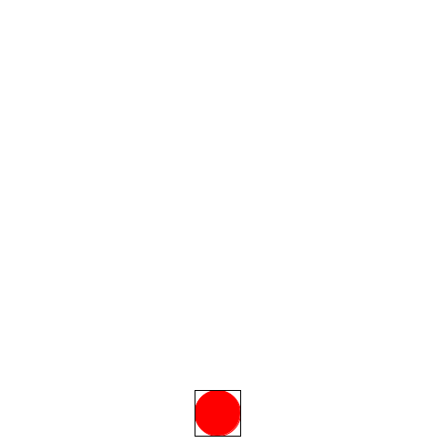
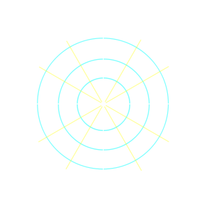
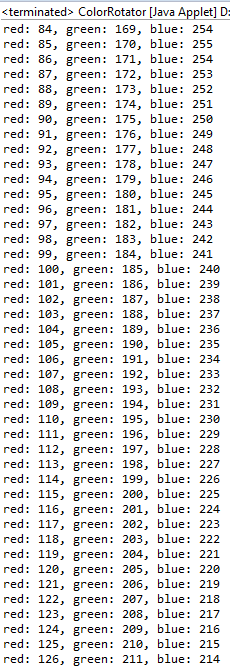

# Decomposition Lab

- [Decomposition Lab](#decomposition-lab)
    - [Let's get movement going](#lets-get-movement-going)
        - [Adding an oval to the screen](#adding-an-oval-to-the-screen)
        - [Animating the oval to move in a straight line](#animating-the-oval-to-move-in-a-straight-line)
        - [Animating the ball to move along a circular path](#animating-the-ball-to-move-along-a-circular-path)
        - [Polar coordinates](#polar-coordinates)
    - [Changing colors](#changing-colors)

Today you are going to recreate this animation and behavior:


To achieve this,
today we're going to provide advice on how to figure out where to start with a large problem.
It comes down to a technique called **decomposition**.

**Decomposition** is the act of taking a large problem and breaking it down into smaller parts.
If you're not sure how many pieces to break it down to,
start with breaking it down into two or three that seem to be nice and separate sub-problems.
From there you can take each of those parts and if they seem complicated,
break those down into smaller pieces too.
This is a technique that you can use
once you know what the problem is or what you are trying to build.

While this lab will hopefully give you some practice in decomposing problems into smaller parts,
I'm also going to use this opportunity to discuss some aspects of programming
that some of you may not have had much interaction with
(yet may be useful for your projects),
like custom colors as well as movement using polar coordinates.

For this lab it may make sense to break down the problem initially into two parts:

1. the circular movement,
2. the color changing.

Now,
if instead of asking you to build the whole thing,
what if I asked you to build one of the two parts?

 Just circular movement | Just change the color
 :----------------:|:-----------------:
 | .

Either of those by themselves is less daunting than the whole.
Breaking problems down helps us more easily tackle a hard project,
and the art of finding a good way to break them down is important
and one that you should practice when programming from here on out.

Decomposing programming tasks not only makes it easier to tackle the problem,
but it also makes it easier to test -
frequent testing ensures that we are on the right track.
In a way,
you are following the
***Test Early and Often***
mantra from unit testing
(more on that to come).
The trick is to test things that feel tricky earlier on,
so you don't wait until the end to see if they work.
Testing only at the end makes it harder to figure out what is wrong.
So let's start with the circular movement
(though if you were doing this yourself,
pick whichever one is more prudent).

Hopefully what I'm asking you to make today isn't trivial.
My true hope is that you don't immediately think *"oh this is easy"*.
Even if you do feel that way,
it shouldn't feel *extremely* trivial,
especially if you take the
**added challenge of making a solution that doesn't use any if statements or conditionals**.

## Let's get movement going

For this lab,
to get straight to working on the contents,
make sure you have downloaded the **ColorCircleDecomp.java** from canvas,
which you can place in your **timers lab**
project by copying and pasting or by moving it into the project's folder via your OS and then
*right-clicking* on the project and hitting *refresh*.

Since the circular movement might feel complicated in and of itself,
let's break that down into three steps.

Let's start with the first.

### Adding an oval to the screen

Open up **ColorCircleDecomp**
after it's been added to the project and make a private ```GOval```,
which you can name ```ball```.
Create the ```GOval``` object in ```run``` (place it at 300, 300,
or anywhere and use ```BALL_SIZE``` as the width and height),
make sure to ```add``` the ball to the screen.
Run the program and make sure that you get a ball on the screen.


### Animating the oval to move in a straight line

Now for step 2,
on each ```actionPerformed```,
move ```ball``` by a pixel or two.
Don't' worry about setting the ball's color or anything.
Run the program and fix anything
to make sure that have a ball that is just moving across the screen continuously.
**Don't continue until you get the ball moving in a straight line across the screen.**


### Animating the ball to move along a circular path

Now with a ball that's moving,
congratulations! We are closer to our ultimate goal.
This is the beauty of decomposition,
and we feel better about accomplishing things.
Now,
let's focus on changing that movement to be circular.
*Do you notice how the circular movement feels just a tad more achievable
since we have already made some progress?*
While the circular movement may still feel tricky,
getting the ball to move across the screen with a timer shouldn't have felt insurmountable,
so we worked on that first to get that going,
which then makes the circular movement feel slightly less daunting.

To help you think about a circular movement let me introduce a little function
that is already a part of the acm graphics library called ```movePolar```.
Rather than dive into some huge explanation,
it's important to play around and to try to figure out behavior,
so...

### Polar coordinates

**Change the ```move``` that you have in your
```actionPerformed``` to ```movePolar``` instead**,
using the same arguments as you had in move.
If you aren't aware or don't remember polar coordinates,
**polar coordinates** are expressed using two values,
one is the *distance* that you want to move,
while the other is the *angle* that you want to move in.

If you haven't run the program yet,
run it again with ```movePolar```.
You should notice that it moves in a straight line,
maybe even in the exact same way as before.
Stop the program and change the numbers.
What happens when you change the numbers and try it again?
If you're not sure,
start by changing one of the numbers by 1,
if you don't get much of a result,
keep changing it by factors of 10 to see the difference.
Then work on changing the second argument.
Come up with explanations as you change a number and run it again.
**Once you think you have an explanation,
you can move to the next paragraph.**

For this acm ```movePolar``` function,
the angle is expressed in degrees from ```0``` to ```360```.
Look at this handy chart below to understand how the angles translate to different directions.



Instead of me trying to tell you which argument is which,
use some different values,
like **45** in the different arguments for ```movePolar``` to figure out order of the arguments.
Once you've figured that out,
then think about this:
***what would happen if we ask the ball to move the same distance around,
but keep changing the degrees each time***?
What would happen?
Try not to introduce very large numbers in each and play with it until you get a circle.
Once you do get a circle,
you can if you want to do the challenge,
think of using the remainder operator to reset the angle back to
zero once it goes past 360 degrees.
Otherwise you can use an if statement if this all feels very rough.

Finally,
you can then tweak the values of the circular movement
so that you can get the oval to start at the bottom of the screen
and to move in a circular movement around the screen to better match what was shown to you.
No need to have the square in the image above,
though you can add it if you want.

Now that you have that movement,
you can now go on to tackle the Colors!

## Changing colors

While smooth color changing has become all the rage recently
especially with the adoption of LED lights in EVERYTHING,
this wasn't always the case.
In fact,
slowly transforming colors used to generate a sense of awe.
For this lab,
let's pretend to be back in those olden times of yore
(you know, the early 2000's).
Before we start trying to change the colors,
we need to understand how colors are represented in computers.
For the most part,
colors for each pixel are represented using 3 values:
red, green, and blue -
where each value corresponds to the intensity of each of those three colors(RGB).
In computers,
you can adjust these three values to get different colors.
The intensity of each color is represented by a value from 0 to 255 in most applications.
For example,
you could open up a paint program or anything else that has a color picker,
and you would be able to see this change.
If you don't believe me,
spend a little bit of time on this
[HTML color picker from W3Schools](https://www.w3schools.com/colors/colors_picker.asp).

Look at the RGB values highlighted in the picture below,
which shows the intensities.
This example shows that for the color white,
you would have the value 255 in all three values of red, green, and blue.


If you are curious
what all the *f*'s are and the *#* prefix are in the section between the highlighted values,
that is just the representation or the HTML code for *white*,
which is also represented as three values,
except that those values are stored in hexadecimal format (Base 16)
where 10 is represented as *a,* 11 *b,* 12 *c*, etc.
So ```ff``` turns out to be ```255```.

Here's one more example which shows *blue*.
Notice that ```ff``` or ```255``` is only on the end,
which represents the fully intense blue component of the color)


Click on a couple more of the colors and you'll notice that they will
all end up being some combination of *red*, *green*, and *blue* values.
This also happens with LED lighting,
where you can actually see the differences in each of the LED markers
provide a different color based on their intensity of their red green and blue lights.
So if we figure out a way to gradually intensify red, green,
and blue values in their intensity and then have them gradually lessen,
then we could have the oval change into different colors in what looks like a smooth progression.

So now that we know that we can get essentially any color with these three different values,
rather than trying to immediately come up with that smooth change,
the program should feel tricky still,
which means we need to break down this part into even smaller steps.
**How would you break up the tasks into smaller chunks?**
Think about this for a minute before moving forward.

As for me,
some ideas are.

1. Just get the program to use some custom RGB color using the ```Color``` class,
   in which a ```new Color``` takes 3 integers to represent the red,green,
   and blue values for that color.
   You can then call ```setColor```
   on the ball with that new Color variable.

2. In ```actionPerformed()```,
   change the value slightly for the first value (red),
   so that it gradually increments from black to red.
   If you get an ```IllegalArgumentException```,
   that's OK,
   we will change that in the next part.
   Remember baby steps!

3. Have it so that you cycle back to zero to get out of the ```IllegalArgumentException```
   (this happens when you provide a value outside of the 255 range)

4. Comment out the ```setColor``` call and introduce a ```println``` statement
    where you print out the one value and comment out the ```setColor``` statement

5. Get the program to print out values from 0 to 3 and then back down to 0 in a zig zag format
    (if you want to be fancy,
    you can do this without an if statement at all
    - to try this,
    write down the numbers from say 0 to 7 and then start with 3,
    have it go down to zero and then have it come back up to 3.
    - If you think of using the mod operator and try to come up with a pattern,
    with enough time you should be able to find a calculation
    that you can use on an increasing number.
    Your program should run something like this

    

    And then it keeps going.
    It doesn't matter what it starts with,
    just as long as it keeps moving back and forth between 3 and 0 and doesn't go past that.

6. Change your ```println``` statements so that they go from 0 to 255 and then back down to 0.
    Run it long enough that you can check to make sure that you don't go past 0 or 255.

7. Use the calculation or value that you have
   that is being printed and place that in your ```setColor``` instead,
   which you may comment out now.
   This should have it now move back and forth
   between 0 and 255 using the color mode for that single color.
   Running the program again should have it move between black and red
   and black and red continuously without crashing.

8. Do that with the green and blue values,
   which will have it move from black to white to black

9. Change the values in green and blue so that they start at a different starting point.
    Since it's a collection of red green and blue values,
    have them all independently move,
    but have them start at different starting points for the colors
    (like 85 and 170).
    If you need to,
    it may make sense for you to go back to doing the ```println```
    statements so that you end up getting an output like this,
    then you can use those numbers as the rgb values in```setColor```.
    For an additional challenge do this without any if statements.
    Submit your resulting code in text format.
    Good luck!

    

Programming projects can get quite large and unwieldy,
so much to the point that you may feel *frozen* as to where to begin.
This paralysis doesn't just happen in programming *but in all aspects of life*.
I've often found that it happens to me
anytime there is something large enough
that I don't feel comfortable being able to say that I can accomplish it.
Having this feeling,
where you end up avoiding or delaying work,
can come from many factors,
some are just to protect yourself
(also called **self-handicapping**)
but other times it happens because you don't know where to start,
which decomposition may help you to get started on your project.

To learn more about self-handicapping,
here are some references:

- [Don't Sabotage Yourself from Harvard Business Review](https://hbr.org/2012/05/dont-sabotage-yourself)
- [Penn State's blog on self-handicapping](https://sites.psu.edu/aspsy/tag/self-handicapping/)
