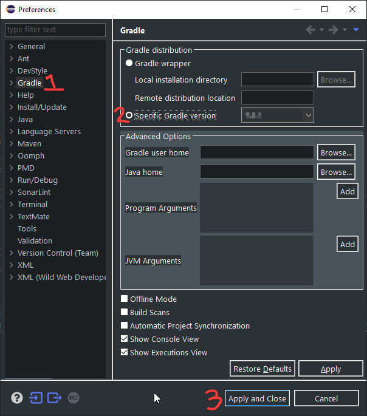
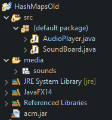
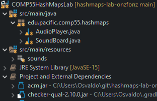
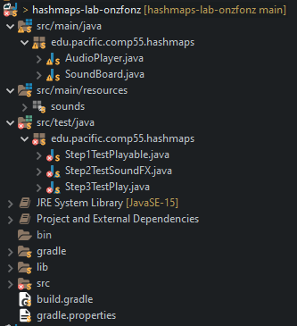
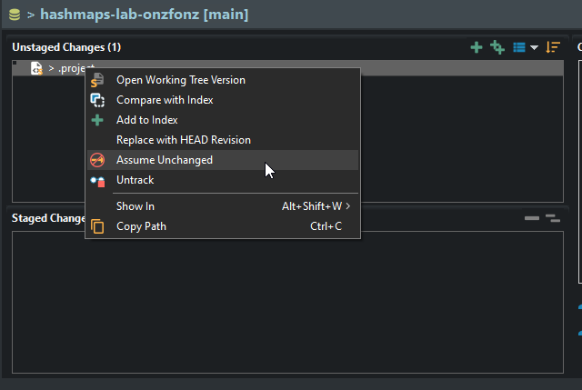
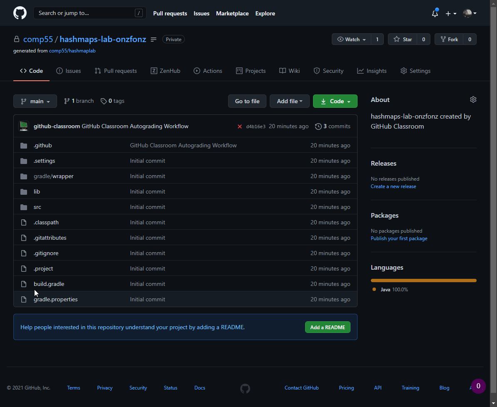
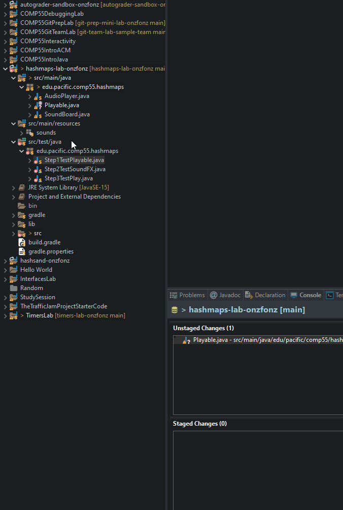
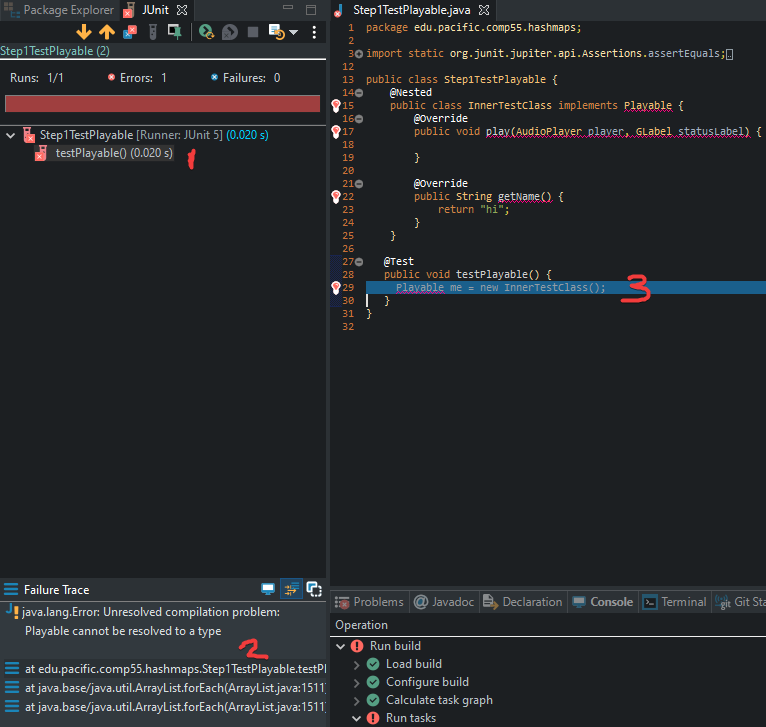
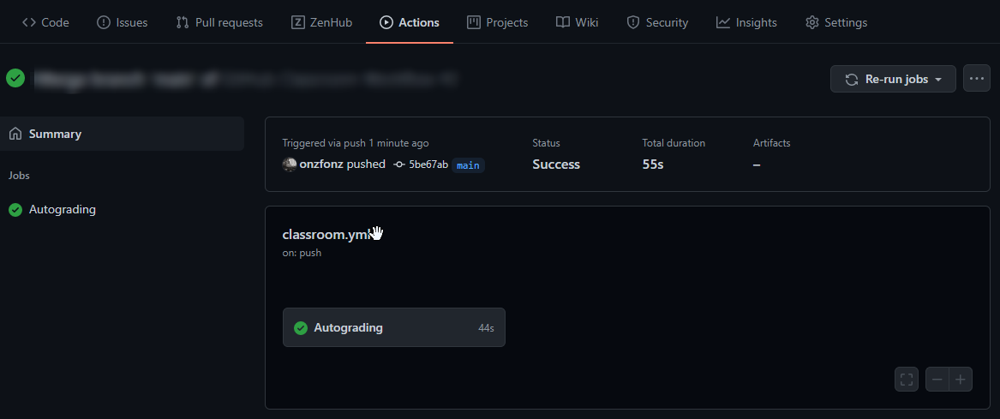

# Part 2 of the HashMap lab

If you didn't read part 1 of the HashMaps lab,
[go back to that lab](12-Hash.html) before continuing.

- [Initial Setup](#initial-setup)
- [Quick detour on Gradle](#quick-detour-on-gradle)
- [Reintroduction to Github](#reintroduction-to-github)
- [Let's get this party started](#lets-get-this-party-started)
- [Steps to take](#steps-to-take)
    - [Step 1. Create an interface called ```Playable```](#step-1-create-an-interface-called-playable)
    - [Step 2. Create a ```SoundEffect``` class that ```implements Playable```](#step-2-create-a-soundeffect-class-that-implements-playable)
    - [Step 3. Play some audio](#step-3-play-some-audio)
    - [Step 4. Setup the ```Hashmap```](#step-4-setup-the-hashmap)
    - [Step 5. Make ```GLabel``` and ```SoundEffect``` objects](#step-5-make-glabel-and-soundeffect-objects)
    - [Step 6. Link the ```GLabel```s to the ```SoundEffect```s](#step-6-link-the-glabels-to-the-soundeffects)
    - [Step 7. Finish Implementing ```mousePressed```](#step-7-finish-implementing-mousepressed)
- [Bonus](#bonus)

## Initial Setup

**Click the link shared with you on canvas to start this part of the lab**
and clone the repository into eclipse,
[just like you've done](lab8media/media/importrepo.gif) before in
[the other labs](lab8media/media/importfromgit.gif).

You will know that you are finished when you have in your repo something that looks like this:


If you instead have a red x or error,
you'll need to do one additional thing,
which is to go to ***Window->Preferences***.
Which will bring up the window shown below.
Follow the steps to select the ***Specific Gradle Version***
option from the Gradle submenu,
then click ***Apply and Close***.



## Quick detour on Gradle

**Make sure that your project folder looks like this** -
 -
notice the icon in the upper left.
That is something new that our projects will have as they use **gradle**,
which is an industry tool made for helping folks
with a variety of issues that occur with building projects.
We'll use it to help us manage additional libraries that you will need for your projects.
Using it will cause the project structure to change a little bit.

Your folder will not look like this exactly,
but once you open it up,
the project will be rearranged slightly.
Here's how the structure differs from before.

| old   |  new   |
| :-- | :-- |
| | |

If you notice,
most things are the same.
What we are gaining by using gradle is a way to automatically install particular libraries.
Remember how at the beginning of the semester
I had you jump through a bunch of hoops to install eclipse and change settings here,
or there,
and some of you have also had to work to fix your java build path for example?
**With gradle all of this is taken care of**.
Instead of fiddling with your buildpath in eclipse,
gradle uses a file called ```build.gradle```
that allows us to provide directions on what libraries are needed to build the project
and we could provide additional instructions on how to get the project to run.
For this lab and from here on out we need a library called **JavaFX**,
and so instead of having you go to a URL and download it
and then edit your eclipse environment
and finally cross your fingers that you downloaded the correct one,
***gradle takes care of downloading it and installing it for you***.
We need to start following gradle's conventions to make it easier on ourselves.
For one,
we will use this pattern of src/main/java to put our files into,
and we will name packages which is a good practice.
Packages are just folders where we group java files that have something in common,
similar to how you would use a directory to place files that make sense to go together.
While I did show this initial directory structure.
It turns out that your project will look more like this.

| project with gradle above | project as it stands now |
| :--: | :--: |
|  | |

There are many files at the bottom of the project that we will not discuss for the time being.
The only one we will need to pay attention to soon is the line
,
this will be the first lab where I will begin to provide you with small test cases
that you can use to ensure that what you are writing is following what we've specified.
You do not need to modify the tests or even open up the tests,
as you will develop everything on src/main/java.
Testing is super important,
and unfortunately, I don't do it enough,
but we will discuss this point in the future.
For now, simply know that there are some test files
that we will be able to run inside that folder.
Those test files are specifically meant to ensure that you've done the first three steps correctly.

If you notice,
you'll see that eclipse is noting a small change,
and your project will have a different project name,
that includes your GitHub handle.
*How can it be that there are changes already when you haven't done anything?*
If you open the git staging view,
you'll notice that .project has in fact been modified.
This is because eclipse has renamed your project and that differs from what was on git.
Normally we do not want to change the .project file
(some folks even advise against including it in the git repo entirely),
but we include it here to make it easier for you all to import your projects initially.
For now,
we will tell git that we are going to assume that ```.project``` has not changed.
Right-click on the file and select ***Assume Unchanged***.
That will remove .project from the Unstaged changes and take away the ```>``` sign.
*You may need **Assume Unchanged** for `.classpath` and the `org.eclipse.jdt.core.prefs` files as well.*



## Reintroduction to Github

You can confirm that .project has in fact not changed,
by revisiting your repo page on github and clickong on the code section.
There you will see the .project file still says ```COMP55HashMapsLab```
instead of ```hashmaps-lab-onzfonz```.
This will also be your first experience using github actions.
**Github actions** is a special part of github
that will allow us to run tests every time that are code is committed.
We are going to use this specifically to make sure that tests can be run.
For us,
we have an autograder here that can provide you with feedback on your commits.
There is a faster way to get feedback that we'll provide below,
but this is a convenient way for those of you who want to make sure that you go beyond
"it works on my machine".



## Let's get this party started

What we are going to build today is an accessory that is a
very 🙃 *essential* 😏 part of a DJ set 🙄.
We are going create a very simple **Sampler**,
aka a **SoundBoard**,
where we will create a couple of different ```GLabel```s
and we are going to play sound effects when each of those different
 ```GLabel```s are clicked.
If this doesn't at all make sense,
it will once you start hearing the sounds,
as they will make you reminisce about those days at a party ✨🎉✨.
To start you off,
you'll have two classes,

1. ```SoundBoard```,
which is a ```GraphicsProgram``` skeleton with a ```statusLabel```
2. ```AudioPlayer```,
which is a pretty nifty class that you'll be able to use to play mp3's.
All you'll need to do is to call the AudioPlayer variable
(in ```SoundBoard```, it's called ```player```)
and call the method ```playSound```.
```playSound``` takes in two arguments,
a *folder*,
and an *mp3*.
While you don't have to look too deeply in ```AudioPlayer```,
if you do decide to open it up,
you'll notice that ```AudioPlayer``` does in fact contain a ```HashMap```
that links a ```String``` (in this case, a *filename*),
to a ```MediaPlayer``` object.

The basic goal of extending the ```SoundBoard``` is to add two ```GLabel```s
and then when each of those ```GLabel```s is clicked,
to play a particular sound effect.
While we could create the labels and then have a gigantic ```if``` statement at the bottom
that would try to link a label to a sound,
let's leverage using a ```HashMap``` instead.
In order to help us with this,
let's first create an interface.
**After each step, please commit your changes with a short comment
as to what you did in the commit message.**

---

## Steps to take

Make sure you commit the changes as you go through.
To help you in making sure you are following along with the labs,
tests have been provided to help you ensure that what you are doing is in fact correct.
You can run these tests either in eclipse by opening up the src/test/folder,
or by pushing your code.

### Step 1. Create an interface called ```Playable```

Go through the eclipse ***File*** menu to make the interface,
and then insert the following two methods inside.

```java
public void play(AudioPlayer player, GLabel statusLabel);
public String getName();
```

[Remember that interfaces](7-Interface.html) allow us to create some objects
that are much more flexible.
In this case, we want to create an interface that allows someone to just implement these two methods.
One method will ask for a string that returns a name,
and the other will read in an ```AudioPlayer``` and a ```GLabel```,
and then play a sound.
**Remember to use *Ctrl-Shift-O* to organize any imports (like ```GLabel```)**.
You can commit and push your code,
or you can also run tests as we have shown here.



If you want to make sure that things ran correctly,
**you want to make sure that you get greens**.
JUnit is a standard testing framework that we will explore more in-depth in a couple of weeks.
The feedback from JUnit is easily accessible
as you can click on the tests to get additional information,
including clicking on the stack trace to get to the offending line of code to show up in the editor,
when you don't pass the tests.



Once you have something that is green.
You can commit and push your code.
**Make sure you do not edit the test files.**
If you want to see GitHub in action,
you can go back and ensure that you have a 1 point out of 3!

### Step 2. Create a ```SoundEffect``` class that ```implements Playable```

As part of this class,
you'll need to have a constructor,
as well as to implement the two methods,
```play``` and ```getName```,
which you should use override for.
Create a private ```String``` instance variable that you call ```name```.
This will allow you to simply return that name for the ```getName``` method
that ```Playable``` asks you to implement.
To get this name,
in the constructor,
just have a parameter that is a string that gets passed into the constructor,
so that you have something like this:

```java
public SoundEffect(String n) {
    name = n;
}
```

By this point,
your code should be able to pass the first and second sets of tests.

### Step 3. Play some audio

In the play method for ```SoundEffect```,
fill out the ```playSound``` method,
by using the ```AudioPlayer```.
If you use the same ```player``` variable,
this could be started by adding this line into the ```play``` method.

```java
player.playSound("sounds", name + ".mp3");
```

```AudioPlayer``` also has a ```stopSound``` method,
which works just like ```playSound``` and will use the same arguments.
**You will want to make sure that you call ```stopSound``` before ```playSound```.**
You should also call ```setLabel``` on the label itself to update what it is playing,
which **needs to have exactly**
```"playing: " + name``` as
the text inside the call to ```setLabel``` for the ```GLabel``` passed into ```play```.
At this point, your ```SoundEffect``` should not have any errors
and you should have three methods that have code implemented.

1. a constructor,
2. a ```play``` method,
3. a ```getName```.

Here the test provided will make sure that you are correctly playing audio and updating the GLabel.
By this point when you push and visit the actions tab in your repo,
you should see a green checkmark!
Make sure this is the case before continuing.
If it does not pass,
then you need to figure out what the issue is before moving on.



### Step 4. Setup the ```Hashmap```

Declare a ```HashMap``` instance variable in ```SoundBoard```
that links a ```GLabel``` to a ```Playable``` and initializes it in the ```run``` method.
If it doesn't recognize HashMap,
make sure you ```import java.util.*;``` or do ***Ctrl-Shift-O***.
In this case, **a ```GLabel``` will be the key and the ```Playable``` will be the value**.
Are you not sure how to be able to declare and initialize a ```HashMap```?
If you aren't sure,
then you'll want to go back and [look over the lab](12-Hash.html) more closely.
In this step,
you are only creating the ```HashMap``` (~2 lines of code),
you will link items in Step 6,
so there is no test per se,
just check you have added two lines of code and then move to the next step.

### Step 5. Make ```GLabel``` and ```SoundEffect``` objects

In ```SoundBoard```'s ```run```,
create ```GLabel```s for both the ```AHH_YEAH``` and the ```AIR_HORN```.
Use the constants around lines 18-25 to give you the x and y coordinates,
names,
and the font string to set each label's names,
coordinates and font.
Make sure you use the same string constant to
**create a ```SoundEffect``` object in run too**.
You should be making two ```GLabel```s,
and two ```SoundEffect```s using only constants as the parameters.
When you run this program,
you should get something that looks like the picture below,
but nothing will happen just yet.
(~8 lines of code)


### Step 6. Link the ```GLabel```s to the ```SoundEffect```s

Near the end of ```run```,
use the ```Hashmap``` that you created to link the ```GLabel``` key with the ```Playable``` object.
Remember since ```SoundEffect``` is a ```Playable``` object,
you'll *link* the ```GLabel``` *with* a ```SoundEffect```.
Again,
if you are not sure how to do this,
[go back and look over the lab](12-Hash.html##basic-hashmap-usage)

### Step 7. Finish Implementing ```mousePressed```

In ```SoundBoard```,
finish implementing the ```mousePressed``` method,
which should leverage the ```elem``` from ```getElementAt```.
Inside the ```if``` statement where you are checking to make sure that ```elem``` is a ```GLabel```,
you can then get the ```SoundEffect``` from the ```HashMap``` and then just play it.
Test it to make sure it does in fact play the sound and voila!
You are now one step closer to err...something.
(~4 lines of code)

---

## Bonus

In class,
you'll notice that I showed an explosion where the label shakes up and down,
(if I haven't shown you this,
please ask me to!).
To implement this correctly,
think about making a new class called
```Explosion``` that inherits from ```SoundEffect```.
You should also create a class ```LabelShaker```
that has a ```GLabel``` as an instance variable
and that ```implements ActionListener```.
Then,
in the ```play``` implementation,
start the ```Timer```
to move the label up and down,
which uses the same mechanics from the dance simulator
for moving the label back and forth on each call to ```actionPerformed```.
