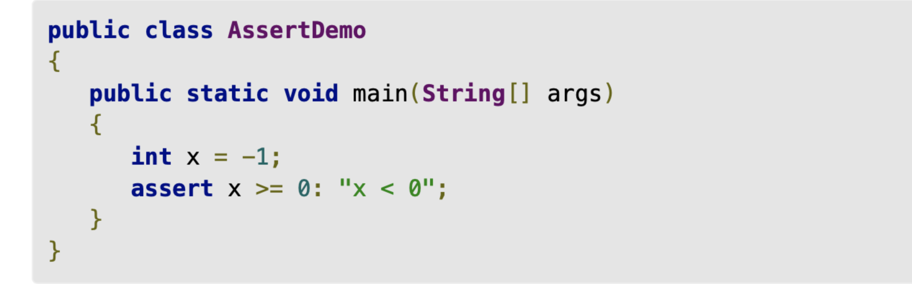

# Assertions

In Java, the ```assert``` keyword signifies an assertion.
Next to the assertion should be a boolean,
and if the boolean is false it lets the programmer know during runtime.
If not false it will continue running the program.
Below is an example of the assert function at work.


[Source](https://www.infoworld.com/article/3543239/how-to-use-assertions-in-java.html)

## How to Enable?

The great part about Assert expressions is that you can either turn them on or off in your code.
Turning all asserts off makes them similar to comments while enabling them allows you to error check on the fly.
In the command line,
`java –ea MainClass` enables assertions in all your classes. While `java –da MainClass` disables them.
Assertions can also be controlled by scope.
This is achieved similarly to the command above,
but instead of MainClass you would enter your targeted class like:

NOTE: Asserts are off by default in Java you must enable them with the java command line using the command listed above

## When to use Asserts?

*"Why not use Exceptions?"* you may be wondering.
I'm glad you asked.
**Assertions are only used in pre-production code.**
They are an easy way to see errors in your program before going to production.
Assertions are a watchdog for programmers only watching data,
while Exceptions are like a mailman that gets data and does a certain action.
Here is more reading on [assertions](https://www.infoworld.com/article/3543239/how-to-use-assertions-in-java.html).

In a nutshell,
Assertions are used for bug checking for data that should NEVER be out of the norm,
can be turned on and off,
and are never used in production code.

Exceptions,
on the other hand,
are more flexible and can take action after catching the desired data.

## GUI Testing

We have discussed and worked on enough code testing.
Now is the time for you to work on application interface testing.
As application developers,
we must keep the user in mind.
What we design is what they see.
Hence, for your application to be user-friendly,
you must learn to test your graphical user interface (GUIs) too.
Therefore, I'd encourage you to check out a [few exercises posted on this testing website](https://www.testingementor.com/software-testing-online-resources/software-testing-exercises/#Software_Testing_Exercise_1_-_How_many_bugs_can_you_find_on_this_buggy_windows_calculator).

These exercises will teach you to look at the application's interface and find bugs in them.
The key objective of Software Testing Exercises is to leverage *Manual Testing & Automation Testing Skills* gained from our project-based *Manual Testing Training* & Test Automation Training.
Especially from a hands-on and project perspective so you could crack Testing Interviews and land a Software Tester job.
This strategy helps those aspiring to break into Software Testing to think laterally and help improve analytical skills and attention to detail.
