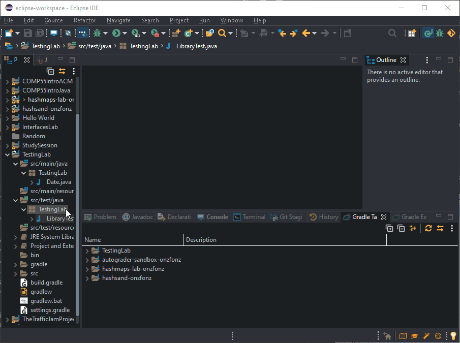
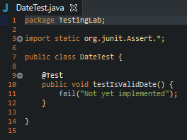
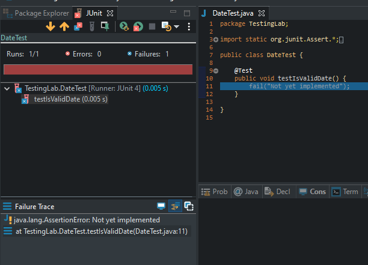

# Testing Lab

In this lab you'll be developing your testing techniques. First we'll
discuss the notion of unit tests, and then we'll switch over to
introducing you to the **JUnit** testing framework, which allows us to
more easily work with unit tests. While you can work on this with your
team or with just a member of your team, all of you will be expected to
turn this in.

## Remember Traffic Jam?

Whether you appreciated doing something tricky, or whether it still
haunts you in your sleep, we did traffic jam to give you something
challenging to work on to get you introduced to the idea of working on a
significant project in parts. Feel lucky that you weren't my first group
of students at Pacific that got that assignment, where I asked them to **complete Traffic Jam without breaking it up and only giving them two
weeks**\! After giving the assignment a few times, what I've seen that
what helps students much more than anything else I've done so far is the main
functions that I wrote for them, to make sure that they test parts
they've written before moving forward. Imagine writing all of traffic
jam only to see the grid and the behavior of traffic jam be at best
erratic, my first students didn't test as they went along, so when they ran the program, they had symptoms like:
- dragging a vehicle to another
spot and then having that vehicle disappear
- dragging a vehicle vertically and backwards would cause the vehicle to jump to the other side of the board **but horizontally**


If you think about the code that was provided, like this code
for Space.java

```java
//Small test code to put in Space.java to check to see if your class works

public static void main(String[] args) {
    Space one = new Space(3, 4);
    Space two = new Space(1, 6);
    two.setRow(two.getRow()+1);
    two.setCol(two.getCol()-1);
    System.out.println("one r: " + one.getRow() + ", c: " + one.getCol());
    System.out.println("two r: " + two.getRow() + ", c: " + two.getCol());
}
```

And then this code snippet for Vehicle.java

```java
Vehicle someTruck = new Vehicle(VehicleType.TRUCK, true, 3, 1, 1);
Vehicle someAuto = new Vehicle(VehicleType.AUTO, false, 2, 2, 2);

System.out.println("This next test is for spacesOccupied: ");

System.out.println("vert truck at r1c1 should give you r1c1; r2c1; r3c1 as the 
                    spaces occupied:does it?");
printSpaces(someTruck.spacesOccupied());

System.out.println("horiz auto at r2c2 should give you r2c2; r2c3 as the spaces 
                    occupied:does it?");
printSpaces(someAuto.spacesOccupied());

System.out.println("if we were to move horiz auto -2 it should give you at least 
                    r2c0; r2c1; it may also add r2c2; r2c3 to its answer:does it?");
printSpaces(someAuto.spacesOccupiedOnTrail(-2));
```

These snippets of code allowed you to test part of your functionality before having
the entire assignment done. This type of testing is typically called
**unit testing**, because we are checking for the most part if a unit
(be it a class or method like the ```Space```, or the ```Vehicle```, or
```spacesOccupied```) is behaving as it should. While these tests themselves
are still a bit general, by running these in your code, you have a more
targeted approach for ensuring that the code you've written so far is
not completely broken. These tests on these individual classes and
methods may be different than what you might consider testing.  Many programmers early on think of testing as running the program and putting in different values. That type of testing is often called system testing,
as you often are testing the entire system to see if it works. However,
like we mentioned earlier, today we're going to focus on becoming better
at producing tests for units so we can make it easier to test and debug
large projects. While it's not necessarily a glamorous job, coming up
with good unit tests is an art.

## Date Testing

For today's lab we're going to concentrate on having you write a method
that will validate Dates. Let's say that we are writing it because it's
going to be used for a new calendar application that we are building.
For the simplicity of the lab, I'm not going to provide you with any
starter files or anything, we are just going to create two classes.
Date.java and DateTest.java in a Gradle Project. To start, go ahead and make a new java
project in eclipse, which you can call **TestingLab** if you'd like.
This can be accomplished by going to the file menu and saying
*File-\>New-\>Project*. Then from there, Select Gradle Project and select the desired folder.  Then open src/main/java and rename the Library.java file that was created to
**Date.java**. For now it should have just one method, which you can
make as a static method and rename to be ```isValidDate```. (You can also feel free to delete the Library.java class and make a new one if you like).  We won't write out
most of ```isValidDate```, but what we'll do is have it for now simply
return true, so the code should look something like this

```java
public class Date {
    public static boolean isValidDate(int month, int day, int year) {
        return true;
    }
}
```
Next what we'll do is to createa JUnitTestCase.  The gradle project has one already for you, but in this case, let's delete it and start fresh.  


Because it is a static method, this
means that we'll be able to simply call it from any other class by
simply saying something like, ```Date.isValidDate(4, 15, 2017)```, which is
similar to how things like the ```RandomGenerator``` and the ```Math``` class
are used (```Math.abs()``` and ```RandomGenerator.getInstance()```. Because
static methods are not part of any object, they can be called by anyone
at anytime, as long as we provide the name of the class where the method
resides. Static methods don't operate on any data in a class, which
makes them different than say something like ```move()``` since that
operates on a single oval object and changes the state of that oval. It
makes one oval move. Static methods don't have those operations, and are
typically written as being utility classes, where all the information
that is needed is passed in. Since in our case we simply want to write a
method that will check whether or not the ```Date``` is valid and we pass in
the ```Date``` as 3 integers and have it return a ```boolean```, it can be
declared as a ```static``` class.

## Junit 4 Framework

Now that we built that method, even though it is unfinished, let's go
ahead and build some tests. One way to build tests is like we've always
done, which is to just create a ```main``` and have it print out stuff,
however, in order to make it easier for us to simply see whether or not
we passed all of our tests (which helps with automation, something our
future robot overlords will love), we're going to use a **testing
framework**. Think of a testing framework as being like a set of
libraries, except that rather than you call a method in the library (ie
```rgen.nextInt()```, the library will call one of your methods (like we had
with implementing ```mouseMoved```, etc). There are many frameworks
available for many languages, in fact since testing is so important
every language that you know of most likely has *multiple* unit testing
frameworks available. Rather than just write a main, we're going to
leverage one of the most popular testing frameworks for java that is
already built into eclipse, the **JUnit testing framework**. JUnit has
been well integrated into eclipse, so using it should hopefully be
straightforward. There are different versions of the testing framework
that have been made over the years, and even though we used a newer framework
in the Hashmaps Lab, what we'll do is for now stick
with the JUnit 4 framework.  If you are super curious about the differences which is not necessary for this class, you can [read about them here](https://sormuras.github.io/blog/2018-09-13-junit-4-core-vs-jupiter-api.html).

## Create a DateTest class using JUnit 4.

If you followed real close the gif from before where you create a new Junit Test Case.

Sometimes when you run unit tests, you may want to
read certain information from a file, or load another object or create
something else first before you start doing any tests or before you do
each test. Similarly you might have to do some clean up after a test if
say you were testing whether or not some information was written to a
file, you may have to delete that information or restore how the file
was before to make sure that things are nice and tidy. If you have in
your JUnit test case these methods, they would be called during each of
these different times. The typical scenario for how the files work is

1)  ```setUpBeforeClass()```

2)  ```setUp()```

3)  ```test1()```

4)  ```tearDown()```

5)  ```setUp()```

6)  ```test2()```

7)  ```tearDown()```

8)  …. Keeps going for each test you have, once all the tests have been
    written then you go to

9)  ```tearDownAfterClass()```

Notice that the **same** ```setUp()``` and ```tearDown()``` are being called. If
you have something more convoluted, it might make sense to talk to me
about it as you don't necessarily want to have more than 1 ```@Before``` and
1 ```@BeforeClass``` directives. 
At
this point you should be back in eclipse with your trusty new Junit Test Case file, where'
you'll see some code that looks something like this:



Notice that what you see is in fact java code, with a couple of minor
differences which I'll go over. The first thing you may notice is this
```import static``` command on line 3, which is slightly different than
import. As you know ```import``` allows us to specify and use libraries, so
you would be aware that there is a class called *Test.java* and once we
import it we can then use it in our file, Java knows where to look.
```import static``` allows us to use methods and variables that are declared
```public static``` without having to use the qualifier. So in this case,
you should know that there is an Assert.java file that has a few
different public static methods, one of them which is on display here is
```fai```l, which will cause our JUnit test case to return saying the tests
failed and then providing a message for why the test failed (In this
case, it's the *Not yet implemented*). Notice that we have no "**.**"
operator or anything else to qualify where the ```fail``` method came from.
This is because we had the ```import static```, otherwise if we were change
line 3 to ```import org.junit.Assert```, we would have to change line 8 to
say ```Assert.fail("not yet implemented")```**.** You can try that if you
like, but make sure to change it back. So ```import static``` is for
convenience, almost like how we had ```using namespace std``` in C++.

Next notice on line 9 that we have the ```@Test``` directive. This is a
special annotation that Java has introduced more recently that lets java
know that the next method under it is one that we would like JUnit to
test. Because it knows that it will need to test it, we can name the
method whatever we like. Go ahead and change the method name to
```testIsValidDateBasic```, since we'll be making more methods in the
future. The final thing to look at is on line 11, which is simply a
command to let JUnit know that we should not pass by calling fail.
Anytime java reaches a line that says fail, think of that like being a
return statement, where the computer immediately exits and returns a
fail result.


## Running the Junit Test

To run a Junit test, you can either use the command shortcut
***Alt-Shift-X, T***, or you can **right click** on the project in the
package explorer and then select, *Run As-\>JUnit Test*. Running the
JUnit Test will open up the JUnit view, where you'll get something that
looks like what you see on the left. First thing to notice is the bar,
which is a color indicator for letting you know whether or not your test
passed or failed. Just Below that is going to be a list of all the test
methods that we have, along with their individual results. In our case,
we only have one test method so far, so that will just show as being a
failure. Above the bar you can notice that we won't just get whether or
not everything passed or failed, but you'll get a much more detailed
look at how many of the tests passed, which will be organized into
methods.

Next in the window below, for each error that you get, clicking on them
in the upper window will give you the exact line where the error
occurred (in this case, we can see that is on line 8 since it says at
the end (DateTest.java:8) and then it gives us the error, in this case
it's the failure that we knew was going to happen as that raised an
**Assertion Error** and gave us the message that we have yet to
implement ```DateTest```. This is how we will get to know whether or not our
code is working. In a way, it is very similar to what we saw in coding
bat, except that instead of us getting results for each and every test
we make, we're going to group those tests into methods and get the
results from each method instead. If we want to know more, then we can
go ahead and check it out by clicking on one of the methods.

## Building basic tests

Let's start the code by building some basic tests for you to run. The
first thing we are going to do is to delete the fail statement on line 8
(try using **Ctrl-D** if you haven't by clicking somewhere on line 8 and
then doing Ctrl-D.) In its place, let's go ahead and type an
```assertTrue``` clause, where we provide a very basic example of an Date.
Because we are starting with basic tests, what we want to start with
first from a test standpoint is to think of tests that will should be
easy for our method to be able to figure out. For example, come up with
a basic Date example that the computer should definitely recognize as a
Date. For example, something like the example I posted above,
```4-15-2017```. For that example, what we want to do is assert that when we
call ```isValidDate``` on ```4-15-2017``` it will return ```true```. Thus the line
would change to something like this.

```java
assertTrue(Date.isValidDate(4, 15, 2017));
```
Once you change this, just to see what it would look like to pass all 
your tests, you can run your unit tests again. While this example is a 
bit contrived (your ```isValidDate```) right now returns ```true```, it will 
give you an indication of what a passing set of tests looks like in 
JUnit. Notice the green bar that is present once you run. Now, come up 
with many different tests so that you ensure that your code is doing what 
you expect it to do and is working without many bugs. To help us make sure 
that our code is working, let's come up with a test where ```isValidDate``` 
should return ```false```. 

You can come up with any type of basic result, but even something like 
```55-8-2017``` should not be considered a valid Date. At its simplest 
terms, such a thing would be considered a simple test.  At this point 
you could copy and paste line 8, but then change the ```assertTrue``` 
to an ```assertFalse``` instead, and change ```4,15,2017``` to 
```55,8,2017```. There are some disadvantages to copying and pasting 
code (like not thinking out of the box with your testing), but just having 
more tests outweigh some of the potential drawbacks in this scenario. 
In addition to ```assertTrue``` and ```assertFalse```, you also have 
available an ```assertEquals``` method, which compares the two parameters 
to make sure that they are equal to each other. There are also assertNull 
and ```assertNotNull```, which will just check for null or not null on a 
particular object. If you are ever unsure about what assert statements the 
JUnit framework has made available to you, the best thing to do is to use 
***Ctrl-Space*** to look up the different assert statements that Java has 
made available to you already. Now, I'm going to ask you to try to do two 
more ```assertTrue``` and two more ```assertFalse``` examples that look very 
similar to the ones you've done. For now, keep the true statements with days 
below say 25, the months from 1 to 11. Likewise, don't try to do anything 
crazy for ```assertFalse```, just have numbers greater than 35 for
the day, 15 for the month, and you can avoid changing the year for now. After which, go ahead and come up with a simple solution to the ```isValidDate``` problem that will satisfy this set of basic tests. Your 
goal for this implementation is to use only 2 ```if``` statements and no ```&&``` symbols. While this example is a little contrived, **I want to make sure that you have a very simple solution so you can understand the
value of the tests for later, so do not have more than 2 if statements in your solution.** All your code needs to do right now is pass these basic tests. Once you have a simple solution that passes the simple 
tests, you can move on to the next part.

## Coming up with Advanced Tests

While there are some that say you must write all your tests before writing code, I want to show you how nice it is to have tests when you have to refactor code.
So, lets come up with some more complicated examples of tests for Dates.
1. Create a new method in our DateTest.java file and name it ```testDatesAdvanced()```.
2. Put the ```@Test``` annotation beforehand to make sure that JUnit runs it. For example: 

```java
    @Test
    public void testDatesAdvanced(){
        // test code here
    }
```
3. Think about some of the more nuanced dates that you've seen out there and come up
 with 4 or 5 examples. Ask yourself, "*Are these actual dates or not?*" or "
 *What dates could I use to possibly fool a computer?*". Some good examples might be 
 ```Feb 30```, ```Dec 32```, and so on. 
4. Once you've come up with examples, create code that will test them by using the 
```assertTrue``` or ```assertFalse``` calls depending on what you have. (You can 
simply copy and paste it here).
5. Once you have a call and no compiler errors, you can run your JUnit test again.
6. This time you'll notice that it passed the simple tests (if you've been following along with the lab), but it fails this advanced one.
7. So, now let's go ahead and do one more set of tests, these would be known as *edge 
tests* - tests where really you're just trying to cause havoc or get the program to 
crash.

   - Examples of edge cases would be zero, negative numbers, or other craziness, for 
   this example do not worry about testing incorrect types like ```char``` or 
   ```boolean```
8. Keep in mind that if you were testing a function that had objects or strings as 
parameters instead, in the edge case you would do things like pass in an empty string 
(```""```) or pass in ```null```.
9. Place these examples into a separate test method called ```testDatesEdge()```.
10.Once you have that, you can then go back and work on the ```isValidDate``` test. 
11. Now you have tests that help you figure out whether or not your implementation is right. Therefore, you can simply keep reworking your solution until you get the correct result.
12.  If you haven't thought of February 29th and when things are a leap year, it's worth reading [this short article about leap years](https://www.infoplease.com/leap-year-explained).
Let me know if you have any other questions.


## Assertions and GUI Testing (Optional)

An advanced tool for testing is using Assertions similar to the assert functions you 
have used previously, but can be done during run time instead of debugging. Also in 
addition to Unit Testing, it's important to know about GUI Testing.  To learn more 
about assertions or GUI Testing, follow [this optional guide created by former COMP 55 students](14-A-TestOptional.html).  


# Review Questions 

### (*Place your answers to these questions as comments in the TestDate.java file and upload to canvas*)

  1. How many Test methods did I have you make?

  2. What are the differences between those test methods?

  3. Provide 5 different calls that start with ```assert``` that you could use in conjunction with JUnit.
