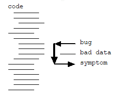
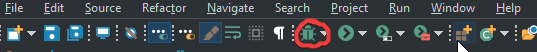
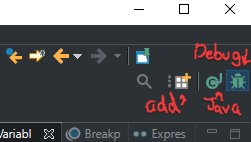
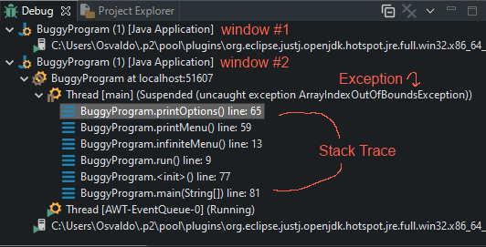
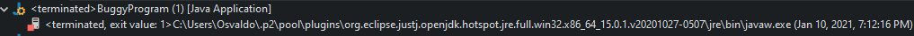
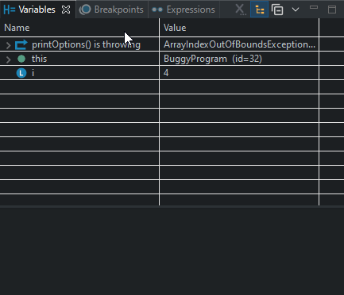
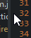
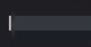
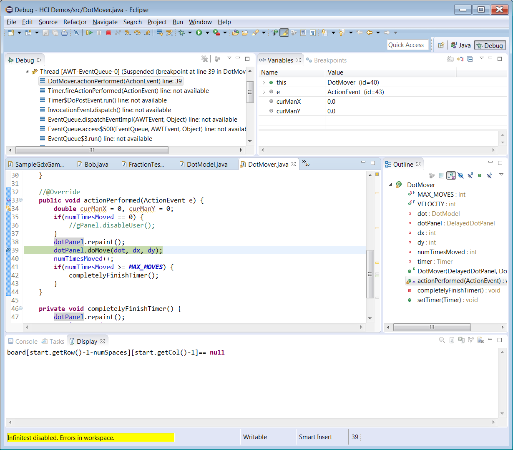
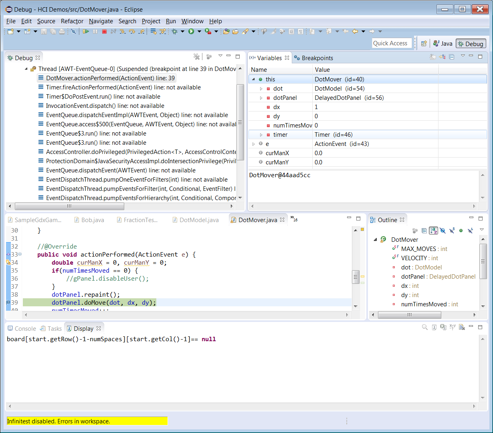

# Debugging in Eclipse Lab

Today you working on a topic often overlooked – How to Debug effectively.
It's where you spend most of your time, and often there's little training on it…

This lab is partly about thinking through a couple of tricks and mental processes about Debugging and learning to use the Debugger.
It will range from very philosophical to very practical.
We'll start with debugging tips.
READ THESE tips before you start on the lab, they were taken from the maker of CodingBat, Nick Parlante.

You'll get credit for the lab for answering questions in the form.
To encourage reading, I have moved the link to where the form is (you'll find out the link to the form as you read).
As you read the lab, you'll be asked at times to visit a form at that moment, with a single problem being an entire section in the google form, which will be in bold.
You can work with one other person throughout the lab, **but each person must submit the form**.

## Some advice

### Keep a calm mindset – You can do this\



Bugs may appear hopeless and impossible, but your code has a logical structure.
The evidence may be obscure, but be consistent in pointing to the guilty code.
Don't panic -- be methodical.
Somehow others can figure it out, and they don't know more about your code than you do.
You can sift through it.

### Follow the symptom backwards through the code (see right)

You observe a symptom -- bad output, wrong function calls an exception.
Track the symptom backward through the code path to find the bug.
It may be helpful to draw it out on paper.

### Ask these questions when debugging

1. What method shows the symptom? What lines of code produce that symptom?
2. If it's an exception, what does the exception error message say --
    null pointer? array access?
    Exceptions can be very informative.
    Look at the line of code in the stack trace and identify what could be null there.
    Anything with a ```.``` or ```[]``` could cause null pointer
    exceptions.
3. What is the state of the variables in that code? What values do the parameters have?
    (a breakpoint is a quick way of seeing all those values)

### Invest time into learning how to use the debugger

Is an exception giving you the blues? Use the debugger!
On exceptions eclipse will stop at the line throwing the exception, which will let you look at the values of variables and parameters, giving you immediate clues as to what is wrong. *You'll learn to use the debugger in a bit.*
If you'd rather print out the state of the variables use:

```java
System.out.println(name_of_variable_here);
```

```System.out.println()``` is especially good if you want to see the state 20 times in succession in a loop -- the debugger is not as good at that (though many times you don't need all of that information, and you could set up a conditional breakpoint to help instead)

For a complex object, take a minute to override ```toString()``` so you can get a faster way to view important details about an object, ```toString``` works both in the console and in the debugger.

## Debugging Mechanics...Things to ask yourself when you encounter a bug

### 1. If an exception was raised, What does the exception say? What line number and method is it from?

Exception printouts can look a bit cryptic, but there's often actual info in them -- ```nullPointer``` vs ```arrayOutOfBounds```.
Usually, the exception will list the file and line number where the exception occurred.
Anything blue and underlined acts like hyperlinks, so clicking on them will immediately jump your editor to that file and line.
The lines also show a stack trace of who called which method,
*so that a function on a lower line will be directly responsible for calling the line above it in that particular exception's case.*
Remember also that there is a [video on null pointer exceptions I did a while back](https://youtu.be/x9JArfGJb8c) that explains more about what exceptions mean in general.

Your grade for this lab will be based on your answers to a [google form](http://go.djosv.com/debuglab),
your answers will include the number of bugs that you find and detail in the last section of that form.

***Problem 1) Go to the online form and complete Problem 1 (the entire section of it).
Continue here once you are done.***

The screenshot in the online form is very similar to what you'll see as you program.

### 2. If an error occurred, what is the state of the object (AKA receiver) and parameters?

You can examine this in the variables window while the debugger is active or in the source,
and then think…
How did that happen?

### 3. Comment Out / Mess With Code

Suppose you know that one of your objects has bad data,
and you are trying to figure out which code is messing it up.
Commenting out calls to sections of code is a very fast way to eliminate code from suspicion.

- e.g. Suppose you have a drawing program and the shapes have bad values.
Is the move code or the resize code to blame? Comment out
the resize code and try it --
the program is barely functional,
but it's a quick way to decide that the code is not the source of the problem.

#### Be willing to alter your code into absurd states to test a hypothesis

- e.g. Suppose you suspect a bug happens only when there are many ```foo``` objects with a value over 500.
To test the hypothesis,
write a ```for``` loop that makes many ```foo``` objects with a value of 1000.
This code is not very logical for the proper functioning of the program,
but it's a very fast way to test your hypothesis.

#### Problem 2 - Go back to the form to think of ways of altering your program to debug faster

---

## The Debugging Lab

For today's code, we're going to be using the **DebuggingLab.zip** that has been posted on Canvas.
Use the import functionality you used in [Lab 2](2-JavaIntro.html).
The code from the lab expands on the fraction code you wrote in the previous lab.
Your trusty mascot *Powercat*
(who also is a budding programmer)
wrote a fractions aid for little kids,
providing simplified fractions and decimal equivalents for kids when they specify numerators and denominators.
Unfortunately,
*Powercat*'s program has some bugs that you need to help find.
The program should allow kids to specify a numerator and a denominator and then automatically simplify the fraction as you move along.
There's also an option to provide the decimal equivalent for the fraction.
Go ahead and try to use the application.
Running the code will reveal your first bug in the console,
which is an exception.
To fix this,
let's use the debugger.

To run the debugger,
click on the bug to the left of the play button ,
you can instead just use the ***F11*** shortcut
(instead of ***Ctrl-F11***) to run the program.



The program should begin to run,
but once running you'll see it jump immediately back into the editor or eclipse might ask if you want to switch to a Debug perspective, check **Remember my** decision*** and then click yes.
Your screen then may look something like this.


*If you get an UnsupportedClassVersionError, make sure to use the latest version of eclipse or message me.*
Let's explain a couple of things about this window.

Eclipse has different layouts for different activities that you would be doing,
which it calls perspectives.
When you are debugging,
it switches to the debugging perspective which you can see in the upper left.



When switching between debugging and editing your java code,
instead of rearranging the windows,
just click between them in the upper-left.
If you've already closed some windows,
you can always reset the perspective by going to ***Window-\>Perspective-\>Reset Perspective***.
If you don't see java or debug listed,
you can use the open perspective icon to add the perspective
(labeled as add above).
When in debug perspective,
you'll have a couple of windows that we should discuss.
The first is the **Debug** View,
which we'll show using the class interface:



The Debug View shows you all of the current instantiations of the program that you are running.
The top-most directive shows you the number of windows open,
or the number of programs that you have clicked to run.
If you have a lot of windows open it may be that you keep
running the program,
but forget to terminate the programs that you've run.
I default to having one instance of the program running.
To terminate other instances so you don't get confused,
it's good to right-click on the other windows and select ***Terminate.*** 
You'll know that a window is terminated if you see a marker like this:



Window 2 is the instance of the program that we care about.
It shows us that there was an **ArrayIndexOutOfBoundsException****,
and a stack trace showing you which methods called what to cause that exception.
If you ever want to see the code at any of these lines,
you can click on the stack trace in the *Debug* view and eclipse will jump to the line in the editor,
like this:


The second window to notice is in the top right.
It is called the **Variables** view.



Here you can click the down arrow to the left of the ```this``` variable to check the instance variables that are part of ```BuggyProgram```.
Clicking the down arrow on ```this``` and then scrolling through to click the down arrow on ```options``` will reveal the length of the options array.
Another option that you have is that you can also simply move your hover your mouse cursor over particular variables while the program is being debugged to see their values.
See here:


**Use that and the other information to edit ```printOptions``` in BuggyProgram.java.
Once you hit the debug button
(****) and the program runs without immediately crashing,
then you can move on**.

- Remember that when you start modifying the code you should consider switching back to the java perspective 

If you need help,
make sure to ask your classmates or the instructor.

## I fixed it!  Now it's gonna work! Wait what? Oh no

Once that's fixed and you run the program, you'll at least be able to enter an option.
Try to set the denominator or pick any option, and watch another
exception pop up.
I added this here because this is another common exception.
Name the exception,
understand why it is being thrown
(instance variables when declared in java are set to 0 AKA null),
and then fix it.
To fix it,
you'll need to add a line to the ```run``` method of ```BuggyProgram```.
**Do not edit the private instance variable,
instead add the line that contains the necessary info to that ```run``` method
(if you have spent more than 10 minutes,
raise your hand to get help to move on).**
**Also** remember that this code may be very undateable,
to the point that there are many issues with the program.
Do not try to fix all of the issues now.
We'll come back to that.
The way you know that you can continue is that you do not get an array index out of bounds or null pointer exception after asking to set the denominator.
The program still has many bugs.

## I can now run the program without getting exceptions right away

You'll be able to run the program but won't have exceptions, but you may
notice that there are some issues with the program.
While we could use
```System.out.println()``` statements to debug, let's instead invest in the
debugger.
Using the debugger can be extremely useful.

## Setting a breakpoint

Double-click on the left bar just to the left of the line numbers in eclipse ,
if you do this correctly and in the right area,
you should see a little circle pop up ,
to the left of the line of code where you set it.

Now every time the program runs in debug mode,
the program will run up until it reaches that point.

In this buggy fractions program,
think about a particular place that would be good to set a breakpoint for where you think a bug is occurring,
go ahead and set that breakpoint,
and then debug the program.

Now your program will stop when it reaches that line.

**Problem 3) Provide a full eclipse screenshot that shows the program stopped at the line ```takeAction(option);```
which is in the ```infiniteMenu``` method.**
*Make sure that you are in the debug perspective,
that the line has a highlight on the line number
(slight gray if using our color theme, see below)
and the Debug and variables panes are showing the relevant information.*



Once here you can inspect variables.
But you can also ask the debugger to execute the following line as if you the computer were executing your program line by line.
You'll see the line that eclipse is currently paused at highlighted in green,
which is eclipse's way of letting you know that it is currently waiting to execute that particular line.
To execute that line,
you can use the commands shown in Eclipse's toolbar.

The red stop button 
above is something you want to hit whenever you want to stop debugging
(*or to terminate any program that you left running*),
while the rectangle-play button (to the left) 
will have the program continue until it reaches the next breakpoint.
Notice the three toolbar buttons that have arrows and are circled in the picture above.
Each of those is called *Step Into*,
*Step Over*
and *Step Return*.
To explain these steps we are going to jump to this next piece of code…
shown below using the classic interface.



Notice the green bar on line 39 with the arrow on the left?
That is equivalent to the gray line in the darkest dark theme that has the yellow arrow ,
it is telling us that the debugger is about to execute the function ```doMove```.
We can ask the debugger to execute code line by line and then pause after each line of execution.
Move your mouse over those toolbar buttons circled above…

- **Step Into**
(F5) will cause you to,
if you were on a line that had a function call on it,
jump into the line.
So in our case,
it would move into ```DotPanel```'s ```doMove``` function.
- **Step Over**
(F6) when you don't want the computer to jump into that function,
but would rather just have the computer execute the entire function and move to the next line.
- **Step Return** 
(F7) when you are done looking at a function and want to jump back out to the function that called it,
rather than trying to step over all the lines,
you can execute them all and jump back.

While stepping through the function,
it's important to continually check the variables window,
though Eclipse will highlight any variables that changed as a result of executing that call.

The variables window will show you both the local variables and parameters that are associated with that function.
To view other variables and their state,
you can just click on the function name in the *Debug* window and you'll be shown that function's variables.
To see the instance variables
(the variables colored in blue),
you'll have to click the down arrow for the ```this``` variable,
like we did with ```options```.
Here's a different screenshot from another program of what the variables window might look like.



**Notice also that when you click on a variable,
a string representation of that variable is presented in the area just below the variables,
in this case,
it's just the ```DotMover``` class and the memory address where it resides.**
If ```DotMover``` had overridden ```toString()```,
the ```String``` equivalent would be there.
You don't have to remember the memory address,
usually it's easier to use the id values that eclipse gives in
the value column
(like *id=40*)
which work like a memory address.
Variables with the **same id are pointing to the same address** in memory.

<br>***Go online and answer questions 4-6***<br><br>

## The Debug Shell/Display Pane

Lastly, the most important and cool pane I'd like to show you is the Display pane,
which they have also renamed as the Debug Shell Pane.
To open this one up you need to go to *Window-\>Show View-\>Other..,*
and in the Debug Folder look for either *Display or Debug Shell*.
For the rest of this lab,
I will refer to it as the Display pane.
The Display pane will then show up maybe at the bottom.
What's nice about this one is that you can write code and have eclipse evaluate it on the fly.
You can even put expressions and complicated lines of code that aren't in your code at all but that you just want to figure out the value to.
So for example,
if we were to debug your Traffic Jam's ```Board``` class,
you may have a line like this in your ```canMoveNumSpaces``` method…

```java
board[start.getRow()-1-numSpaces][start.getCol()-1] == null
```

Unfortunately,
you can't inspect that line while debugging your Buggy Fractions Program
(you would need to inspect it while debugging your own code,
if you had a ```board```, ```start```, and ```numSpaces``` variables)…
but if you were to debug your traffic jam and had a breakpoint in ```canMoveNumSpaces```,
you could examine any piece of that line to determine what the code would evaluate to.
Coming back to the initial bug that we had,
you can write some pretty creative expressions and evaluate each piece,
which may also be helpful when you have really confusing lines.
See here for an example of how to examine different parts of your code that get evaluated to a value,
which with any expression you could highlight part of the statement to see how the different parts get calculated
(this is very useful when checking if statement conditions for example).


In the display,
you can highlight **any** part of that line and *right-click-\>inspect*
(***Ctrl-Shift-I***),
or click the magnifying glass 
to the right of the display panel
(For macs you may have to add a ```return``` statement).
Eclipse will then execute that line
(or selected text)
and then let you know what the result is.
This becomes extremely useful in letting you try stuff out as you are programming to make sure that you get it right rather than having to continually rewrite your code run and then get to the point you need to…
This is one of the most powerful tools to use to your advantage as you could use it to test out your hunches on the fly.
Imagine being able to check if your formula for checking a particular space in ```moveNumSpaces``` could be evaluated without having to keep re-running the code\!
I think as soon as I run into a problem when I'm debugging something that I'm unsure about it working,
I jump into this mode when I have to rewrite a line to make sure that it works.
Rather than make the change and hope that it works.
I set a breakpoint on whichever line of code I'm running, debug, and then use the debug shell to figure out the exact code before writing it in.

<br>**Problem 7 – Go online to answer the next question**<br><br>

This makes sure to me that you know how the Display tool works and that you can use it.
Use the variables that are currently in the method you are debugging or declare something new and interesting.

Now that you are armed with all of these tools,
your task for today is to figure out what is wrong with this Fractions Helper program.
Remember that google is your friend if you are unsure about anything,
and I am around as well.
Work with a partner for this lab.
Put breakpoints,
think of good test-cases that you can write in the code
**(adding code is great when debugging)**
and come up with additional tests that you can write to help you understand what the problems are and to ensure that your Fractions Program is truly working the way it should be.
Your tests can be simple print statements like we've done with Traffic Jam.

**Problem 8: Start debugging the code in full now, use the instructions provided online to document what you try.**

The last thing that I do want to mention is that with good debugging,
comes good testing.
Notice that `SimplifiedFraction` has a main class,
why not start with that instead of running the whole program?
You could try out some of the different methods and see what they return to make sure that things are running correctly.
By having such testing you reduce the amount of time looking for clues,
in a way if we are thinking of the detective mindset,
you are asking good questions to your suspects rather than waiting around for something to happen again.

If you have any questions let me know.
Good luck finding the bugs\!
