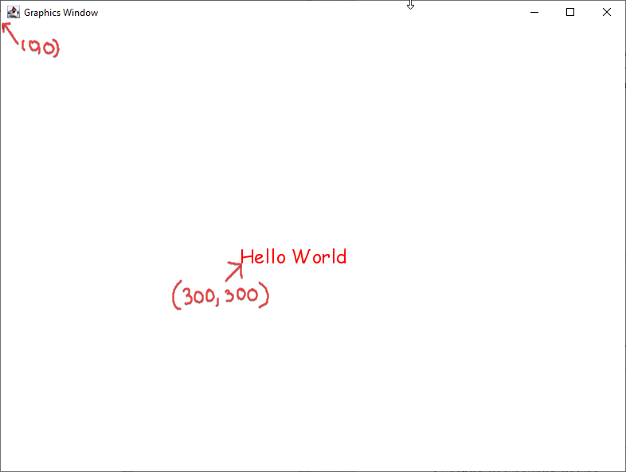
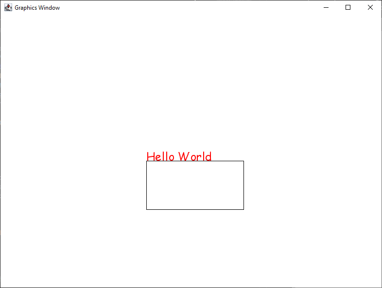
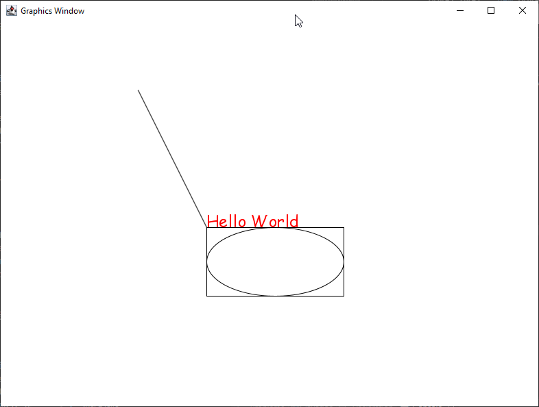
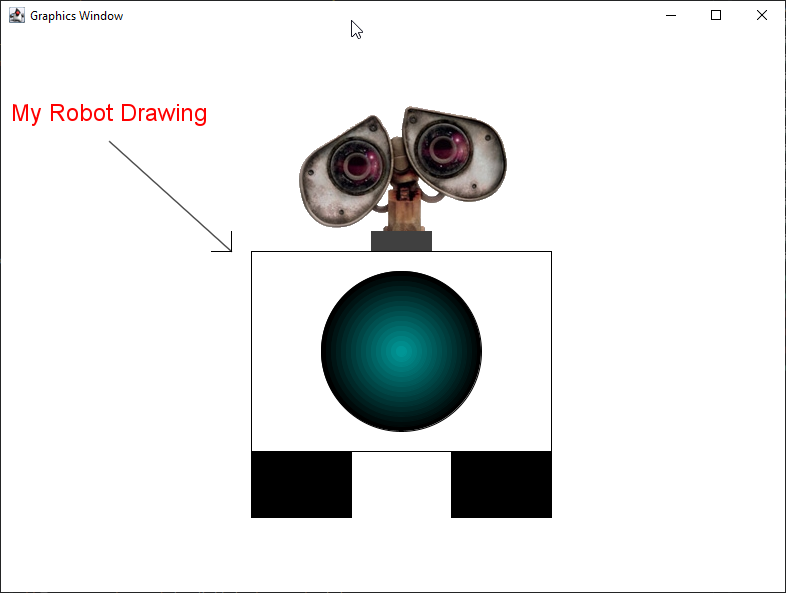

# Intro to ACM Lab

- [Introduction](#introduction)
- [Modifying our label (Changing font, size and style)](#modifying-our-label-changing-font-size-and-style)
    - [Extracting constants](#extracting-constants)
- [Adding Shapes](#adding-shapes)
- [GImage](#gimage)
- [Applying Color](#applying-color)
- [Overlapping Objects](#overlapping-objects)
- [Making a robot (Upload your robot picture as your deliverable)](#making-a-robot-upload-your-robot-picture-as-your-deliverable)
- [Ready to go beyond?](#ready-to-go-beyond)

## Introduction

By this point,
you've completed the Java Lab and have done some work on the project.
Congratulations!
Getting started and getting a program to run in a new language is no easy task.
With your love/hate relationship with java already budding,
it's time for us to learn a special library
that we will be using this semester that will let us easily incorporate graphics into our programs.
This library is called the ACM library,
a library built by a [special task force](https://dl.acm.org/doi/abs/10.1145/1121341.1121384)
for the [Association for Computing Machinery](https://www.acm.org/about-acm/about-the-acm-organization),
a large trade organization for Computer Science Professionals.
The version that we'll be using is a specially adapted version of the library,
which has since been modified by [Eric Roberts](https://profiles.stanford.edu/eric-roberts),
a professor from Stanford who was a part of that ACM Project.
We are using a modified version of that library.
We are going to use this library because:

1. It is easy to learn
2. Its structure follows OOP programming well
3. The way it's laid out will well prepare you to learn other languages and libraries in the future

First,
download **IntroACMLab.zip**
from canvas and then import that file as an existing project into Eclipse,
as we did in the [*Intro to Java*](2-JavaIntro.html) lab.

Once imported,
open **ACMLab.java** in the editor.
This file contains additional features that we have yet to talk about.
Here are the contents of the ACMLab.java file.

```java
import acm.graphics.*;
import acm.program.*;
import acm.util.*;
import java.awt.*;

public class ACMLab extends GraphicsProgram {
    public static final int PROGRAM_HEIGHT = 600;
    public static final int PROGRAM_WIDTH = 800;

    public void init() {
        setSize(PROGRAM_WIDTH, PROGRAM_HEIGHT);
        requestFocus();
    }

    public void run() {
        add(new GLabel("Hello World", 300, 300));
    }

    public static void main(String[] args) {
        new ACMLab().start();
    }
}
```

- **Imports:** Lines 1-4 contain ```import``` statements:
  ```import``` calls are similar to ```#include```s that we had in C++
  in that they help Java figure out what libraries you will be using.
  One of the nice features of Java
  is that it allows you to reference a folder of classes all at once,
  so for example,
  rather than have to write 20 import statements for each class that we want to reference,
  we can use the ```*``` to say,
  go ahead and import all of the classes in the ```acm.graphics``` directory.
  Not sure what you need to import?
  Never fear,
  just type the class that you need,
  Eclipse will red squiggly it for you and then you can use the quick fix option to add the import.
  You can alternatively just type ***Ctrl-Shift-O***
  after typing the class,
  which will tell Eclipse to
  automatically search its entire catalog for which import you should have and then
  *write the import statements for you*.
  If you try to use a class that is defined differently in multiple libraries,
  Eclipse will prompt you to choose.
  The majority of imports we'll use start with "java." or "acm."

- **extends:** Line 6 should be of interest
  as you see the word extends followed by ```GraphicsProgram```.
  ```extends``` is a special keyword in Java that lets you inherit capabilities from another class.
  In our case,
  what we want to do is inherit from the special ACM class,
  ```GraphicsProgram```,
  which will do a lot of the necessary legwork to get ourselves ready to deal with graphics.
  By saying ```ACMLab extends GraphicsProgram```,
  we are telling Java that the ```ACMLab``` **IS** a ```GraphicsProgram```,
  and so we get all of the benefits and tribulations of being a ```GraphicsProgram```.
  This means that we'll need to leverage
  and write a few additional methods to make our program work.
  Rather than using ```public static void main(String[] args)```,
  consider ```public void run()``` as our starting point for now.

- **public static final int:** Lines 7 & 8 declare constants for the program to reference.
  **It is good programming practice to declare any number that is not 0, 1, or 2, as a constant**.
  We're going to break with that convention for the opening part of the tutorial
  as we are introducing you to the different calls,
  but once you get into the activity,
  please make new constants.
  Constants make your program easier to change in the future and easier to read.
  While there are a couple of extra keywords here that I don't want you to worry about too much yet,
  the ```final``` keyword is the one that is telling Java
  that a particular variable can no longer be changed.
  One nice part about constants is that they don't need to be literal values,
  they can be formulas based on other constants like this:

    ```java
    public static final int NUM_PIXELS = PROGRAM_HEIGHT / PROGRAM_WIDTH;
    // This makes constants very useful - make them often!
    ```

- **public void init():**
  It doesn't make sense to get too into the internals of this method on lines 10-13.
  Be aware that it allows us to specify the size of the window before it gets created.
  This is useful in our case as we want to start with a larger window.
  The size is specified in pixels.
  A **pixel** is the smallest unit possible to display on a computer screen.
  So this creates a window 800 pixels wide and 600 pixels high.
  While for some of you this might create a decent-sized window,
  for others of you with 4K screens,
  the window might still be extremely small,
  for now,
  you could try to make the screen relatively big,
  but this will be something you may have to continually adjust.
  You also may be able to fix this by
  [visiting this URL](http://stackoverflow.com/questions/30555401/java-disable-dpi-aware-not-working/39372897#39372897).
  The ```requestFocus``` call just allows the window to be the active window
  for both the mouse and the keyboard,
  which will be useful in the future.
  Other than changing the size,
  you should leave the ```init``` method alone.

- **public static void main(String args[])**
  You've seen lines 19 and 21 before,
  but what may be interesting here is how empty our main is,
  and Line 20.
  **Please don't spend too much time thinking about or copying Line 20 for your future code**.
  Think of this main function that we have as template
  (aka boilerplate)
  code that will be in most graphical programs,
  you should not need to modify the mains for the graphical programs that you create.
  This small function tells java how to start your program.
  If you notice,
  it just creates a ```new ACMLab```
  (which it does not even save into a variable! :disappointed:).
  Then on the same line,
  it calls ```start```,
  which is an internal call for `GraphicsProgram` that helps set up the graphics window
  and get everything started.
  You should in most cases,
  *leave the ```main``` alone for any graphics programs*.
  Instead,
  just focus on putting your code for graphics programs in the method,
  ```run```,
  which we'll discuss next.

- **public void run():** Lines 15-17 have the method
  that you should consider the starting point for your program,
  and it is here that we will be putting most of our code
  as well as function calls to the rest of our code.
  Currently,
  there is only one call on line 16,
  which is, ```add(new GLabel("Hello World", 300, 300));```.
  ```GraphicsProgram``` follows what one can think of as a *collage model* for making graphics.
  Rather than creating graphics with a pen where you give commands
  to move the pen around the screen to draw things,
  the graphics package allows you to create objects,
  which one can think of as cutting out shapes from a piece of paper.
  Once the objects are created,
  you then need to add them to your canvas.
  The ```add``` command at the beginning of the line is reminiscent of that.
  On the other hand,
  what's inside the ```add``` command –
  ```new GLabel("Hello World", 300, 300)```-
  can be thought of as making a shape
  (or label in our case).
  While the label writes the text given in the label,
  the 300s specify the x and y coordinates in pixels of where the label will be placed.
  Another thing to know is that in Java,
  **0, 0** is the upper left-hand corner of the screen,
  rather than the lower left-hand corner,
  as shown by the picture below.

    

    *The picture above shows part of the program window when our program is run,
    along with the message Hello World
    (using the always appropriate and highly underutilized Comic Sans font).*

## Modifying our label (Changing font, size and style)

If we wanted to make additional changes to the ```GLabel```,
it would make
sense to store that ```GLabel``` into a variable that we could then refer
to.
**Go ahead and change your code to separate the add part from
the creation part by storing the new ```GLabel``` into a variable called ```label```.**
Once you have the ```GLabel``` in a variable,
rather than adding it right away,
we can make modifications to it by sending the label different messages.
For example,
go ahead and color the label **red**.
We can do this by inserting the statement ```label.setColor(Color.red);```
in between creating the label and adding it to the screen.
In addition to making the label red,
let's go ahead and make the font bigger,
which you can do by saying ```label.setFont("Arial-Bold-24")```.
The font just needs to be a font that is registered on your computer,
followed by the style and size,
separated by hyphens.
The style is optional
(and will be left out in examples),
and the font needs to match a font on your computer for it to work.

### Extracting constants

Remember that when we have numbers that we keep using,
it makes sense to create final variables,
which are constants in Java.
Constants are nice because they make the code more readable,
and they allow us to make more changes that make more sense based on the code.
Let me show you an easy way that eclipse allows us to extract constants.
Click anywhere on the first 300 your label,
right click and choose *refactor->extract constant* or *source->extract constant*.
There,
you'll get an option to name it something,
I just named it ```START_X``` in caps,
to denote that it's a constant and that it represents the starting X point for the code.
Notice there was an option to have it change all versions of 300 to that variable.
In our case,
I think it makes sense to keep them separate,
so **go ahead and do another extract constant of the other 300 to separate the x and y**.
From here on out I will refer to those as ```START_X``` and ```START_Y```.
Other things that folks end up extracting as constants would be things like the font and the color,
which you should also practice with.


## Adding Shapes

Let's move on to work with the three most basic shapes in the ACM library:

- rectangles
- ovals
- lines

The best way to learn is to just play around with some of the numbers for each shape
to get used to how things behave.
Let's start with a rectangle.
To make a rectangle,
create a ```GRect``` and then add it to the *canvas* AKA the program window.
A ```new GRect``` takes in four arguments,
the **x** and **y** position of where the Rectangle should be placed,
and its **width** and **height** all in pixels.
So for example,
let's place a rectangle at ```START_X, START_Y``` with a width of ***200***,
and a height of ***100*** (You can also consider extracting these constants as well).
You can place this code after adding the label.
Run your program again,
and you should get something like the picture shown on the next page.



If you didn't get a rectangle,
double-check that you added it to the screen.
Notice that while both the label and the rectangle were placed at 300, 300;
each used it as a different anchor for where to place its object.
In the rectangle, 300, 300;
is the upper left of the rectangle,
while for the text,
it's the lower left.
To understand how the oval works,
let's go ahead and add an oval with the same arguments as the
rectangle,
so you're code inside ```run``` should look something like what's below…
**but hopefully with more constants!**

```java
GLabel label = new GLabel("Hello World", START_X, START_Y);
label.setColor(Color.red);
label.setFont("Arial-24");
add(label);

GRect rect = new GRect(START_X, START_Y, 200, 100); //200 and 100 should be constants
add(rect);

GOval oval = new GOval(START_X, START_Y, 200, 100);
add(oval);
```

Once you run this,
you'll notice that you now have a different picture,
with the oval inside the rectangle.

```GOval``` works by creating the largest oval
that can fit inside a rectangle with the given dimensions
(A circumscribed oval).
It also follows the conventions of using the upper-left as its starting position.

Both ```GOval``` and ```GRect``` can change colors just like a ```GLabel```.
In addition to this,
```GOval``` and ```GRect``` can be filled,
this is done by calling ```setFilled(true)``` on the ```GOval``` or ```GRect``` of your choice.

```GLine``` works slightly differently.
```GLine``` also takes four integers when it's created,
but the integers stand for the x and y coordinates of the two endpoints
that would make up that line.
So if we were to use the same arguments again,
we would notice that we would have a picture like this.



There are a lot of other methods that `GOval`, `GLine`, `GRect`, and `GLabel` have, which
can be used to manipulate various attributes of each object beyond what we've done here.
Thankfully, the University of Stanford offers a lot of nicely compiled summaries for them.
If you want to see more specific documentation about these classes,
then you can visit the university pages for them here:

- [`GOval`](https://cs.stanford.edu/people/eroberts/jtf/javadoc/student/acm/graphics/GOval.html)
- [`GLine`](https://cs.stanford.edu/people/eroberts/jtf/javadoc/complete/acm/graphics/GLine.html)
- [`GRect`](https://cs.stanford.edu/people/eroberts/jtf/javadoc/student/acm/graphics/GRect.html)
- [`GLabel`](https://cs.stanford.edu/people/eroberts/jtf/javadoc/student/acm/graphics/GLabel.html)
- [`GImage`](https://cs.stanford.edu/people/eroberts/jtf/javadoc/student/acm/graphics/GImage.html)

## GImage

The last class this lab will introduce today is ```GImage``` class,
which lets us add rectangular images.
```GImage```s take three parameters,

1. a filename
2. an x coordinate
3. a y coordinate.

The one difference is that the first parameter passed to an image must be the name of the image,
including the extension.
However,
since we are loading something other than code,
**images will need to be inside the media folder**.
The media is at the same level as `src` and `bin` folders in your project.
If it's somewhere else or you want an additional folder inside of your media folder,
you should prefix any image with that folder name,
like ```foldername/image.png```.
If you'd like to get the size of any image object,
after it's been created,
you can call ```getWidth()``` or ```getHeight()```.
You can use this in combination with a ```setLocation(x, y)```
that will change the object's location if you want the object to be placed in a particular area.

```java
GImage image = new GImage("media/photo.png", START_X, START_Y);
image.setSize(400, 400);
add(image);
```

If you want to learn more about `GImage` remember: take a look at its documentation,
which was linked to earlier when covering shapes!
Documentation like that is handy for reference if you happen to forget anything specific.

## Applying Color

Once you have created your shape or image,
the ACM library gives you the ability to fill it with a wild variety of colors.
Depending on what you created,
the process for applying the desired color you want vary between each other.
The different options that will be discussed are ```GLabel```,
and ```GRect```.
```GRect``` is interchangeable with ```GOval```.

If you want to apply color to a ```GLabel```,
look at the following table to compare code snippets:

| GLabel | GRect |
| :--- | :--- |
| `GLabel text1 = new GLabel("Hello World", START_X, START_Y);`<br>`text1.setFont("Arial-24");`<br>`text1.setColor(Color.BLUE);`<br>`add(text1);` | `GRect rect = new GRect(START_X, START_Y, 200, 100);`<br>`//200 and 100 should be constants`<br>`rect.setFillColor(Color.YELLOW);`<br>`rect.setFilled(true);`<br>`//This will apply the color you have chosen`<br>`add(rect);`|

The first column has a ```GLabel``` that changes to blue.
The second column has a  ```GRect``` that changes to yellow.
The main difference between the first and second columns is how you set the color,
```.setColor``` vs ```.setFillColor```.
When you use ```.setColor``` on a ```GRect```/```GOval```,
you change the color of the outlines,
not the shape's fill itself.
If you use ```.setFillColor(Color.INSERT_COLOR_HERE)```,
you fill the shape with the color of your choosing,
but it won't be shown just yet.
Instead, you must use ```.setFilled(true)```
to apply the color to your shape and it will now show after you ```add()```
the shape and run.

## Overlapping Objects

As you become more proficient you may want certain shapes to appear in front of others
in case they are overlapping.
The best way to control this is by changing the order in which you add the objects.
*The latest object that you add will always be added on top of the rest of the objects*.
You can play around with this by filling some shapes and setting them to different colors
so that you can experiment with them.

## Making a robot (Upload your robot picture as your deliverable)



With your newfound knowledge of working with rectangles, ovals, labels,
lines and images,
you'll be tasked with creating a robot like the one shown above for this lab,
**substituting the "My Robot Drawing" with your name instead**.
It doesn't have to be exactly like the one here,
but try to make it centered and use the different components you've learned here.
You'll have to do a little bit of math to figure out how to get things centered.
I would encourage you to not have a bunch of numbers in your file,
but rather to use constants and some arithmetic to place the robot correctly.
You should also talk and help your neighbors to make sure they don't get stuck.
You don't have to worry about doing the gradient color for the circle,
but for those of you that are curious,
this is not a gradient at all,
it's just multiple circles on top of one another,
with each one a slightly different color and slightly smaller than the last.
The ```Color``` object has methods that you can find and use to help you change colors,
they are expressed as a combination of red,
green and blue integers between 0 and 255.
Remember that anytime you are looking at methods for a function,
you can use the keyboard shortcut ***Ctrl-Space***
to look up methods that different classes respond to.
This may be helpful to do with the ```Color``` class.

If you use constants and math,
it would be relatively easy to get a different-sized robot.
This is just as key as getting used to the objects,
how fast can you change your robot from being short and round to tall and skinny?
You shouldn't have to change too many lines of code.
To help you make your robot easier to change or move,
know that you can also use the x and y coordinates of different objects by calling
```getX()``` and ```getY()```.
In cases where you get errors for casting,
you can use type casts to go from a ```double``` to ```int```
or vice-versa,
just like you did in C++.

## Ready to go beyond?

You should spend your time making an awesome robot so that you feel comfortable with objects.
However,
if you feel like you have a robot that is awesome,
rather than leaving,
you should begin to explore some animation.
All ```GObject```s respond to a `move` call,
which takes in two parameters,
the ```deltaX``` and ```deltaY```,
which are how many pixels you want the object to move in each direction.
If you add a pause to be called after each call to move,
you'll be able to get some form of animation.
The pause takes an integer which is the number of milliseconds you want to pause.
So the basic two lines look something like this:

```java
sparkysRect.move(2, 1);
pause(5);
```

Write a ```for``` loop that repeatedly calls one of your objects to move by 2 pixels,
followed by a ```pause``` of 10 milliseconds,
and see the magic happen.
You can spend some additional time making some cool animation.

If you're done with that and what to create more complicated drawings,
you can also explore a couple of different types of objects
that we didn't go over if you want to create some other animations,
like for example ```GArc``` and ```GPolygon```.
You can find out more about those and other items in the graphics library here:

<http://cs.stanford.edu/people/eroberts/jtf/javadoc/student/acm/graphics/package-summary.html>
