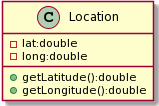

# UML Lab

For today's lab we are going to go over some of the basics of **UML** which stands for *Unified Modeling Language*.  UML is good for getting a high level understanding of a piece of software and how different components interact with one anohter.  While the this sometimes sounds scary, *"UML What?!? You want to introduce us to another language!?!"*, don't fret.  We'll mostly be using it to help us create diagrams.  The reason UML came about is that since everyone had a different way of representing systems, the UML standard was meant to have a universal standard that everyone can follow, similar to how we use certain words or names to evoke certain meanings, like the name Karen for example.  Many of you already have encountered and have expeirence with UML, which came from merely looking at the Traffic Jam assignment, which had a lot of UML diagrams that many of you referred to as you were developing your solutions.  From the UML, you were able to consistently check to make sure that you implemented the methods necessary as well as to get an understanding of how different parts of the system interacted with each other and which classes had access to what.

In our case, with an object oriented language, we're going to mostly discuss how classes and their methods interact.  By us having a way to model this representation, it gives us a better sense of how the software that we are proposing to build works.  What I'm going to do is show you the basics, via this quirky program called [draw.io](https://draw.io)  Let's start with the basic building block that we will use in building UML diagrams, which will be the **class**.

## Creating a class in UML
Representing a class in UML is one of the basic building blocks for designing a system.  To do so using UML you just end up providing a name for the class and place it in inside a rectangle, like so

## *Image to insert with UML simple class here*

Obviously though we want to have some more information, like variables and methods that the class supports.  We can do this by making the rectangle taller and having two sub areas, one for variables and one for methods.  Notice that in UML, the syntax for declaring variables is this:

*```variableName:type```*

The colon (```:```) is used as a marker between the type and the variable's name.  Notice that the type is **after** the variable name which is reverse compared to what you have in Java/C++ many other languages, but again, this is meant to be able to be used in any language, so we will not question it and continue.

For methods, they look a little closer to what we do in C++ but use the same reverse syntax for specifying types, so functions would follow this format:

*```methodName(arg1:type, arg2:type):returntype```*

So in this case, the type of what you would return ends up being placed at the end of the method instead of before the method name, just like in Java/C++.  Lastly, we can begin each variable/method with a prefix to detail its accessibility across classes by using ```+``` for public, ````-```` for private and ```#``` for protected. 

One of the easiest ways to get started with UML diagrams is by merely drawing something, but since some of us are anemic to drawing, we are going to use a tool called *PlantUML*.  PlantUML allows us to use text and symbols to come up with a diagram.

## Class Diagrams in PlantUML

### Basic Class definitions

To start, right click on [this webpage](http://plantuml.com) and say *open in new window*. You may want to have the plantUML page and these instructions side-by-side (if you haven't done this using keyboard shortcuts, you can hold the Window Logo Key and type left or right, and then click on the other webpage.  On the plantUML site, Once there, click on the online server option on the left sidebar.   This will open up a webserver that has a sample sequence diagram, which we'll discuss in the future. 

For now, replace the line:
```
Bob -> Alice : hello
```

with these two lines:
```
class Location {
}
```

Notice that when you finish typing, you see a class picture down at the bottom that looks something like this:


One of the nice features of PlantUML is that it continually redraws based on what you have written, giving us that instantaneous and continuous feedback.  So far the syntax for defining a class should feel very similar.  If we wanted to generate another class, we would simply write another class below those two lines (but above the ```@enduml``` line).  Try that now by writing a class called ```Song```.  You should now see the two classes side-by-side.  **Do not continue until you see both classes in the plantuml diagram**

### Adding class variables and methods
Let's add two variables to ```Location```, which would be the latitude and longitude (which we'll refer to as ```lat``` and ```long```).  Use the UML format outlined near the top of this document, making sure that those declarations are placed in between the curly braces.  If you did this correctly, you'll get something that looks like this:


Notice how the there are red squares, which are being used here to denote that the variables are private.  This is not standard UML which uses the (-) as part of the diagram, which we would be able to change if we add the line ```skinparam classAttributeIconSize 0``` just below our ```@startuml```.  Next add two methods for the class which can be done on separate lines just after the variables, using the notation provided up top.  Doing so would allow us to get a picture like this:



Notice how merely with the inclusion of parenthesis, this automatically puts us in the bottom section of the class, which is where all the method defintions go in a class diagram (the middle area is where all the instance variables are placed).  Therefore in PlantUML, to add any of the class information, we would merely add the variables and methods inside the curly braces of any class defintion that we have added.

This should provide you with sufficient information to declare classes and the methods that would be inside of those classes.  While having the class names and what they contain and do is important, these class UML diagrams have one last important part to discuss, which is how they are related to one another.  Luckily, PlantUML has a very lightweight way for us to represent relationships between classes, let's look at that now.

### Establishing relationships between classes

One way that we often represent some assocation between classes is merely by drawing a line or arrow from one class to another.  This can be done very simply in plantUML as well, through the use of hyphens and some ASCII type art.  After all of the class definitions (but again, before the ```@enduml``` line), we can represent simple relationships between the classes and on separate lines.  To create associations between classes we merely have to mention both classes by name and then use some symbols in between the classes.  Doing so will draw the given relationship between the two classes.  Here are some examples and what they normally mean.

|symbol|association|example|
|---|---|---|
| ```-```| creates a simple horizontal line between the two classes, which represents a very general assocation between the two classes.  (A second hyphen changes the orientation of the classes and lines to be vertical, and even more hyphens means a greater distance between the two classes).  Distance doesn't have any well regarded meaning but can be useful in helping you draw out particular relationships. | *```Student---Course```* |
| ```<-``` <br> or <br>```->```| uses the greater than (```>```) or less than (```<```) sign to represent an arrow in UML which can be used to show some type of unidirectional association.  Otherwise, if you would like to show a bidirectional association, you can use both arrows, (*```<->```*), but I would just stick to the simple line (*```---```*) instead of having both symbols on the end here | *```Student-->Key```* |
| ```*--```| uses a diamond for a **Composition** relationship, to denote that there one object has an instance variable that directly holds the other or is a part of the other. Sometimes you will see some difference between Composition and Aggregation, which has to do with whether one class will exist without the other, For comp 55 you can ignore this distinction, just use it if you feel as though you would have a single instance variable that would contain the other class (you can use the word *contains* to check to see if the relationship holds) | *```Student*--Brain```* |
| ```<\|--```| used for inheritance, to say that the class on the left is the superclass for the class on the right.  Use the phrase *IS A* to check to see if the relationship holds | *```Student<\|--GradStudent```* |

Realize thought that this isn't everything that you can do, plantUML is pretty powerful!  I'm normally against having something that is additional text that feels like being another language, but in this case, I think that it is well worth it, as it allows us to think more about the code and not have to draw the diagrams in this perfect format.  If you wanted to have additional information on how to say denote things like abstract classes or interfaces, you can look at plant-umls [official documentation](http://plantuml.com/class-diagram).  Please realize though plantUML *is a product that does not completely adhere to UML standards*.  As such, I want to make sure that you get some practice with following the formats listed above for referencing to variables and methods so that you can easily read UML diagrams in the future.  Also, realize that the documentation is quite lengthy, most of what you would need is at the very top.  The plantUML syntax is quite extensive.  Do not worry about positioning things in certain places here.

The goal would be for you to by the end of this come up with some logical structure for five classes (that have both variables and methods and are linked to one another), that includes a ```Song``` and a ```Location``` (think about how to link those together, however you like).  make sure to include an interface, as well as an inheritance relationship as well as other relationships between the classes (it should be interconnected).  

Ensure that the skin is on.  You will need to upload a screenshot of your creation to canvas, or you can use plantUMLs export picture features.  Good luck!

### Help it doesn't look how I would like it to look!

So while one of the beauties of plantUML is that it takes care of the drawing for us and all, sometimes we want to ahve some control of the layout.  If you do say want to group some classes so that they appear together, you can use the ```together``` command, which takes some curly braces.  Then any class that you mention inside together (which must be prefaced with the keyword ```class``` will be arranged together on the screen) so if we wanted to group song and location together, we would need to write

```
together {
    class Location
    class Song
}
```

You can also use the keyword ```hidden``` as part of a relation to hide associations