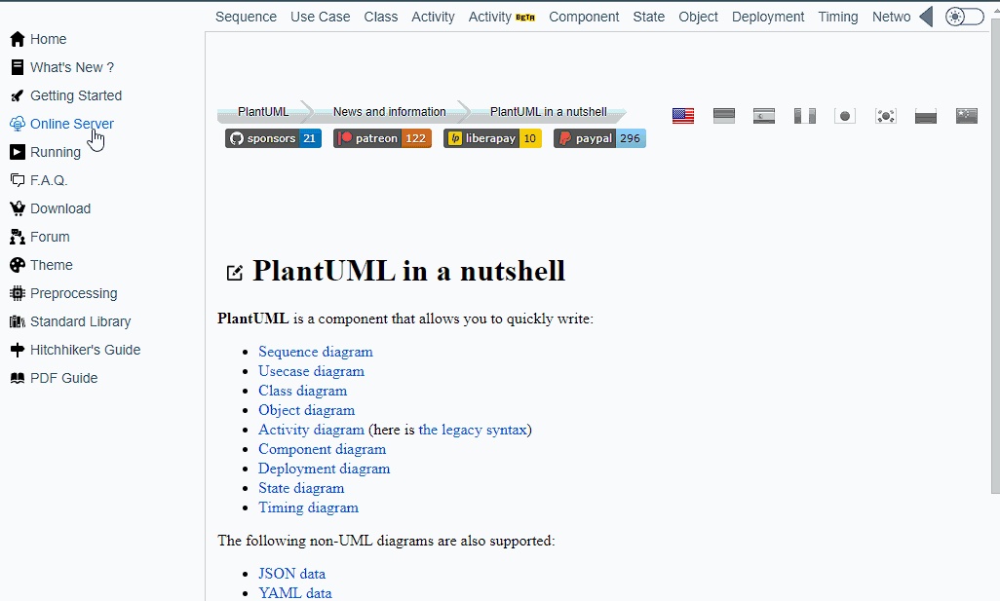
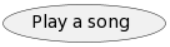

# Use Case Diagram Mini-Lab

- [UML Intro](#uml-intro)
- [Wait, why plantUML again?](#wait-why-plantuml-again)
- [The Use Case Diagram](#the-use-case-diagram)
- [Starting a PlantUML use case diagram](#starting-a-plantuml-use-case-diagram)
- [Explanation of the plantUML code](#explanation-of-the-plantuml-code)
- [Introducing use cases](#introducing-use-cases)
- [Making connections](#making-connections)
- [Defining the System](#defining-the-system)

For today's lab, we are going to learn about the **use case diagram**,
which is a part of **UML** which stands for *Unified Modeling Language*.

## UML Intro

UML is good for getting a high-level understanding of a piece of software
and how different components interact with one another.
If you want to learn more about UML, you can visit the [official UML website](https://www.uml.org/).
While this can sound scary,
*"UM-What?!? You want to introduce us to ANOTHER language!?!"*,
don't fret.
We'll mostly be using it to help us create diagrams.
The reason UML came about was to have a universal standard
that everyone can follow when designing software,
similar to how we use certain words or names to evoke certain meanings,
like the name Karen for example.

For a more concrete example of how UML is used in software development,
consider the following use case.

> Imagine you are a software developer working on a mobile banking app.
To ensure that the application is designed and built to meet the needs of the end-users,
you and your team would create a use-case diagram using UML to outline all the major interactions,
like checking account balances to pay bills.

Each interaction is a use case. The diagram will identify external systems that the app needs,
like payment gateways or databases.
By using UML, you get a high-level view and ensure the app meets user needs.

Many of you already have encountered and have experience with UML via the Traffic Jam assignment.
There are many types of UML diagrams.
That assignment showed mostly two,
the UML Class Diagram and the UML Sequence diagrams.
From those two types of diagrams,
you were able to consistently check to make sure
that you implemented the methods necessary
as well as to get an understanding of how different parts of the system interacted with each other
and which classes had access to what.
Many of you referred back to the diagrams much more than reading the text.
While most of the diagrams presented were either class diagrams or sequence diagrams,
for this lab we will be working with a different type of diagram from UML -
the **Use Case Diagram**.

What I'm going to do is show you the basics of the Use Case Diagram,
via this quirky program called [plantUML](https://plantuml.com).
While it does make sense to perhaps learn to draw different types of UML diagrams
on a piece of paper,
since we are programmers,
we are going to use a specialized program
that will allow us to communicate the diagrams with others.

## Wait, why plantUML again?

Over the years,
I've noticed that drawing diagrams is often inviting,
having a sheet of paper with different folks can be a collaborative and often rich discussion.
However,
I've noticed a tendency for myself and the majority of students in this class
to avoid drawing diagrams on a piece of paper.
A majority of folks (but not all)
when given the option started trying to draw diagrams on the computer -
this often leaves many of us learning a new program that will allow us to draw,
correct,
and then edit diagrams efficiently.
While programs exist to help you draw UML diagrams,
I haven't found them to be great solutions for ensuring that the diagrams
that students draw are in fact following the UML standards.
For example,
folks using these programs sometimes use ovals when they should use rectangles
or create arrows when we shouldn't have some,
and vice versa.
Also,
once we have created a diagram using a computer program like paint or PowerPoint,
if we need to make changes we tend to drag our feet,
as it becomes all the more cumbersome for us to change the diagram.
Therefore,
from now on we will use the diagramming language **plantUML** to draw our diagrams.
This will allow us to stay in text
but have a way to easily modify our diagrams and share the text with others,
which means that they can be easily updated.

## The Use Case Diagram

A Use Case Diagram typically give us:

1. a 10,000-foot picture of a program
2. an overall feel of what the program does.

The main Components of a use case diagram include:

### Actors

- External entity that interacts with the program
- Can be represented as a person or external system
- At least one actor required in a use case diagram
- Multiple actors can represent different users and external components

### Use Cases

- Represented as ovals
- High-level interactions expected in a program
- Should represent the entire process an actor is involved in
- Number of use cases should be kept to less than seven

### Interactions

- Used to connect actors to use cases they initiate or interact with
- Shows the flow of interaction between actors and the system

### The System

- Represents all use cases being implemented by the system
- Formal use case diagram terms: whatever is inside the rectangle is what will
be developed as part of the system.

## Starting a PlantUML use case diagram

To start,
right-click on [this webpage](http://plantuml.com)
and say *open in new window*.
You may want to have the plantUML page and these instructions side-by-side
(if you haven't done this using keyboard shortcuts,
you can hold the Window Logo Key and type left or right,
and then click on the other webpage.)
On the plantUML site,
Once there,
click on the online server option on the left sidebar.
This will open up a plantUML web server that has a sample sequence diagram,
which we'll discuss in the future.
Notice how in the text editor,
the beginning line is ```@startuml``` and the last line is ```@enduml```.

*We'll have to place any of our statements to describe our UML diagram between these two lines*.

For now,
let's replace that single line that is between those two statements (shown here):

```plantuml
Bob -> Alice : hello
```

with:

```plantuml
left to right direction
actor "Partygoer" as p
```

and you will see this at the bottom of the plant URL pane:




## Explanation of the plantUML code

The first line
(```left to right direction```)
is merely a directive to tell plantUML that we will be working horizontally.
The second line introduces our first actor.
Our use cases and actors follow this format.

*```keyword "Name on Diagram"```* **```as```** *```varname```*

In our example from above,
the **keyword** we are using is *```actor```*,
followed by the name we want to appear on the diagram (```Partygoer```),
as a string literal in quotes (```""```).
Then we use the reserved word **```as```**,
which helps plantUML know we are introducing a new part to our diagram.
Finally,
we used the letter ```p``` as our *```varname```*.
Think of the ```p``` as a variable name that you can use
to reference this particular actor in the future.

**Go ahead and now use this format to introduce a new actor called ```DJ``` in your diagram**.
You can name it whatever variable name you want.

Notice that when you do that,
you will see another actor appear,
the actor appears unintuitively above the actor you just created.
To switch the order of the actors (so that the DJ is below the partygoer,
*as it should be*...folks at a party should come first!),
just rearrange the two lines,
so **make sure that the DJ is below the partygoer in your diagram**.

## Introducing use cases

If we study the format that we learned above about how to introduce new parts,
then creating the use cases themselves can be straightforward.
Using the same format that we have above,
you can introduce use cases.
The only thing that is different from say an actor
is that instead of us using the keyword ```actor```,
we use the keyword ```usecase```.
With your newfound knowledge of creating use cases,
**go ahead and create three use cases in plantUML for:**

1. requesting a new song
2. playing a song and
3. voting on existing songs

As for the variable names,
you can use shorthand variable names.
Some folks like to preface the shorthand with *```uc```* to stand for use case.
Once you finish doing this,
you will see three ovals representing the three use cases that appear in your picture.
**Make sure you have the three ovals before you continue**.
Just as a reference,
here's what the play song should look like.



Do not worry about how they are arranged right now or where they are.
We will connect them next.

## Making connections

Now with the actors and the use cases,
let's make connections that demonstrate how the actors are involved
in each of the three use cases that we have proposed.

I'm going to propose that you follow this overall format:

*```left_varname```* ***```operator```*** *```right_varname```*

Where the left and right variable names
are for the actor and use-case names we created in the previous section,
and the operator would be special symbols that we can use to represent the relationships.
Note here that the **order matters**.
If you decide to put the use case on the left and the actor on the right,
*it will end up placing the actor to the right of the use case instead of the left*.

Let's see how this would work in the context of adding something to our use-case diagram
to show the appropriate connections between actors and use cases.
Let's think about the *voting on a song* use case,
one may argue that that would be something that the *Partygoer* would primarily be responsible for,
so let's declare a connection between the two by using the hyphen operator (```-```).
To do this,
we merely add a line in the UML diagram that provides the variable names of your actor and use case,
separated by a hyphen.
Start with a single hyphen between your ```Partygoer``` and ```vote on a song``` use case.
Once you see the diagram update,
add a second hyphen and then look at the picture below.
What just happened?
If you continue adding hyphens,
you'll notice it will also get longer and longer.

To help with creating linkages,
I'd like you to
**add at least 3 more linkages based on what you feel would be use cases
where the Partygoer or DJ would be involved**.
This means that you should have at least 4 connections established.

## Defining the System

Finally,
the last thing we want to show how to do in PlantUML is to define the system itself,
which we can do in PlantUML
by merely enclosing the use case statements within a set of curly braces ```{ }```
and using the keyword ```rectangle``` before the left curly brace,
so you would have something like so.

**```rectangle```** *```"Title_Name"```* ```{```

*<pre>  usecases in rectangle here</pre>*

```}```

**Go ahead and enclose all 3 use cases into a rectangle and have the title be your name.**
Make sure that for your picture,
*the DJ ends up being on the right-hand side, while the partygoer is on the left*.
To get credit for this lab,
submit your screenshot to canvas.
