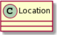
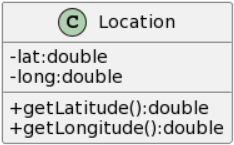

# UML Class Diagram Lab

For today,
we are going to continue using plantUML to develop class diagrams,
which detail how classes and their methods interact.
Making models helps us better understand how the software that we are proposing to build will work.
Let's start by first discussing what the class diagrams will look like
(and how to draw them on a piece of paper) first.

## Drawing a class in UML on a piece of paper

Representing a class in UML is one of the basic building blocks for designing a system.
To do so in a paper drawing for UML you just end up providing a name for the class
and place it inside a rectangle,
like so:


We can increase our understanding of a system when we can add more information to a class,
like variables and methods that the class supports.
We can do this by making the rectangle taller and having two sub-areas (separated by lines),
one for variables and one for methods.
Notice that in UML,
the syntax for declaring variables is this:

*```variableName:type```*

The colon (```:```) is used as a marker between the type and the variable's name.
Notice that the type is **after** the variable name
which is reverse compared to what you have in Java/C++ and many other languages,
but again,
this is meant to be able to be used in any language,
so we will not question it and continue.

For methods,
they look a little closer to what we do in C++ but use the same reverse syntax for specifying types,
so functions would follow this format:

*```methodName(arg1:type, arg2:type):returntype```*

So in this case,
the type of what you would return ends up being placed at the end of the method
instead of before the method name,
just like in Java/C++.
Lastly,
we can begin each variable/method with a prefix
to detail its accessibility across classes by using ```+``` for public,
````-```` for private and ```#``` for protected.

One of the easiest ways to get started with UML diagrams is by merely drawing something,
but since some of us are anemic to drawing,
we are going to use *PlantUML* again,
as it allows us to use text and symbols to come up with a diagram.

## Class Diagrams in PlantUML

### Basic Class definitions

To start,
right-click on [this webpage](http://plantuml.com) and say *open in new window*.
(Remember to do the side-by-side with Windows left arrow!).
On the plantUML site,
remember to click on the **online server** option on the left sidebar.

For now,
replace the line:

```plantuml
Bob -> Alice : hello
```

with these two lines:

```plantuml
class Location {
}
```

Notice that when you finish typing,
you see a class picture down at the bottom that looks something like this:



One of the nice features of PlantUML is that it continually redraws based on what you have written,
providing us with instantaneous and continuous feedback.
So far the syntax for defining a class should feel very similar.
If we wanted to generate another class,
we would simply write another class below those two lines (but above the ```@enduml``` line).
Try that now by writing a class called ```Song```.
You should now see the two classes side-by-side.
**Do not continue until you see both classes in the plantUML diagram**

### Adding class variables and methods

Let's add two variables to ```Location```,
which would be the latitude and longitude (which we'll refer to as ```lat``` and ```long```).
Use the UML format outlined near the top of this document,
making sure that those declarations are placed in between the curly braces.
If you did this correctly,
you'll get something that looks like this:


Notice how there are red squares,
which are being used here to denote that the variables are **private**.
This is not standard UML which uses the (```-```) as part of the diagram.
Let's change that -
add the line:

```plantuml
skinparam classAttributeIconSize 0
```

as the second line in our text,
just after```@startuml```.
Next add two methods for the class which can be done on separate lines just after the variables,
using the notation provided up top.
Doing so would allow us to get a picture like this:



Notice how merely with the inclusion of parenthesis,
this automatically puts us in the bottom section of the class,
which is where all the method definitions go in a class diagram
(the middle area is where all the instance variables are placed).
Therefore in PlantUML,
to add any of the class information,
we would merely add the variables and methods
inside the curly braces of any class definition that we have added.

This should provide you with sufficient information
to declare classes and the methods that would be inside those classes.
While having the class names and what they contain and do is important,
these class UML diagrams have one last important part to discuss,
which is how they are related to one another.
Luckily,
PlantUML has a very lightweight way for us to represent relationships between classes,
let's look at that now.

### Establishing relationships between classes

One way that we often represent some association between classes
is merely by drawing a line or arrow from one class to another.
This can be done very simply in plantUML as well,
through the use of hyphens and some ASCII-type art
(just like we did with the use case diagrams).
After all of the class definitions
(but again, before the ```@enduml``` line),
we can represent simple relationships between the classes on separate lines.
To create associations between classes we merely follow this format.

*```left_class```* ***```operator```*** *```right_class```*

Using this format will draw the given relationship between the two classes.
Here are some examples and what they normally mean.

<!-- markdownlint-disable MD037 -->
|symbol|association|example|
|---|---|---|
| ```-```| creates a simple horizontal line between the two classes, which represents a very general assocation between the two classes. (A second hyphen changes the orientation of the classes and lines to be vertical, and even more hyphens means a greater distance between the two classes). Distance doesn't have any well regarded meaning but can be useful in helping you draw out particular relationships. | *```Student---Course```* |
| ```<-``` <br> or <br>```->```| uses the greater than (```>```) or less than (```<```) sign to represent an arrow in UML which can be used to show some type of unidirectional association. Otherwise, if you would like to show a bidirectional association, you can use both arrows, (*```<->```*), but I would just stick to the simple line (*```---```*) instead of having both symbols on the end here | *```Student-->Key```* |
| ```*--```| will draw a diamond for a **Composition** relationship, to denote that one class (the one where the diamond is closer to) has an instance variable that directly holds the one it is linked to. Sometimes you will see some difference between Composition and Aggregation, which has to do with whether one class will exist without the other. For comp 55 you can ignore this distinction, just use it if you feel as though you would have a single instance variable that would contain the other class (you can use the word *contains* to check to see if the relationship holds) | *```Student*--Brain```* |
| ```<\|--``` (actually the vertical pipe character) | used for inheritance, to say that the class on the left is the superclass for the class on the right. Use the phrase *IS A* to check to see if the relationship holds | *```Student<\|--GradStudent```* |

<!-- markdownlint-enable MD037 -->
Realize though that this isn't everything that you can do,
plantUML is pretty powerful!
PlantUML allows us to think more about the code
and not have to draw the diagrams in this perfect format.
If you wanted to have additional information
on how to denote things in the diagram like abstract classes or interfaces,
you can look at plantUML's
[official documentation](http://plantuml.com/class-diagram).
Please realize though plantUML *is a product - it is not necessarily the UML spec*.
The PlantUML documentation is quite lengthy,
most of what you would need is at the very top.
For now,
do not worry about positioning things in certain places here.

To submit something for this lab,
I would like for you to by the end of this come up
with some logical structure **for at least five classes**
(that have both variables and methods and are linked to one another),
that include:

- a ```Song```,
    ```DJ```,
    ```Venue```,
    ```Playlist```
    (think about how to link those together, however you like).
- At least one connection to each class.
- A logical inheritance relationship
  (you'll need to come up with another class to help with this)
- A logical composition relationship
- A logical unidirectional relationship
- Each class should have at least one variable and 2 methods
  and should make some sense.
  (Go beyond having getters/setters and think of methods)
  Be sure to include parameters and return types.
- The skin is on that allows us to see the traditional UML format.

Use your classmates to get help in navigating plantUML.

You will need to upload a screenshot of your creation to canvas.
Be creative with your associations.
Good luck!

### Help it doesn't look how I would like it to look

So while one of the beauties of plantUML is that it takes care of the drawing for us and all,
sometimes we want to have some control of the layout.
If you do say want to group some classes so that they appear together,
you can use the ```together``` command,
which takes some curly braces.
Then any class that you mention inside together
(which must be prefaced with the keyword ```class```)
will be arranged together on the screen.
So if we wanted to group song and location together,
we would need to write

```plantuml
together {
    class Location
    class Song
}
```

You can also use the keyword ```hidden``` as part of a relation to hide associations

### Extra Information

If you are interested in an extra-curricular software that might be useful for any other projects,
please [follow this tutorial about Lucid Charts](https://github.com/comp129/comp55/blob/adding-extra-link/docs/labs/LucidChart.md)
