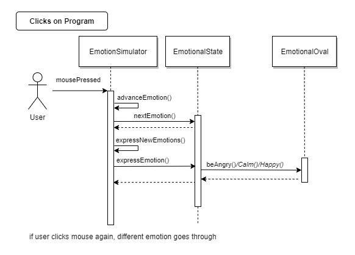
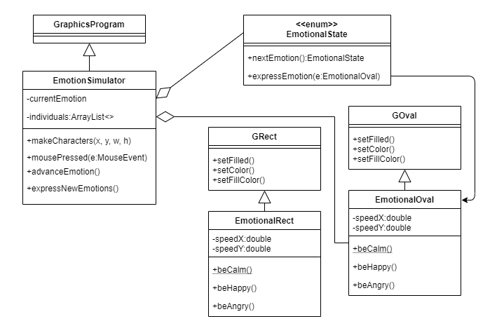
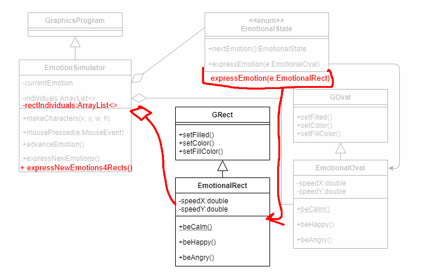
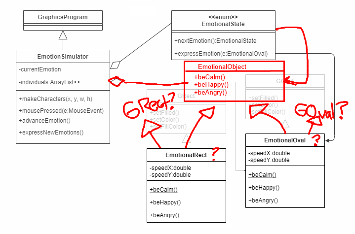
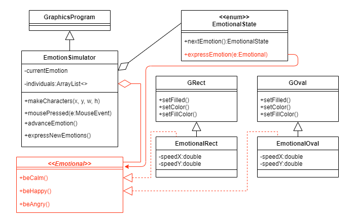
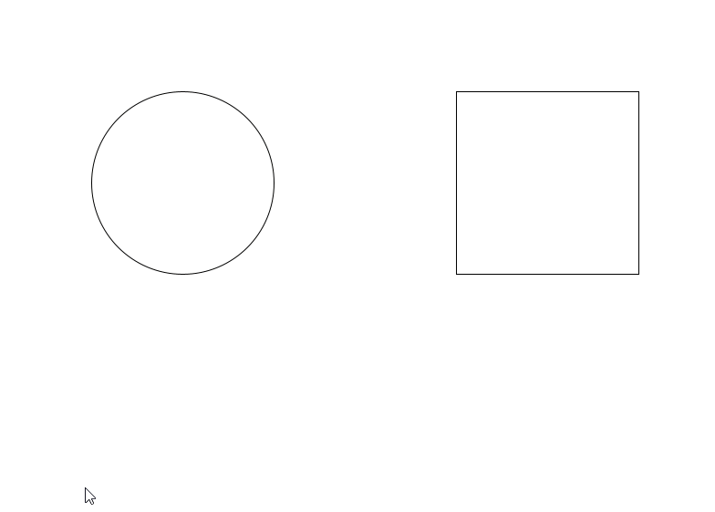
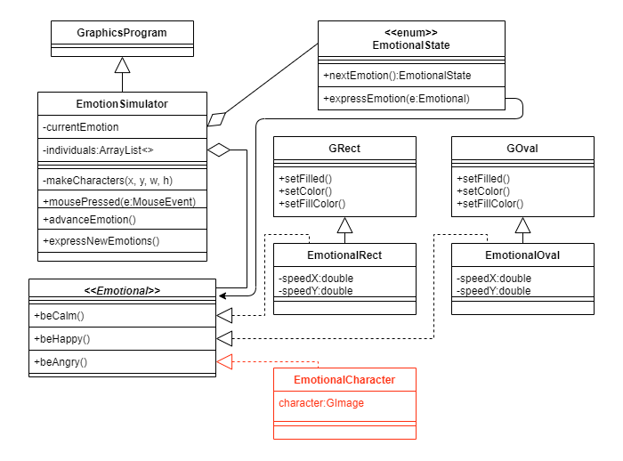

# Interface Lab

## Why Interfaces?
The purpose of this lab is to introduce you to interfaces, which is a
neat way to be able to use some of the benefits of polymorphism without
having the headaches of inheritance. While inheritance has its uses, one
of its biggest disadvantages comes when you want to borrow multiple
abilities from different classes. Java only supports inheriting from a
single class, while other languages that support multiple inheritance
often have some clunky constructs to help determine what to inherit from
which object. For example, if you wanted to create a ```ToyGuitar``` Class
that inherited from both ```Toy``` and ```Guitar``` and they both have a
variable called ```timesPlayed```.  However:
- In ```Toy```, ```timesPlayed``` is counting the \# of times the
toy has been switched on while
- In ```Guitar```, ```timesPlayed``` is counting the \# of times
*Stairway to Heaven* has been performed


<br>
*Source: [Giphy](https://giphy.com/gifs/fxLuTQsx3zQKk/media)*

In this case, which version of ```timesPlayed``` should
```ToyGuitar``` inherit or modify when you reference ```ToyGuitar```? This can
become messy and quite buggy. However, one thing that Java has
realized is that you should be able to *inherit* multiple sets of
behaviors. This is where interfaces come in. **Interfaces** are special
java files that allow us to declare methods, *but provide no
functionality for those methods*. Java allows classes to implement as
many interfaces as they like, which will become useful when you want to
tie two classes together in a more flexible way.

## Working on our Simulator for this lab
Let's start by downloading the **InterfacesLab.zip** file, which you can do
from canvas or [directly from here](http://go.djosv.com/interface)

Import that zip file [like you normally would](lab2media/media/image2.gif).

In today's lab, what we are going to do is simulate the typical programming process, and so we are going to create an office programming simulator.  The goal of the simulator is to display the three most common emotional states in programming.  I would say that these three emotional states often happen in this particular order:

Before you begin programming there may be a sense of calmness or possibly a neutral feeling.  That calmness then changes to happiness as we are being productive and writing
code that we think will work.  That happiness then changes to anger/frustration when we encounter a bug.  Once we fix the bug, then we return back to being
calm, which lets us write more code and the cycle repeats.  Our program will be responsible for showing different graphical representations for each of these different states.

Let's talk about the program in its current state, which has three files.  

- ```EmotionalState``` is an enum class that has a couple of methods that will help us transition between our three states, ```CALM```, ```HAPPY```, and ```ANGRY```.  It also has a couple of helper methods that will help us launch particular pieces of information, such as cycling to get the next emotion (```nextEmotion```) and calling the appropriate method to express a particular emotion (```expressEmotion```).
- ```EmotionalOval``` is a subclass of ```GOval``` that adds two parameters for speed (we'll ignore them for now).  More importantly, ```EmotionalOval``` implements *three* methods that are in a way associated with the emotional state, which are ```beCalm()```, ```beHappy()```, and ```beAngry()```.
- ```EmotionSimulator``` is the main starting point for this lab.  It's a graphical program where we are creating an ```EmotionalOval```, and adding mouse listeners so that when the user clicks in the simulator the program will move to the next emotion for everyone in the simulator and have them express that new emotion.  

Here's what the standard UML diagram would be for how this class looks initially.  (*Note: I did not add private methods to this diagram*)


***Run the program***.  Once it opens and you start clicking, you'll notice that the program goes through a few different stages.  For the purposes of this lab, we will assume that everyone goes through the same emotional states at the same time.  So once the user opens the application, all entities are in a *calm* state.  When the user clicks on the screen all of the individuals that are on the screen will change their state.  Here is the sample sequence diagram for how this interaction would play out:



In this lab, we want to add more objections that show emotion so that they are displayed on the screen when the user clicks on the mouse.  Currently, all we have is a single ```EmotionalOval```.  While we could try to add a second EmotionalOval or three or four, having just a bunch of emotional ovals that do the exact same thing isn't that exciting.  Let's introduce a new class called an ```EmotionalRect```.  One thing you may be tempted to do is just copy and paste ```EmotionalOval```.  I will look away from your screen while you do so 👀.

Once you copied ```EmotionalOval``` and renamed it to ```EmotionalRect```, let's go ahead and edit the new file to have it extend ```GRect``` instead of ```GOval```, which is on line 5.  You may get a lot of red errors, which are mostly because you have to import GRect into your new file, which you can do by changing line 3 to have it import ```acm.graphics.GRect```, or you can use the keyboard shortcut ***Ctrl-Shift-O***. At this point you should no longer have any errors.  Yay! You have created an EmotionalRect!  But...how are we going to integrate it into our program?  Let's revisit our diagram, which with EmotionalRect currently would look like this:  



If this is the case, then we have to think about how we are going to connect this GRect with the rest of our program?  One solution is just to keep copying and pasting like we already did (and I looked away from 🙈), and copy and paste things like expressNewEmotions, introduce a new method in EmotionalState for expressEmotion specifically tied to EmotionalRects, as well as have a new ArrayList for EmotionalRects.  This is what the new potential diagram would look like.  



While that may sound ok, what if we wanted to have another different emotional being?  It sounds like a lot of copying and pasting, and we are better people that that.  We don't want to harm anyone.  So another solution would be to perhaps not have EmotionalRect and EmotionalOval subclass from GRect and GOval, but maybe instead from an EmotionalObject.  Then we could change all of our instances from EmotionalOval to EmotionalObjects and then still potentially make it work?  So here is a UML of that proposition.


The problem with such an approach is that if we have both now subclass off of *```EmotionalObject```*, how will they get the properties of ```GOval``` and ```GRect```, and how will we be add them on the screen and call all the wonderful methods we want to use like ```setColor``` and such?  There has to be a better way.  

## Introducing the Interface

It seems as the EmotionalObject becomes very close to the topic that we had above, where we wanted ```ToyGuitar``` to inherit from both ```Toy``` and ```Guitar```.  In this case, it would be ideal if there was some way for us to have our objects inherit from both the Graphical and Emotional counterparts.  This is where the interface is going to come in, and what we are going to do is **refactor our existing code to separate out Emotional behaviors into an interface that we shall call ```Emotional```**.  Here is what the diagram is going to look like.


Everything in red shows what is new or is changing.  Essentially what we are going to do is to first create an interface that has our three emotion methods - ```beCalm()```, ```beHappy()```, and ```beAngry()```.  We will then add some keywords to link up our ```EmotionalOval``` and our ```EmotionalRect```s to that interface.  Finally, we will fix our other classes so that they are able to leverage our new interface.  Let's start.

### Step 1: Make an Interface named ```Emotional```
***Right click in your project to make a new interface and call it ```Emotional```.  Once you go through the dialog, you can hit finish, and the new file will appear.***


Once you do that, you'll see a file that looks like this
```java
public interface Emotional {

}
```

This file is quite empty and while the topic of *Interfaces* may sound intimidating, interface files are typically quite empty and only hold method declarations.  The methods do not define implementations in the interface so many interface files are less than 10 lines of code.  Interfaces are inherently simple and the benefit will come when we have other classes refer to these files in the future.  What we are going to do in our scenario is to add the three methods from our UML diagram.  Go ahead and do that now.  **Add the three method declarations to the interface**.  Not sure which three methods I'm referring to?  Look at the UML diagram.  The declaration will look just like the method definitions from ```EmotionalOval```, except that instead of having a definition with curly braces, it will end with a semi-colon.  Once you add those three lines of code, you can move on to the next step.

Connection To Visual:
On the UML diagram, ```GRect```, ```GOval```, ```EmotionalRect```, and ```EmotionalOval``` are all part of the shapes that get displayed with the colors changing inside them. The ```EmotionSimulator``` takes in the information of the three emotions to display the colors corresponding to each emotion to display them inside the shapes when the mouse is clicked.  

### Step 2: Change ```EmotionalOval``` and Rect so that they both implement the interface
Open up ```EmotionalOval``` and locate the start of the class definition, which looks like this:
```java
public class EmotionalOval extends GOval {
```
What we are going to do is after ```GOval``` but before the curly brace, add the keyword ```implements``` and then the name of our interface.  What this means is that we are telling java that ```EmotionalOval``` will have defined all of the function declarations that are mentioned in the interface, so specifically it will have implementations of ```beCalm```, ```beHappy```, and ```beAngry```, which it does already.  You should not get any additional errors after adding in those words, and now ```EmotionalOval``` has successfully become a class that has implemented an interface.  Please do this as well for ```EmotionalRect```.  After having added this and saving both files, **assure yourself you do not have any errors in either file before moving on.**  You should also notice that if you are using the class color scheme, that the name of your interface should now be green in both files.  This is just coloring so that you are aware that you are dealing with an interface, and that color will appear throughout for ```Emotional```. 


### Step 3: Change ```EmotionalState``` and ```EmotionSimulator``` to use type ```Emotional``` instead of ```EmotionalOval```

The beauty with using an interface now is that we get the benefits of polymorphism. It's like what you could think of as being a superclass, but without all of the fuss of figuring out what data will be changed.  We do not run into the same problems that we had before when we were thinking of trying to inherit information from multiple classes because interfaces do not have any data.  Interfaces can only respond to particular methods, but cannot direct how those methods behave.  While this may feel trivial, it is incredibly powerful.  By not having any responsibilities other than calling methods, both sides can be very abstracted from each other.  A class that calls a function belonging to an interface and the function definition do not need to know anything about each other, which allows for both sides to be extremely flexible.  

***Open up ```EmotionalState``` and change the parameter ```being``` in the ```expressEmotion``` method from ```EmotionalOval``` to ```Emotional```***. Then save the file.  Other than the type changing color (if you are using our color scheme), there will be no other changes that will need to be made, and you will not run into any additional compiler errors.  

***Open ```EmotionSimulator``` and do something similar with the arraylist ```individuals```.***  Be careful in this situation not to modify the type in the ```makeCharacter``` function.  It's not that we want to change all mentions of ```EmotionalOval``` to ```Emotional```, in ```EmotionSimulator``` we still want to create an ```EmotionalOval```.  Instead what we want to do is have the oval be a part of a list of ```individuals``` which are now ```Emotional``` objects.  This means that we only need to make three changes here (for clues click on ```individuals``` and look through all those highlighted lines).  

The other change that you'll need to make is to our private helper method. Once you make these changes, if you run the program, you should have the exact same functionality as when you first ran the program.

### Step 4: Add an ```EmotionalRect``` to the ```EmotionalSimulator```
What you will need to do here is merely to create a ```new EmotionalRect``` at new coordinates, ```add``` it to the screen and ```add``` it to our ```individuals``` list.  I did have a convenience method called ```makeOvalCharacter``` that you could try to reuse, but unfortunately because of all the different parts, it makes more sense to keep them separate.  You could define a ```makeRectCharacter``` which would be very similar but for ```EmotionalRect```s.  If you place the ```EmotionalRect``` at say ```500, 100``` with the same ```SIZE```, you should get something like this:



### Step 5: Make an ```EmotionalCharacter```
While these two classes so far feel very similar, remember that each class and their behavior is there own, and different reactions could come up for the three different states.  For this let's deviate a little bit more from the Oval and Rect classes and instead make an EmotionalCharacter.  This time, instead of copying pasting the other classes, let's start fresh, by creating a new java class, where we have eclipse help us create a class with inherited methods.


Notice how eclipse has done all the heavy lifting for us already, including the handy annotation Override to make sure that we are in fact overriding the interface methods and not something different.  If we wanted to even though there is nothing here, we could add this to individuals and the program would not crash.  Let's do that now.

***Modify ```EmotionSimulator``` to make a ```new EmotionalCharacter``` and add it to the individuals.*** Because we have yet to create anything we cannot in fact add the ```EmotionalCharacter``` to the screen.  To really demonstrate the versatility here, let's have the class not subclass off from anything, but instead hold a ```GImage```.  If we were to create a UML diagram for ```EmotionalCharacter``` here's what it would look like:



Notice how clean the implementation is here!  ```EmotionalCharacter``` only implements ```Emotional```, and as long as we create and add it in ```EmotionSimulator``` we are good.  *(We could have also added an arrow to ```EmotionSimulator``` to denote this, but this is good enough since we are not necessarily storing an ```EmotionalCharacter``` or have an ```EmotionalCharacter``` in any ```public``` facing methods.)*

Because there is not much change to add here, let's go ahead and open ```EmotionSimulator``` and add a new private method called ```makeImageCharacter``` (*add just two parameters ```x, y```*).  In the method create a new ```EmotionalCharacter``` (with no arguments for the time being) and add the character to the ```individuals``` list. While we have not implemented anything, it should still not break the program and ```EmotionalCharacter```, though it does nothing, will still be called by the simulator.  ***Put a ```system.out.println``` call in EmotionalCharacter's ```beAngry``` method, run the program again and watch your eclipse console print the message when you get to angry!***  This will work as long as you add the ```EmotionalCharacter``` object you created to the ```individuals``` list in ```EmotionSimulator```.  Also make sure to call ```makeImageCharacter``` in your makeCharacters method using the parameters ```300, 300```

#### ***Create and add a ```GImage``` to the screen in ```EmotionSimulator```***
Let's make sure that we can get a GImage into our ```EmotionSimulator```.  As part of ```makeImageCharacter```, create a new ```GImage``` at ```x, y``` and store it into a local variable. Then ```add``` the ```GImage``` to the screen.  Currently, the ```GImage``` and the ```EmotionalCharacter``` are not linked, but run the program again and you should be able to see the image.  **Do not continue until you see an image when you run the program.**  Though when you click nothing will happen (other than the println statement if you kept it).  What we now need to do is link the ```GImage``` we just created to our ```EmotionalCharacter```.  Let's do that next.

#### ***Create a ```GImage``` instance variable in ```EmotionalCharacter```***
Here you will just create a private instance variable to hold the GImage.  If you look at our UML diagram above, you'll notice that I named it ```character```, though you can name it whatever you want.  An alternative useful name could be ```characterImg```.

#### ***Create a constructor that passes in a ```GImage```***
While you can write this separately, an easier way to do this is to go to your ```EmotionSimulator``` and inside your ```makeImageCharacter``` method, where you create your ```EmotionalCharacter```, add in the parenthesis of that constructor the name of the local variable you created for your ```GImage```.  You should at that point get a red squiggly under it.  If you then do a ***quick fix*** and choose ***create constructor***, eclipse will then create a constructor for you in ```EmotionalCharacter``` that will have a ```GImage``` as a parameter.  Then in that constructor make sure to add in a line that would set the parameter passed in to your instance variable, similar to what you did in your [early java lab](2-JavaIntro.html####step-4:-override-the-toString()-method)

#### ***Set the image in each of the three methods.***
Now in each of your three ```Emotional``` methods, make sure that you set the image.  I have provided you with three files for the time being, which are "calm.png", "joy.png" and "anger.png", so you can call ```setImage``` using each of them as the argument.  

#### ***Run the program***
You should now see your three objects on the screen, and when you click on the three methods.  Assuming you typed the names correctly for each of the three files, then you will see the ```EmotionalCharacter``` cycle through its states.  Now we have three different objects that are all different, and yet all can end up being ```Emotional``` and thus express the three emotions that we have outlined.  

### Step 6: Add your own class that implements Emotional in a different way!
While all of what we have done has felt very similar,  Remember that with an interface, you have utmost flexibility!  All you have to do is create a class that ```implements Emotional```, and as long as you define those three methods, then you can participate in the EmotionalSimulator (as long as you create that object and add yourself to the list of ```individuals```).  While our examples are simple, remember that they could also be quite complex (if you do something expensive time wise, it may make sense to spawn it off using ```SwingUtilties.```*```runLater```*.  *You have complete control as to what you would like to do.*  So as the last step, **I would like you to create a new class and add it to the simulator, so that when it is called, you have something that implements the three methods.**  While we did not use ```speedX``` and ```speedY``` in our other classes, you could use them and experiment with something completely different.  What you do or how you respond is completely up to you!  Also remember that while we have this specifically tied to a mouse listener, it doesn't have to be that way.  There is nothing in an interface about when it should be called or how it should behave. Know that that it's a merely a collection of methods that one has to implement, which could lead to some great examples of polymorphism.  To get credit for this lab, **you will take three screenshots of the three states, showing your four objects reacting to the three feelings**. Upload all three images them as a zip, or stitch them together.
