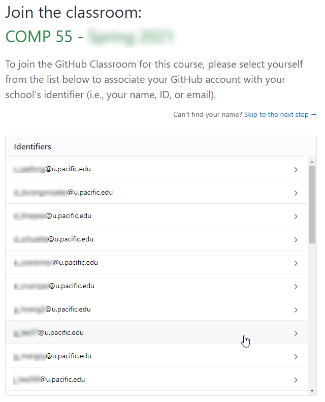
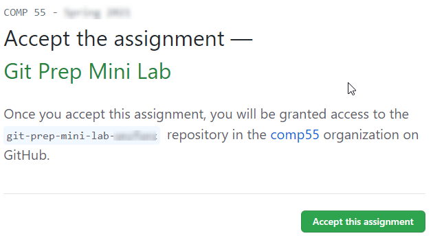
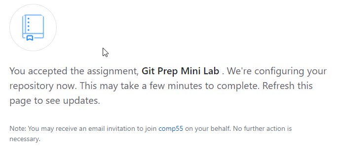
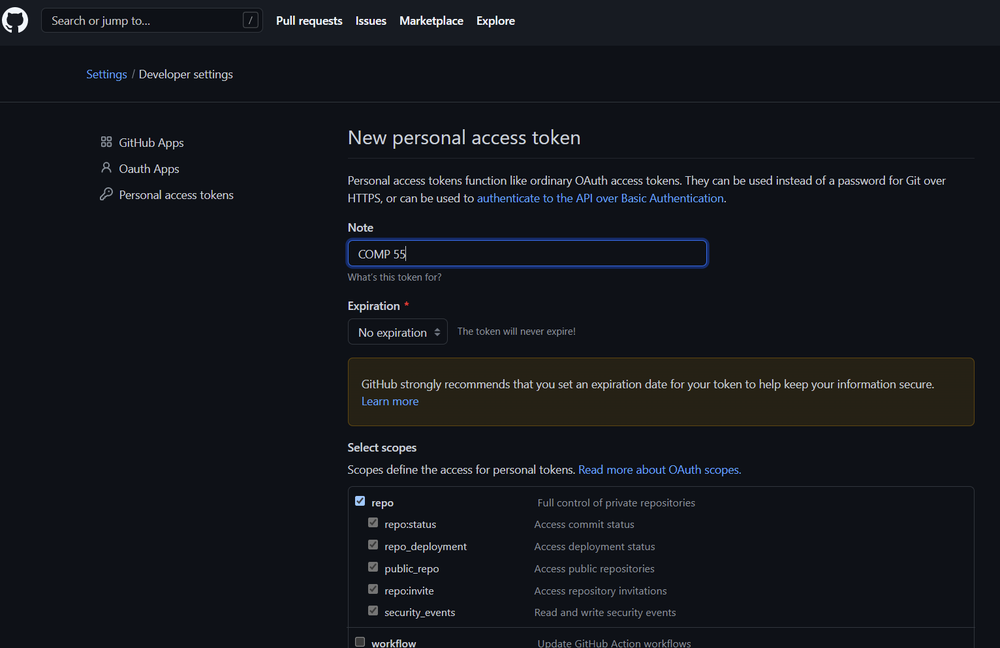
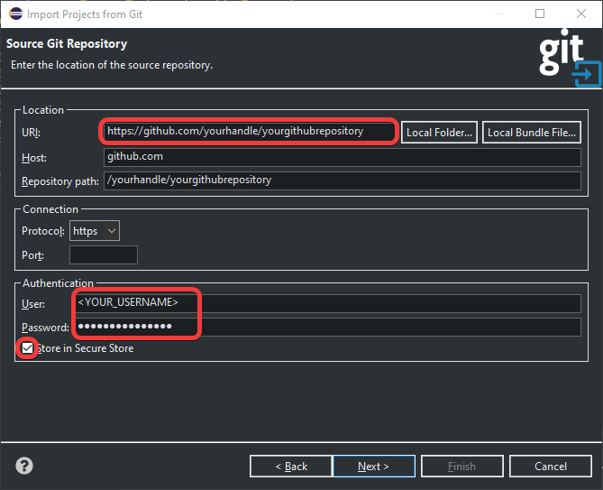
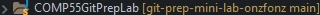
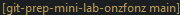
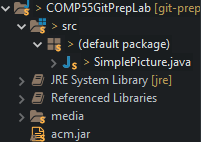
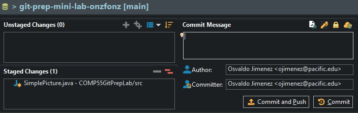
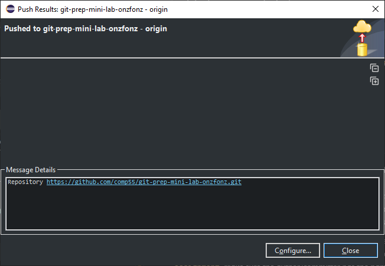

# Preparation for Git Team Lab

- [Overview](#overview)
- [Signup for a GitHub account](#signup-for-a-github-account)
- [Start GitHub Classroom](#start-github-classroom)
- [Importing your new GitHub Repository into eclipse](#importing-your-new-github-repository-into-eclipse)
    - [Help! I lost my GitHub URL](#help-i-lost-my-github-url)
- [I have the URL but have yet to connect to GitHub](#i-have-the-url-but-have-yet-to-connect-to-github)
    - [Generate a token and store it in secure store](#generate-a-token-and-store-it-in-secure-store)
- [Opening your project](#opening-your-project)
- [Examining ```user.name``` and ```user.email``` to your Git Preferences](#examining-username-and-useremail-to-your-git-preferences)
    - [Look to see if you have user.name and user.email](#look-to-see-if-you-have-username-and-useremail)
    - [Adding user.name and user.email if you don't have them](#adding-username-and-useremail-if-you-dont-have-them)
- [Committing and pushing changes](#committing-and-pushing-changes)
- [Verify your activity on GitHub](#verify-your-activity-on-github)

## Overview

This lab is a mishmash of steps
that need to be completed individually before we meet again in class.
We will be joining the wide world of sharing code repositories.
To do that,
we'll learn about git,
which is a way being able to keep track of our code changes,
and we're also going to learn about and use GitHub,
which is one of the leading companies to host git repositories (think projects) online.
*Some of the images that are here are taken directly from or sourced directly from GitHub itself.*

## Signup for a GitHub account

The easiest way to do this is by going here:

**<http://education.github.com/pack>**

If you already have a GitHub account,
you can still get the pack (and you should!),
but you can also just jump to [start GitHub classroom](#start-github-classroom).

Some of these are just awesome technologies
that might be of use later when you are writing programs to take over the world.
**One thing you'll need to do for certain is to [verify your email address](https://docs.github.com/en/get-started/signing-up-for-github/verifying-your-email-address).**
You can check to see if your email is verified
by checking the Emails tab of your account settings in GitHub.

If you have a warning icon like this picture,
then you'll want to ask to resend the verification email and verify your email with them.


<br> *Source: GitHub*

If you do not have a warning sign or the label does not say *Resend Verification email*,
then your email is verified.
The other thing you should do is give yourself an icon picture,
which is always fun to do and can be done from the profile option in settings.

## Start GitHub Classroom

Visit the **classroom GitHub link** that was provided to you in canvas.

You'll be presented with a window like this:



Select your email from the list below,
and continue,
making sure to accept any of the authorizations that are present and to accept the assignment.



This is going to have you enter the comp55 organization.
If you have already signed up for an account it may ask you to re-enter your credentials.
Once accepted you'll be greeted with this image asking you to refresh.



Wait a minute or two,
and then follow the lead given by GitHub,
refresh the page,
then click on the repo name,
which will have your own GitHub handle on it as part of the link.
That will take you to the GitHub site where you will see your repository,
with your handle at the end of the repository name.
Click on the green code button 
and then the copy button 
to copy the URL,
as shown here:


Make sure to save this URL that was just created specifically for you.
You will need it in the next step,
so please also just keep this page open.
Otherwise, if you close it,
you'll need to navigate back through it
by going to the classroom.github.com link provided and logging in.

## Importing your new GitHub Repository into eclipse

Now once Eclipse is open,
go ahead and do a *File->Import->Git->Projects from Git with Smart Import*.
On the next screen choose the Clone URI button as shown in the image below.


Enter your GitHub URL that you created from the classroom assignment.
(Eclipse may have also automagically filled it in for you.)
**Do not press Enter just yet or fill in your password**.

### Help! I lost my GitHub URL

If you have lost the repository URL,
go back to [GitHub](http://github.com).
When you get there,
or if you log back in you just need to access your repositories,
which will be listed on the right once you log in.
You can also use the search page up top,
if you type ```comp55``` you'll be able to see your repo.
Once you locate the repo,
copy the URI like it was shown in the lab previously.

## I have the URL but have yet to connect to GitHub

If you read every detail...
Congrats!
I said earlier not to click or to fill in your password.
You can fill in your username though.
GitHub has taken additional measures to protect your account from password abuse,
so they now require everyone to use a **token**
to access their information outside of GitHub's website.

### Generate a token and store it in secure store

Go back to [GitHub](http://github.com) and log in,
then click on your profile icon in the upper right,
and then go to *Settings->Developer settings->Personal Access Token->Create New Token*.
Then give the token a name,
set expiration to *No expiration* or *90 days* and select the ```all repos``` checkbox at the top.
This will be used in place of your password.



Because you'll need to enter your credentials often,
it may make sense to just store them in the secure store,
which means that the credentials are stored on your computer.
If you are super worried about safety,
please just store them there and use this account as a throwaway account for this class.
I've had to deal with many more students forgetting their GitHub passwords,
having expired tokens and locking themselves over their accounts,
than having students whose computers have been hacked
and whose GitHub credentials have been rickrolled.
So please check the option **Store in Secure Store** so that way your password is saved.
As part of this,
Eclipse may ask you for some recovery questions
(which you can skip),
but regardless ***save your password in the secure store***,
the only scenario where I can see this being an issue is
if you are sharing an eclipse program with another developer who has a different login,
and that should be quite rare.



Just click *next* a bunch of times
to verify that all the settings look correct like this image shows below.


When you click Finish,
you'll see that your project is now in the package explorer and will look something like this.



Notice that there is this text in brackets

that is to the right of the name of our project.
That information is showing us the repository name as well as the name of our branch,
which is called main.
For this class we will not discuss much on branching,
so we will work exclusively on the **main** branch.

## Opening your project

Go ahead and open up the project *COMP55GitPrepLab* and double-click on *SimplePicture.java*.
You'll see that it will behave as if you imported the project.
You can also run it if you like.
At this point,
the project should work and run.
If it doesn't,
you may have to change some preferences on your eclipse,
but this is very rare.

## Examining ```user.name``` and ```user.email``` to your Git Preferences

So that we can make sure that you get credit for committing and working on the project,
we're going to have you make one additional change to your Eclipse settings,
**which you will need to do if you work on any other computers so that you get credit for all of your work**.
Go to eclipse and click on *Window->Preferences*
(If you are on a mac, this would be in *Eclipse->Preferences*.

Once there,
you'll see this window,
which I'll ask you to navigate to the git configuration
by typing **git** in the search box and then clicking *Configuration*.

### Look to see if you have user.name and user.email


**You need to verify that you have those two fields with each computer that you use.**
Change your name attribute to your actual name.
If you don't have user.name then skip to the next paragraph.
If you have the entries for user.email and user.name in the bottom
but with your email and your actual name,
then you can click **Apply and Close**
to exit preferences and [jump to the next section](#committing-and-pushing-changes).

### Adding user.name and user.email if you don't have them

You'll be adding your email
(the one you used in GitHub)
and name to your settings for all computers.
On the same git configuration screen,
click the *Add Entry* button on the upper right.
For the *key* type **user.email** and for *value*,
you want to put the email that you registered with or used to signup for a GitHub account.
The user.name can just be your first name if you want.
Once done,
then you can click ***Apply and Close***.
*You need to do this with every computer
that you have so that you can get credit for your submissions.*
Make sure to use the same name and email for all your computers!

## Committing and pushing changes

For this mini-lab,
we're only interested in getting you used to
the mechanics of making a simple change and uploading that change to GitHub.
So here's what I'm going to ask you to do.

Change line 16 in *SimplePicture.java*
so that the text says ```"How I felt before knowing about github"```,
and change the ```y``` position for the GLabel to ```300```.

Once you do this,
you'll notice that your project will now have a greater than sign
(```>```)
in the package explorer,
which will look something like this:



Those signs that you see to the left of the project
are letting you know that git believes that these files have changed.
When files have changed,
git wants to give them a new version number.
To give or to save these files so that git can reference them in the future,
you'll want to do what's called **commit**.
To commit the files,
simply right-click on the project,
near the bottom of the menu,
and select *Team->Commit*.
That may open up a **Git Staging View**,
which will look something like this:



If you look,
**staged** changes are files that git has identified
as needing to be updated once you click the commit button,
while **unstaged** changes
are files that git has identified as being different than what's on the server,
but will not be updated after clicking commit.
*You need to be careful of what you decide to put in staged changes versus unstaged changes.*
When you try to commit,
git looks at all files in your current directory to see what is new or what has changed.
Anything it doesn't know what to do will be put in the unstaged changes area.

In the picture above,
the right area is the commit message,
where you'll want to write a short message that outlines what changes you made,
in this case, you can simply put something like:

```Changed the text to reflect the final assignment```

*Make sure the author/committer has the name and email
that you stored in your preferences settings*.
Finally, near the bottom right of the image,
you'll find two buttons:
***Commit and Push*** and ***Commit***.
In this situation,
I'm going to ask you to simply click **Commit and Push**,
which not only saves a new version of your project (**commit**),
but also sends your changes over to github.com (**push**).
Sometimes you may just want to commit without sending all the changes to the server yet.
We'll talk about that in the git lab in the future.
For now,
just click ***Commit and Push***.
After clicking,
you'll get a dialog box where you can click Close.



## Verify your activity on GitHub

Once you completed the steps and push,
verify that you have finished
by visiting **[github.com](https://github.com)** and clicking on your repository.
Once there,
follow the gif below:


Like the image,
you should see your changes.
If github.com has the change you pushed that's part of the credit.
The other part of the credit will come from the settings.
In github.com you can go to your repository and click on the **commits**,
where you'll see a list of the changes that you've made to the project.
You should see a commit that has your picture and name on it at the top.

Like the gif above click on the text that has your commit message
and you'll see the changes that you committed and how your commit changed the file,
which you can immediately identify.
If you see your custom picture and your name or id,
then you'll get the rest of the credit.
If you don't,
then simply make an additional change to one of the files
(adding a line or a space)
while [editing the user preferences as outlined earlier](#examining-username-and-useremail-to-your-git-preferences).
There's no need to upload anything to canvas as all your changes will be stored on GitHub.
Hooray!

That's it for now!
We'll do more with git in the future,
but this is just meant to get you ready for when we start coding.

Before you start coding though, make sure that you have:

- approval to start
- updated starter code
- updated methods and classes
- finished the rest of your system design project.
