# Git Team Lab

Points are given based on completing all steps with your team

- [Introduction](#introduction)
- [Step 0: Everyone - Pick roles and setup room](#step-0-everyone---pick-roles-and-setup-room)
- [Step 1: Team Admins - setup repository](#step-1-team-admins---setup-repository)
    - [Everyone else – Review the mini-lab steps](#everyone-else--review-the-mini-lab-steps)
- [Step 2: Everyone - Clone the new project](#step-2-everyone---clone-the-new-project)
- [Step 3: Everyone - make a change and reset (undo)](#step-3-everyone---make-a-change-and-reset-undo)
- [Step 4: Martyr & Hackslash - Martyr commits and Hackslash pulls afterward](#step-4-martyr--hackslash---martyr-commits-and-hackslash-pulls-afterward)
- [Step 5: Everyone - Look at the results in the History](#step-5-everyone---look-at-the-results-in-the-history)
- [Step 6: Hackslash - commit multiple times and then push](#step-6-hackslash---commit-multiple-times-and-then-push)
- [Step 7: Procrastinator - Commit and Unsuccessfully Push](#step-7-procrastinator---commit-and-unsuccessfully-push)
- [Step 8: Martyr & Hackslash - commit and push the same line](#step-8-martyr--hackslash---commit-and-push-the-same-line)
- [Step 9: Everyone - Successfully resolve a merge conflict](#step-9-everyone---successfully-resolve-a-merge-conflict)
- [Step 10: Everyone - Be aware of a conflict problems](#step-10-everyone---be-aware-of-a-conflict-problems)
- [Step 11: Everyone - Practice pushing and pulling](#step-11-everyone---practice-pushing-and-pulling)
    - [More Git Theory (Optional)](#more-git-theory-optional)

## Introduction

While this is a team lab,
each of you will need to do this on your computer.
Your points for this lab will be based on both your own
and your team's ability to finish this lab,
so it's important to work together.
**Make sure that you can see what everyone else is doing so that you can help each other.**
It's also important that all of you finished the [Git Prep Mini-Lab](8-Github-Prep.html),
which was necessary to finish before starting here.

## Step 0: Everyone - Pick roles and setup room

Setup your computers so you can all see each other's screens,
and decide on labeling the people on your team:
Each one of you will take on one of these four roles:

1. git team admin (team member without computer issues)
2. hackslash
3. procrastinator
4. martyr (git team admin will take on this role for 3-person teams)

If your group has five team members, the fifth team member will still need to follow along and complete the parts of the lab that involve everyone.

In addition to feeling comfortable with computers,
your git team admin should also feel comfortable searching for things in google.
Once you decide on an admin notify me.

## Step 1: Team Admins - setup repository

### Everyone else – Review the mini-lab steps

Team Admins,
**go to the link supplied via canvas**.
There you'll accept the assignment,
and it will ask you to create a team.
Make a team with your team's name.
Once you [continue](lab9media/media/acceptteam.gif),
you'll eventually be asked to wait a little bit while GitHub creates the repository.
[After refreshing the page](lab9media/media/repomade.gif)
you'll get the default files that I have provided for all of you for this lab.
The next thing will be to let everyone know that they can now signup.

## Step 2: Everyone - Clone the new project

Once your team admin has notified you that the team has been created,
**visit the link that was provided to you in canvas**.
Make sure that you **choose your correct group**.
Once you've chosen the group and accepted the group assignment,
you'll then be led to your new repository.
At this point, you'll want to **clone** your team's new project.

To check out the project,
you'll need the URL from GitHub,
so once you are on the project page via GitHub's site,
remember that you can copy the URL using the copy button

next to the URL that is revealed after clicking on the

button on your group repo page.

With that URL in your clipboard,
you should use the
[same guidelines from our previous lab](8-Github-Prep.html#importing-your-new-github-repository-into-eclipse)
that we posted previously about cloning a git repository via eclipse,
so go into eclipse,
open up the git perspective and clone a repository.

If you've forgotten the steps here,
it's best if you go back and refer to the images about
[importing into eclipse](lab8media/media/importrepo.gif)
and [following the import wizard](lab8media/media/importfromgit.gif).

*Before moving to step 3,
make sure everyone on your team has the group project
and that it looks the same on everyone's computers*,
which means it should look something like this:
.
There should be nothing to the left of the folder.

## Step 3: Everyone - make a change and reset (undo)

This may seem silly,
but mistakes happen.
Changes also become more difficult when you have accidentally made changes
and you want to receive the latest version of the project.
For many of you,
this will be the first time where you will be working with other people to write code,
which is exciting but can also lead to some trouble.

What I'd like you to do is simply add one line to the
java file in this project and **save the file**.
It can be changing a color,
adding a comment or anything else you'd like to do that will only take a minute.
The change is not important,
what's important is getting used to using git with a team
before you start working on a much more complicated project.

Once all of you have made the changes and saved the file,
you'll notice that your project,
along with the file that they modified,
now has a greater than sign (```>```)
next to all projects and directories that contain changes that differ from the latest **commit**,
which is a named revision of your code.
Study this image here and what happens after saving.


More specifically look at what happened to the file after saving,
which is that you have the sign next to all the changes.

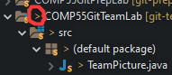

If you ever want to see what's different
you can right-click on the file and select *compare to->HEAD revision*.

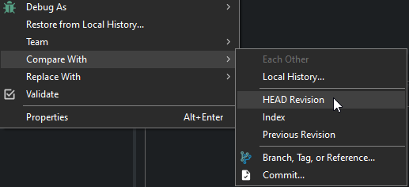

Anytime you see a greater than sign,
it means that you have something different than the
latest version,
and you have two choices to make:
commit or **reset a directory**,
which would revert your changes to the last committed version,
thereby *losing the changes you've made since your last commit*.
Let's all do this right now.
To do this,
right-click on the project,
and say *Team->Reset*.
And follow this example here.


Selecting the **Hard option** at the bottom will do a *Hard reset*,
which will replace your current files with the previous files that were committed.
Notice that after clicking the **Reset** Button,

you'll see that the changes you just made will go away and the **>**
symbol will be gone from the project,
which lets you know that you are back to how the project was initially.
Doing a reset is useful in situations where you don't remember what changes you made
and you are getting into situations where you are getting errors
and don't feel like you've done much with the code.
Once all your team members make a change and reset
so that they *no longer have a > sign on their project*,
you can move on to step 4.

## Step 4: Martyr & Hackslash - Martyr commits and Hackslash pulls afterward

Let's have the Martyr make a commit -
**if you don't remember your roles please review them now.**

Remember how in grade school sometimes when discussions were unruly
you had a *talking stick* where the person holding the stick was the only one able to talk?
For this lab, we're going to mimic this behavior,
where I want your team to take turns with the *programming stick*.
While one person is holding the programming stick
they will be the only ones making changes to the code,
everyone else should just watch them.
Now, this isn't realistic,
but this is just meant to again get us used to the workflow
of how to leverage this software while working on a group project.
***Let's have the martyr refactor the String filename for our GImage as a constant (~Line 14).***
Save, and next,
**commit and push** the change.
One note on committing.
When committing in the git staging view you end up seeing two areas,
***Staged Changes*** and ***Unstaged Changes***.
Files that have been saved after being modified will show up in one of these two areas.
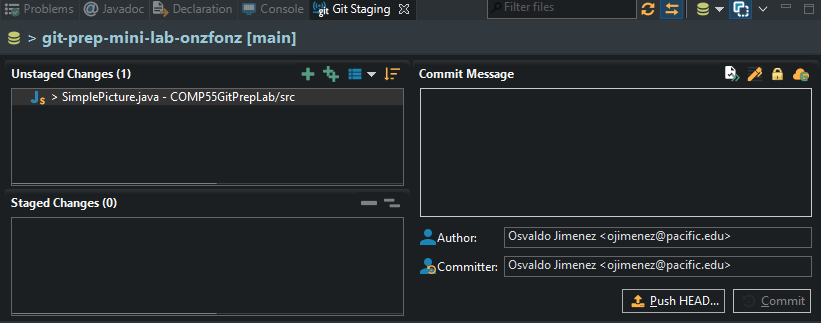

**Staged Changes** means that these are changes
that are going to be submitted as part of that commit,
while **Unstaged Changes** are changes
that may have been made but that you don't want the repository to record.
Any files that you could potentially add to the directory will show up as unstaged changes.
A commit needs at least one staged change,
but you do not always want to move everything from unstaged to staged.
For example,
let's say you were testing out some code
and added a picture of yourself to the project so that you could use it.
You may not necessarily want that picture to be added into git
and stored on GitHub as once you add it to the repository,
it's a bit more difficult to get it out.
Another thing could be certain development preferences
that you have like having a certain text coloring theme.
Git may not know much about your project,
it merely checks your git repository for new files
or files that have changed and asks if you want to commit them.
If you don't want git to track certain files,
you can ask git to **ignore** those files.
On the other hand,
your java files should typically be in staged changes every time you commit though,
as you want git to keep track of those changes in each commit.
Remember that when you commit,
you will have to enter a **commit message**
which summarizes what was done.
Once the martyr commits and pushes,
if it was successful they'll get a message like this.

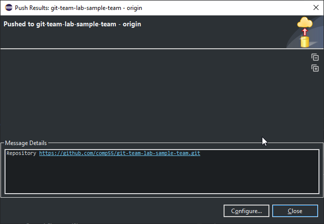

It's important to look at the upper window,
since if it fails it's going to give you a message
that just says something like *rejected, non-fast-forward*
in the area highlighted.
We'll get into this more in a later step.
Everything else will just have information on the date of the commit:
when it was,
and what repository it was for.
Once you're finished clicking the message,
you can click OK.

Once the martyr pushes,
the hackslash person, who does not have the > signs on their project,
should pull the project from eclipse
(which they can do by right-clicking on the project and saying *Team-> Pull*,
selecting the Pull option that does not have the three dots next to it).
If hackslash does have the > sign on their project,
have them do a hard reset as we did in step 2 before pulling.

## Step 5: Everyone - Look at the results in the History

Open up the history view to view the changes.

Everyone can open up the **History view**
which can be done by right-clicking on the project and selecting *Team->Show In History*.
This will bring up the history of commits,
along with the authors and the little messages detailing what happened.
If you click on the history and file that is present,
scrolling through the lower left window will show you the changes made.


The history will show you the list of all the changes
that were made for a particular project and when they were committed,
along with an ID that you can just think of as being a version number.
Notice how in the picture above clicking on the different files
will highlight the additions and deletions
that were made to that file as part of that commit.
Git will keep track for you line by line of each change on each file
that was made as part of that commit.

When you do a history view,
also notice that **the martyr has the same history as the hackslash,
but their history differs from the procrastinator and the git team admin.**
You can verify with your team members that their history has a different commit ID at the top,
depending on whether they pulled or committed or did nothing.
That is because *git uses your local copy of the repository to bring up the history.*
It does not give you the latest version unless you ask it to fetch the latest version or pull it.

## Step 6: Hackslash - commit multiple times and then push

Let's have the hackslash,
who just pulled in the previous step,
now add a comment at the top of the java file,
**but not push.**
After committing,
let's have the hackslash add a comment to the beginning of the java file
and commit again without pushing.
If the hackslash did push that's OK,
just start the process over.
What the hackslash should have is a series of two commits that have not been pushed onto the server,
where the changes are only in the comments at the top (lines 1 & 2).
Hackslash should also not edit any other lines!
Once the hackslash has this,
they should open up their history view
to verify that they have two commits that their teammates don't have.
The other option would be
to have the hackslash just check in the package explorer where their project is:

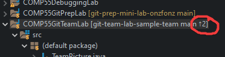

Notice how at the end of
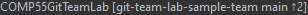
you see 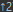,
the up arrow means commits need to be sent to the server
and the number 2 denotes how many changes need to be sent
(in this case, 2 commits).

Once the hackslash has the two commits,
they can then right-click on their project and say
*Team-> Push to origin*.
Pushing to origin takes those local commits that they have on their computer
and sends them over to the GitHub server,
making them visible to everyone.
Hackslash,
make sure you get a message that does not say it was rejected,
but rather,
that you got a successful push,
which means your screen should look similar to this
and the 
you had in your repo should disappear.


About committing…
You should think of committing as being like a meta-save.
Generally,
you want to commit every time you add some new feature to your code that works.
If you get something to work or there is new functionality
then you should commit to describing what it is that you added.
**For this class, I'm going to ask you to commit very often.**
Committing code is going to be an important factor in your grade.
While you shouldn't commit after doing every line like I'm going to ask you to do here,
I would say once you've added something that makes the program different than what you had before
(say a difference or change of 10 or 20 lines of code just to give a rough estimate)
it would make sense to commit.
It makes sense that when you have something
that can be described in a short message as being different than what you had before,
you should commit it.
Then after having several commits,
once you have something that you feel is:

- working well enough
- won't break other people's code
- is bug-free
- provides value to your teammates (it makes sense that they have it)

that is when you should push the code to GitHub.

With the hacklash successfully pushing,
have the martyr pull the latest results,
and verify that they both have the same history.
Notice that when the martyr pulled,
their version of the code was replaced with the newest version.
This is what generally happens when you **pull**,
it will not only fetch the information from the server but also change your code
so that you have the latest changes in your project's files.
*So far the hackslash and martyr should have the latest changes, and the others should not.*
This is important before moving on,
if not you can just repeat this step to make additional changes to the code.
No need to revert.

## Step 7: Procrastinator - Commit and Unsuccessfully Push

Let's have the procrastinator push changes

Now it's the procrastinator's turn.
***Procrastinator, make a change to the text of the GLabel (~Line 18) to whatever you want.***
Then **save** the file,
commit (*Team-> Commit*)
and try to push the changes they just made to that file.
*While the commit will have been successful,
the push will not.*
Eclipse very subtly tells you the push was unsuccessful,
by showing you this:

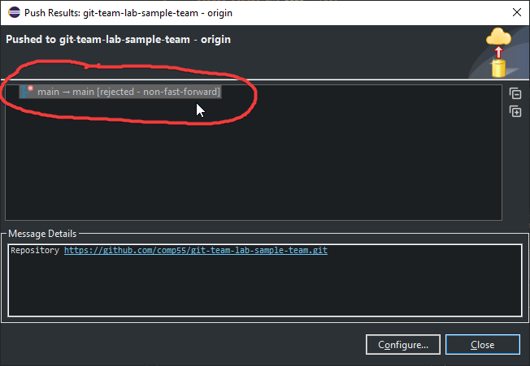

Why was it rejected?
Let's have a quick drawing to see what's going on here.

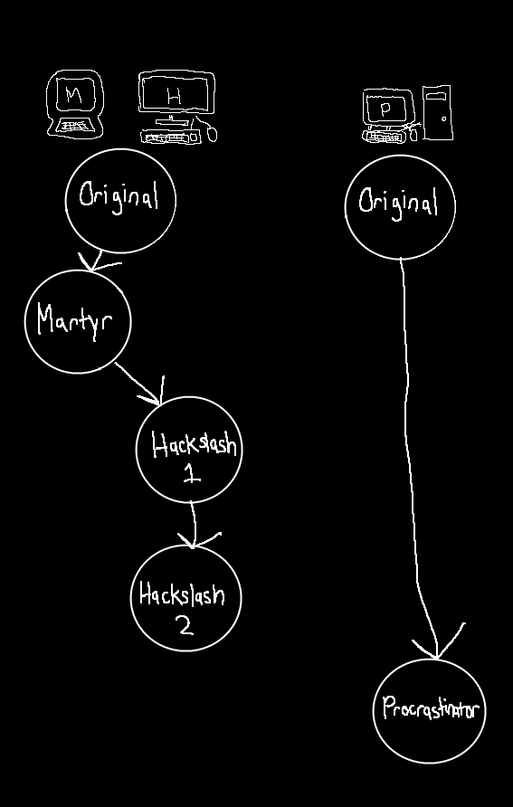

In this drawing,
think of the two sides here as being a simplified view of the two competing histories.
On the one hand,
the left side represents the history of commits that the server has,
as well as martyr & hackslash.
Let's explain.
First, everyone was on the original version.
Then martyr ended up making a commit based on that original commit.
The martyr pushed their changes.
Next, the hackslash,
who pulled the code received the latest commit,
so their commits were based on the martyr's changes.
Meanwhile,
the procrastinator,
who never pulled,
committed a change based on the original commit.
When the procrastinator tried to push their changes.
The server noticed that their newest change was based on the original,
but that they did not have the latest changes,
and therefore rejected the change,
saying it couldn't update the server since they don't have the latest information.
One way to view this is that both sides have a different version of their history,
each with their copy of how they feel the history of the versions is.
A more accurate representation of this graph,
which is transformed based on what happens in the image,
reveals that the procrastinator's and martyr's commits are both based on the original commit.
Because the procrastinator's build is not based on the latest version,
it won't allow it to say that it is the latest version.
This is completely reasonable behavior.
You should not worry as much about getting into this situation but rather just know how to get out.
To resolve this,
what the procrastinator is going to have to do is to pull the code,
**[ensuring they don't have a > symbol before pulling.]**
(*Right click-> Team-> Pull)*.
Because they have already committed,
git will do its darndest to do the right thing
and merge the procrastinator's changes with the hack's changes
and create a new version based on the changes.
That new change or the merge would theoretically look like the following graph below.

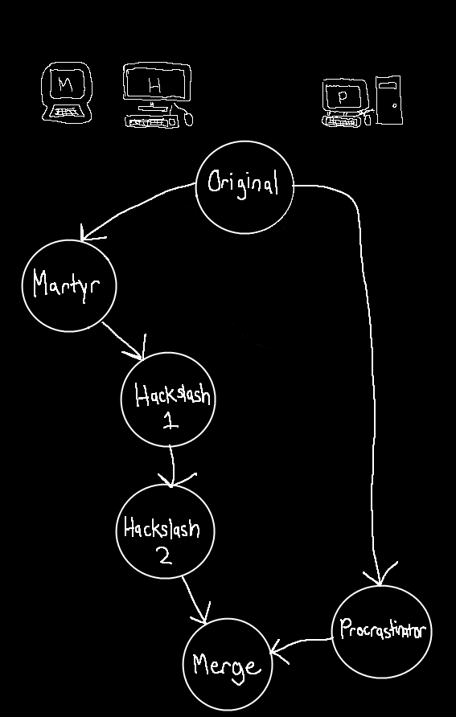

As you can see what git is doing is basing the new commit off of the two changes,
what was on the server and the changes that the procrastinator did.
As mentioned previously when you pull,
git will automatically try to create a merged version.
Based on the merge it might be able to merge the two commits completely by itself,
or it may need your help.

When the changes are done on completely different files,
git does not have much trouble merging,
since it will just use the latest version of the file from each commit.

When the changes are on the same file if git has an idea of where those lines are,
git will also do its best to keep the changes from each version,
as you can see from this pull.
However,
if it needs more information from you to make the decision,
you will enter into what's considered a merge mode
since it needs to know what version is the latest based on your decisions.
In this case,
since the procrastinator pulled if they were to get conflicts
then they would be the ones deciding which lines of the file are the most current.
We will get ourselves into that mess in the next step,
as all of you need to be aware of and at least try it.
If you did put yourself into that mess already,
congratulations!
You can move on to the next step,
just read this part here until you get the picture that has the **Conflicting** result.
If git knew how to merge the two files,
then the procrastinator will get a success message to pop up,
where the result will say **Merged**, like this:


In this case,
the Procrastinator,
after clicking OK,
will now have the representation on their machine like the graph that I placed up at
the top,
they can confirm this by showing the history of the git commits in their history,
(they can get here by right-clicking on the project,
and then going to *Team-> Show Repository in History View*.)

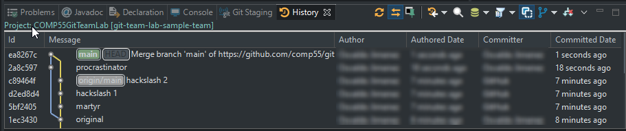

In this view,
notice the  label.
It is attached to the commit that is the latest one that GitHub has for the main branch.
That tag is different
but shows how your main version is based on the origin main
and that the hackslash 2 commit that was made is the one
that the server thinks is currently the most recent.
This is also where the
 comes into play,
as it is saying that the version of the git history that the procrastinator has,
contains two commits that need to be pushed to the server
(the difference between 
and ).


To do this,
they should right-click on the project and select *Team->Push To Origin*.
Once they do that they should verify it was a success by looking at the results.
The procrastinator will see that the origin main tag is now at the top,
indicating GitHub has the most recent changes from their computer.

Now the rest of the team can pull the latest changes,
**making sure they don't have any greater than signs on their projects**.
Once they pull they should also look at the history view
and notice their history matches the procrastinators,
with all of them looking now something like this:

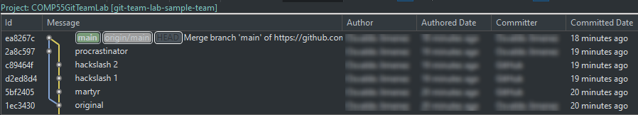

If you notice the left,
it shows a similar diverging graph that comes back together with the merge at the end.

Here's a [full walkthrough](lab9media/media/resolvemerge.gif) for the procrastinator
on solving the merge steps,
which just consists of pulling and then pushing,
when a push is rejected.

## Step 8: Martyr & Hackslash - commit and push the same line

🔥Let's cause some havoc 🔥

By now you've either had success getting git to merge something for you
or git failed at being able to merge things for you.
If git was successful in merging,
let's have you get into a situation
where git can't figure out what the latest version or the best lines to have in the file are.
To do this we're going to set it up
so that the martyr and the hackslash try to modify the same line in the same file.
**After having pulled, have both hackslash and the martyr change the GLabel's text.**
The easiest thing to do in this case is to change the text
by adding your name as part of the label.
You can use your real name or you can use the name I've assigned you.
Then go ahead and commit.
*Let's have hackslash push their commit to the server and then try to have the martyr push theirs.*
The martyr will notice that they will be rejected from pushing their changes.
When they pull to get the latest changes from the server,
they'll notice that the result will be slightly different,
where they'll get conflicting results instead of merging.

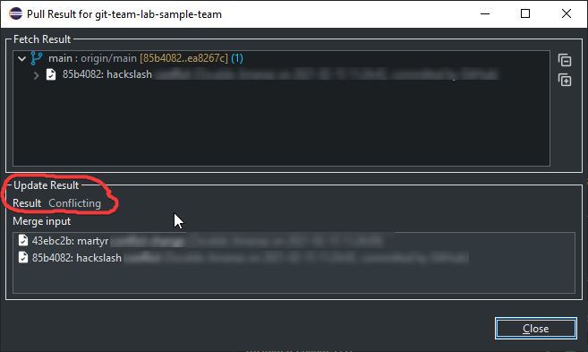

Now,
this is going to look a little bit scarier as well,
since your project explorer will have some red icons that are next to it.

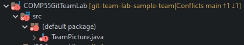

Also take a look at the status message in the package explorer -
.
Here notice that it is telling you that you are in a conflicting state,
with one change yet to be pushed to the server,
while you also need to incorporate one change from the server.

Notice the git staging view has also changed
and now indicates that something is wrong.

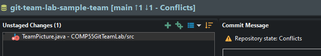

These are the numerous ways that eclipse is letting you know
that you have conflicts or changes that it doesn't know how to resolve.
Since it can't automatically merge them like before,
**it is the task of whoever gets the merge conflict to carefully solve the issues**.
In this case,
if you followed the instructions,
it will be the martyr's job.
Open TeamPicture.java.
Once opened,
notice the scary red,
but don't worry about it!
Git has replaced your java file with a text version of the one it needs help resolving,
the java file when opened up will look something like this:

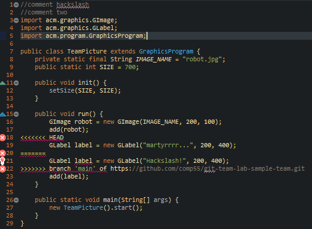

The important parts to look at are lines 18-22.
Line 19 shows the version that you made,
while line 21 shows the version that was on the server.
When it doesn't know which change is right,
git will use this notation:

```text
<<<<<<< HEAD
    your changes
=======
    changes on server
>>>>>>> branch 'main' of https://url-for-your-git-repos-here
```

This notation lets you know you need to make a decision
for all places where it notices a conflict on what should be used.
If you get into a conflicting state,
it's your job to decide what code to keep
(yours, the servers or some mix of the two).
Once you decide what lines are the right ones,
you will go ahead and delete the rest of the markings
so that the errors go away and it looks like a java file.
In this case,
let's have the martyr use hackslash's line 21 instead.
This means that after editing and saving the file,
it should look something like this.

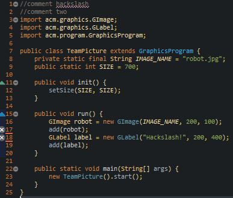

(The gray x's to the left of the line numbers are only there if you haven't saved the file yet.)
While the syntax errors went away,
you'll notice that the repo still says that it is in conflicting mode.
Notice the red icons in the project explorer for martyr have not disappeared,
and all the previous places that mentioned conflict are still there.
To get rid of the red marks,
the martyr should drag the file from unstaged to staged changes,
in the git staging view.
(Alternatively, they could also right-click on the file
and choose *Team-> Add To Index* after saving.)
The icons will update to indicate that the file will be added to the repository
:
Once the icons have changed,
the **martyr will commit and push the changes** to update the server.
So click the button like this picture is showing here to get rid of being in the merge state.
Make sure to push,
as you may not be able to pull additional code until the conflict and merge have been resolved.
Once they have been pushed,
the arrows and merged status will go away.

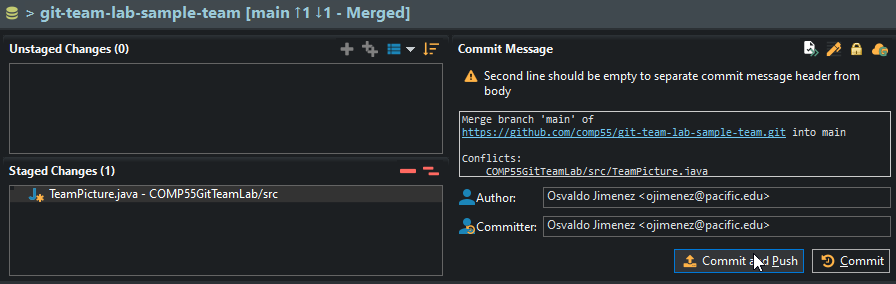

**If you ever get to a conflict and aren't sure what to keep, ask your team members.**
If your team members do ever commit changes that later disappear,
those changes will be tracked and viewable
so that you can get them and change your code back if needed.
(You can always feel free to ask me if you run into that type of issue as well.)
The safest thing is always to save and commit your code.
Note that in certain situations after committing you may have to resolve multiple conflicts.
This happens when you haven't touched or been active in working with the code in a long time.

## Step 9: Everyone - Successfully resolve a merge conflict

Wreak 🔥 More 🔥 Havoc 🔥

This part about resolving conflicts is so integral,
that I now want you to - as a team,
try to make a change on the same line.
Go through the process of each of you resolving the changes being in that conflict mode
and having to re-add the file and commit and push.
Part of your credit from this lab will be me looking at your git history
and seeing that all of you have tried this,
so make sure to help each other along the way.
Since the martyr tried making the change the last time,
have them push first so that they don't have to do the process again.
Also make sure that no one tries to pull after each push,
assume they don't know the changes have been pushed.
So that the last person will be possibly many commits behind everyone else.

## Step 10: Everyone - Be aware of a conflict problems

While this is the end of the official lab,
I want you to be aware of one more issue that seems to pop up a lot when folks are using git,
which is a git conflict problem.
This tends to happen when you have uncommitted changes,
and then you decide to try to pull in the latest changes.
Git has issues with this because pulling replaces your code and files with the latest versions.
However,
if you have work that you saved,
but did not commit,
it would be throwing this code potentially away.
This is not the case when you commit,
since those changes are stored on the database if you ever need to go back to them,
which you can view in the history.
**If you do have** >
**signs on the project explorer and decide to pull in changes from the server**
(and the server has changes to give you)
you'll raise these scary messages one on top of the other.

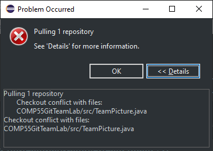
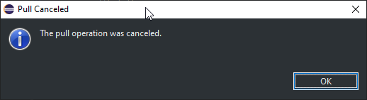

If you do get that error,
you have a few options,
you can either commit
your latest changes,
or if you feel like you didn't make any changes and they must be by accident
or say you were just playing around with the code,
then it would be best for you to do a hard reset like we did in Step 2.
Once you either commit or reset the code,
you can then try to pull the code again.
Remember that if you did commit after pulling and merging
you should push the code back on the server
so that you let the server know that you have the latest changes.

If you ever want to find out if changes have been made
but aren't ready to replace your code with those changes
(but just want to see how many changes have been made or how many changes you need to incorporate),
you can instead right click on the project and select *Team-> Fetch from Origin*.
Then just like you saw before in the package explorer,
you'll be able to see the number of commits that are you behind from your server,
with a down arrow to show them.

## Step 11: Everyone - Practice pushing and pulling

Practice the workflow!

Based on the lab,
I think it's important to remember how to work on the project.
Before you start working on the project,
make sure to pull to get the latest changes.
The easiest way to know you are up to date is
by making sure you have no arrows in the project explorer
and that when you pull it tells you everything is up to date.
Then you go ahead and
commit,
commit,
and commit again.
Once you are finally ready then push your changes.
If that push fails,
you'll need to do a pull to merge with your team member's changes.
Once you merge and commit,
you should then push your changes.
There are more advanced ways of using git,
but this is the way that I'm going to be looking for you to use git in this class,
as simply getting used to source control when working on projects is a big undertaking.
For the rest of this lab,
you guys should just get into the habit
of trying to quickly modify the file that you have
and making changes to it together.
Each of you should try to have as many changes made to this lab project as possible
and points will be given based on the smallest number of commits and merges done by the team member
with the smallest amount of activity before the due date.
Also for this class, I want all of you to only use the single ```main``` branch.

### More Git Theory (Optional)


Here is a helpful illustration from the
[Eclipse Foundation](https://wiki.eclipse.org/EGit/User_Guide#Recording_Changes_in_the_Repository)

The above illustration can be read like this:

- When you **add a file**,
you are telling Git to keep **track** of it.

- Once you **modify** the file,
git recognizes that the file is different,
but does not immediately submit those as official changes to the repo.
To put them up for consideration,
you **stage** the changes.
A good metaphor for this is that you are preparing to save these changes as a draft.
- Once you stage the changes,
you can then **commit** those changes,
which keeps them in git's history.
This is like you saving the draft (as a copy).
Committing is good in that it allows you to keep track of what you've done.
- The cycle then moves you back to having all the files be up to date,
so the cycle repeats.

For more information regarding the illustration and using Git with Eclipse,
check out the [EGit/User Guide](https://wiki.eclipse.org/EGit/User_Guide#Getting_Started).

Also if any of this confuses you,
you may start searching google for more resources to learn git.
There is some good stuff out there
(and also lots of bad stuff).
However,
most of the help provides solutions that need to be entered in the command line,
so it's probably better to ask me or your TA if you need help or have any questions.

Let me know what still confuses you so I can make this lab better in the future!
