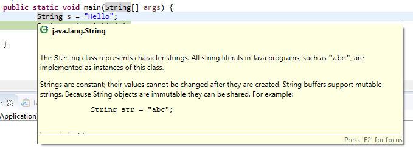
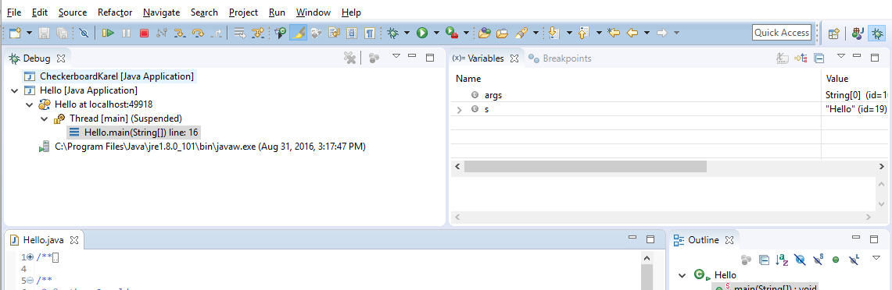

# Quick Reference for Understanding and Using Eclipse

I want you to think of this as being sort of a reference that I elaborated on from Nick Parlante,
a former instructor of mine who is also the person behind codingbat.
If there are terms here that you aren't familiar with,
then I would encourage you to ask me or others about them or see if you need any additional help.

- [Cool Eclipse Features](#cool-eclipse-features)
    - [Closing/Removing/Quitting](#closingremovingquitting)
    - [Debugging features review](#debugging-features-review)
    - [One Final Tip](#one-final-tip)

## Cool Eclipse Features

- Eclipse has **many** features,
  but here are a few cool ones.

- Add a new line to a program,
  and just type ```System.``` --
  it pops up "auto completions".
  Use the *up* and *down arrow keys* to look at your options,
  then hit *Return* to select & *Esc* to get out.
  Also,
  typing *Ctrl-space* brings this up on command,
  even without a dot.
  For example,
  type ```Colle``` and hit ***Ctrl-space*** for it to pop-up suggestions.
  Select *Collections* and once you press the *period* key
  then you'll get static methods in the Collections class.
  This will be useful for things like the ```Math``` class
  so you don't have to remember all of the methods as each method comes with a description.

- ***Ctrl-space*** works wonders in a variety of places,
  it will always try to provide you with relevant suggestions based on what you've typed so far.

- Hover over a word in the source to pull up its javadoc.
  For example,
  you can type the following line ```String s = "Hello";```
  and then hover over the ```String``` word and you'll see the documentation of ```String``` pop up.

    

- You can right-click and then say *Source->Correct Indentation* to fix the indentation.
  Alternatively,
  you can also just *Select All* (***Ctrl-A***)
  and then hit ***Ctrl-I*** to fix all the indentation,
  so your code is properly indented at all times.

- You can easily comment and uncomment out a line of code by hitting
  (***Ctrl-/***)

- Select a method name and use *Navigate->Open Declaration*
  (or just type ***F3***),
  and it goes to the definition of that method.
  Click the little left yellow arrow at the top of the window to go back.
  In this way,
  you can kind of surf through your sources.

- When navigating with the arrow keys through a document,
  hold down the ***Ctrl*** key when going left and right.
  It will navigate between words.
  It will save you from having to press the arrow key so many times.
  This keyboard shortcut works in most programs.
  Pressing ***Home*** and ***End*** to navigate to the beginning or end of a line
  is what I use the most.
  Holding ***Shift*** while you navigate will allow you to highlight text as well.

- Select a method/variable/class name,
  *right click* and choose *Refactor->Rename*
  (***Alt-Shift-R***) -- this is a superficial feature,
  but it sure is handy to fix up a name choice quickly.

- You can easily make a new method out of any code by selecting a block of code,
  right-clicking and choosing *Refactor->Extract Method* (***Alt-Shift-M***).
It's smart about what parameters are required.

### Closing/Removing/Quitting

- If you want your resources to be focused on a particular project,
  you can right-click on a project,
  and close it.
  Closing it won't remove it from the package explorer,
  but will not let you open the files or will allow you to run the project,
  which some people prefer to make it faster.
  To do this,
  *right-click* the project and select *Close*

- You can also remove the project from Eclipse,
  *right-click* the project and select *Delete*.
  This should prompt with a *do not delete contents*,
  which is what we want
  ("contents" in this case refers to the .java and other files out in the directory).
  This removes the project from Eclipse,
  but leaves its directory, files, etc.
  intact out in the filesystem.
  I would recommend you close instead of remove.

- When you close eclipse and open it back up it will revert back to the view you were last in.

### Debugging features review

To debug in eclipse

- Double-click in the editor at the left of a line to set a breakpoint on that line

    

- Use *Debug* 
  instead of the adjacent *Run* 
  to run in the debugger
  (Note: "Run" is different from "Debug" --
  Run ignores the breakpoints).

    

- This should prompt you to switch to the "debugger" perspective

    

- Click *Remember my decision* and then *Yes.*

- Eclipse is now going to change its perspective or how it is laid out.
  Think of a perspective as a different view.
  If you are debugging,
  you'll want to see different things than when you are editing the code.

- There are little buttons at the far upper right to switch perspectives,
  use the left-most one to open up a perspective if it's not listed.

    

- In the debugger,
  look at the stack and variables

    

    You can see that the main program method is the one that is running on the left,
    which will show you what line it is currently on.
    The right window will list all of the variables present in this scope.
    Notice that the variable ```s``` has the value ```"Hello"```

- Eclipse has the typical ***Step-Over***,
***Step-In***,
***Step-Out*** controls to advance the program in little steps.
    

- Before you can make those steps,
  you have to set a breakpoint in a good place
  so that the debugger knows where you should stop to take a look at variables.

- The red square highlighted above will stop the program.
  You should have used this
  so that you don't have too many copies of the program running at the same time.
  

- Click the ***J-Java*** in the upper right to return to the editing perspective
  (after killing the program typically)

- In debug mode,
  an exception can automatically drop into the debugger,
  which is a very easy way to look at the variables etc.
  at the time of the exception
  (this happens when you *Debug* the program,
  not when you *Run* it).
  Inside the debug perspective,
  the *Run->Add Java Exception Breakpoint* command allows you to edit which exceptions drop automatically into the debugger.

### One Final Tip

If you are about to add some print statements on a line -
consider using the debugger to break on that line instead.
It will allow you to click around and look at all the variables.
On the other hand,
if the line is hit many times and only fails on the 67th time ...
well ```println``` is handy for showing a time series like that.
What's also handy though
is adding an ```if``` statement to your code specifically to help you debug,
something that says

```java
if (i == 67) {
    System.out.println("reached 67th time");
```

and then placing a breakpoint on that ```println``` line.
It makes things much easier
when you can narrow down when something is happening.
While there are many IDEs including eclipse that support these conditional breakpoints
(without having to write the ```if```),
merely writing this is a quick way to get the code to stop when you want
instead of exploring the IDE at this point
and helps you better understand your execution.
