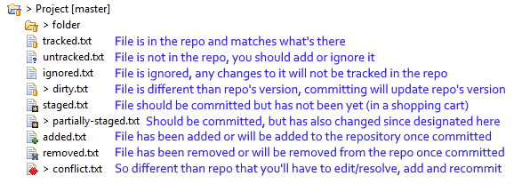

# Git Tips

Here's a couple of things you have to know to use Git and not have it
mess with you.

1)  Ensure your team member uses the project I've given you to setup the
    repository
    
    1.  While you may be tempted to use another project or code that
        someone else has done, It's best to use the project I've given
        you as a starting point as it has the acm.jar file embedded as
        well as all the hidden details needed to have your teammates
        checkout the project and have it immediately run.

2)  Be careful what you commit
    
    1.  If you end up using the project that I've provided, after the
        first commit done by the team member setting up the project,
        .project and .classpath should not be present in the commit
        files.

3)  Look at the icons in your project closely: Here is a list of icons
    with filenames that give a partial explanation of what is happening
    with files in your project.



Some of the most important icons here are the "\>" symbol. This
indicates that the project and subsequently, some files (in this case
```conflict.txt```, ```dirty.txt```, and ```partially-staged.txt``` as well as ```folder```) are
**dirty**, which is that they are different than the current head of the
repository. Normally as soon as you make changes, you'll see differences
here.


Untracked means that the file is currently not being kept track of in
the repository, decide whether or not you want to keep track of it. If
you do, then you can add it to the index.


The last one conflict is an important one to take notice of, as you'll 
have to resolve any conflicts there before you're allowed to continue 
contributing to the project. It's best if you resolve the conflicts 
by following the steps in Tip \#4.

4)  If your project isn't being pushed, look at the errors that are
    being given\! Read what git is telling you. Sometimes you'll need to
    keep committing and then pulling until everything is up to date,
    once you have no more conflicts and you've pulled you should be able
    to commit and push.
    
    1.  Sometimes you're working on your code while one of your other
        team members pushes a later version of the code to the
        repository. If so, git won't let you push the code, no matter
        how many times you try, until you merge your changes with the
        changes in the repository. To do this, after you commit, do a
        pull, and most likely you'll get a couple of files that have
        conflicts in them. This means that you'll have to open them up
        and remove the errors and decide what the right piece of code
        for that area is. Once you do that, then you'll be able to add
        the file again to the index and commit again. You can then try
        to push again (You can just use the option "push to upstream".
        If it won't let you, continue the pull and merge.

5)  If you're having issues with the repository, you can always reset
    your folder to match what the latest version is. To do this,
    right-click on the project, then select ***Team-\>Reset….*** Make
    sure to select the remote version or the local version of the
    repository you want to switch to, and then select a hard reset,
    which will attempt to replace your entire folder contents with what
    is in that version. Know that if you do a hard reset, you will lose
    any changes you made, so only do this as a last resort or if you
    haven't made changes and just want the latest part. This is also
    useful for when you have a dirty project (which you can tell when
    the greater than sign is present next to the project).
